# **Colour Forge**

A paint catalogue and recipe book for miniature painters

# Contents

- [User Experience](#user-experience)

  - [Site Owner Goals](#site-owner-goals)
  - [A Visitors Goals](#visitor-goals)

- [User Stories](#user-stories)

  - [Account Registration and Authentication](#account-registration-and-authentication)
  - [Paint Collection Management](#paint-collection-management)
  - [Recipe Creation and Management](#recipe-creation-and-management)
  - [Viewing and Searching](#viewing-and-searching)    
  - [User Experience and Visuals](#user-experience-and-visuals)    
  - [Security and Error Handling](#security-and-error-handling)    
  - [Data Management](#data-management)    
  - [Administration](#administration)    
  - [Social Features](#social-features)    

- [Design](#design)

  - [Wireframes](#wireframes)

    - [Homepage](#homepage)
    - [Side Menu](#side-menu)
    - [Registration Page](#registration-page)
    - [Profile Pages](#profile-pages)
    - [List Display Option for Library and Recipe Pages](#list-display-option-for-library-and-recipe-pages)
    - [Cards Option for Library and Recipe Pages](#cards-option-for-library-and-recipe-pages)
    - [Separate Pages Option for Paint library](#separate-pages-option-for-paint-library)
    - [Modal Option for Paint library](#modal-option-for-paint-library)
    - [Separate Pages Option for Recipes](#separate-pages-option-for-recipes)
    - [Modal Option for Recipes](#modal-option-for-recipes)
    - [Custom 404](#custom-404)

  - [Entity Relationship Diagram](#erd)
  - [Schema](#schema)

- [Security and best Practices](#security-and-best-practices)  

- [Features](#features)

- [Bugs and Issues](#bugs-and-issues)

- [Technology](#technology)

  - [Frameworks and Programs](#frameworks-and-programs)

- [Testing](#testing-and-validation)

- [Version Control and Deployment](#version-control-and-deployment)

- [Credits](#credits)
  

# User Experience

## Site Owner goals

- To store user data securely, particularly things like login credentials, using best practices like password hashes and other forms of encryption.
- Ensure that the app is accessible and responsive over all devices, providing a mobile friendly design. 
- Enable data management allowing users to add, edit and delete from their collections of paints and recipes. 
- For the user interface to be simple and easy to use, allowing users to create and store recipes or add to their paint collection. 
- To promote sharing and creativity by allowing users to document and share their painting methods with others. 

## Visitor Goals
- Easily organise and track my paint collection, ensuring I know what I have available and what I may need to replace. 
- Create and store paint recipes, so that I can replicate colour schemes and methods over the life of a painting project. 
- To have a clean, user friendly interface to allow me to manage my paints and recipes without confusion. 
- To be able to access my collection and recipes from any device so I can use the app while working on miniatures or while out shipping for paints. 
- To quickly search and filters paints or recipes to find specific entries based on things like colour, type of paint or project. 
- For my data to be securely stored so that I have no concerns about losing my recipes or any personal information that may be stored. 
- To be able to easily share recipes with friends. 

# User Stories
## Account registration and authentication
- 1. As a user, I want to be able to register for an account so that I may save my paint collection and recipes. 
- 2. As a user, I want to log in securely to access my data. 
- 3. As a user, I want to be able to reset my password if I forget it
- 4. As a user, I want to be able to change my account details

## Paint Collection Management
- 1. As a user, I would like to be able to add new paints to my collection by entering details of the paint. 
- 2. As a user, I want to be able to edit details of any paints in my collection, such as quantity, if I need to replace it and so on. 
- 3. As a user, I would like to be able to delete paints that I no longer have or use. 
- 4. As a user, I want to be able to search and filter my paint collection. 
- 5. As a user, I would like to be able to add paints to my library from an existing list. 

## Recipe creation and Management. 
- 1. As a user, I would like to be able to create new recipes using paints from my Library. 
- 2. As a user, I want to add detailed step by step instructions to my recipes. 
- 3. As a user, I would like to upload images to help see how each stage of the recipe looks. 
- 4. As a user, I want to be able to add tags or other identifiers to recipes to help me organise them. 
- 5. As a user, I would like to be able to edit my recipes as I improve them or need to change paints used. 
- 6. As a user, I would like to be able to delete recipes that are no longer of use to me. 

## Viewing and Searching
- 1. As a user, I want to be able to search my library and recipes using keywords. 
- 2. As a user, I want to be able to see all recipes that may use a particular paint from my library. 

## User Experience and Visuals
- 1. As a user, I want the application to be clean and easy to navigate. 
- 2. As a user, I would like the application to be fully responsive so that it can be easily used regardless of the device I access it from. 

## Security and error handling. 
- 1. As a user, I want my password to be stored securely to protect my account. 
- 2. As a user, I would like that only I am able to modify or edit my library or recipes. 
- 3. As a user, I want to receive visual feedback or confirmation when I edit or delete a paint or recipe. 
- 4. As a user, I would like to be alerted when I try and submit an incomplete form, with an indication of what data may be missing.

## Data Management
- 1. As a user, I would like to be able to import my paint collection for faster entry. 
- 2. As a user, I would like to be able to export my collection and recipes so that I know i have a back up. 
- 3. As a user, I would like to be able to reset my library, recipes or both to allow me to start over if needed. 

## Administration
- 1. As an admin, I want to be able to manage user accounts, including editing and deletion. 

## Social features
- 1. As a user I would like to be able to have a link for my recipes so that I can share them with other users. 

## Site Visitor

# Design

## Wireframes:

Wireframes were created with Balsamiq software to provide rough mock-ups for layout.

### Homepage

The home page currently shows either a login page, or a specific landing page, where users can add paints or recipes to their account, as well as showing a carousel of their library and recipes depending on if they're logged in when accessing the page or not. 

Mobile

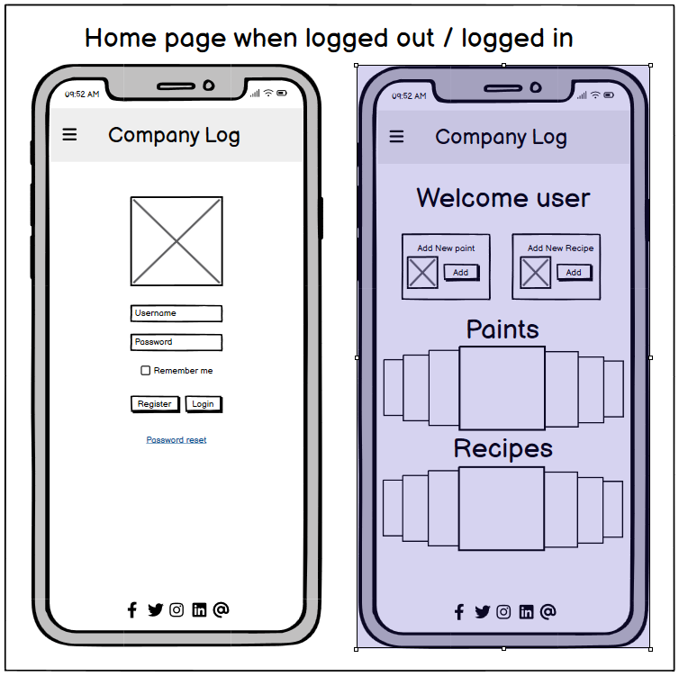

Desktop

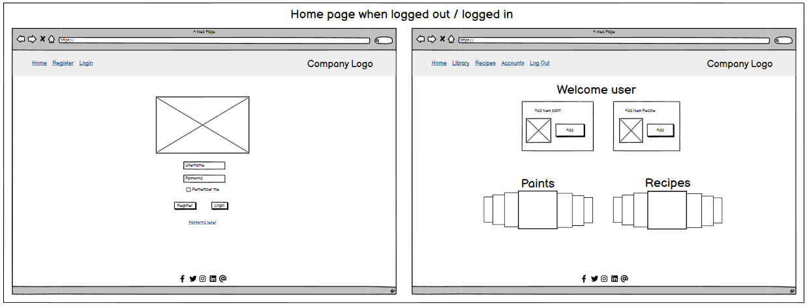

### Side Menu

The side menu is specific to the mobile experience and will show either login/registration options for none logged in users, or more typical site navigation options for logged in users.  

Mobile

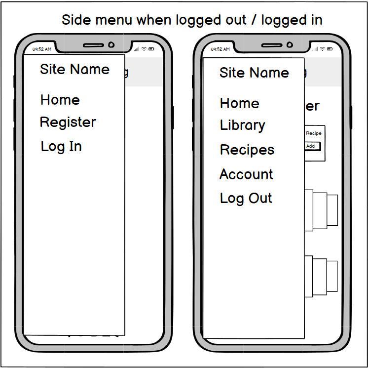

### Registration Page

The registration page is accessible both from the home page and side bar when the user is not logged in. It allows a user to register for an account.  

Mobile

Desktop

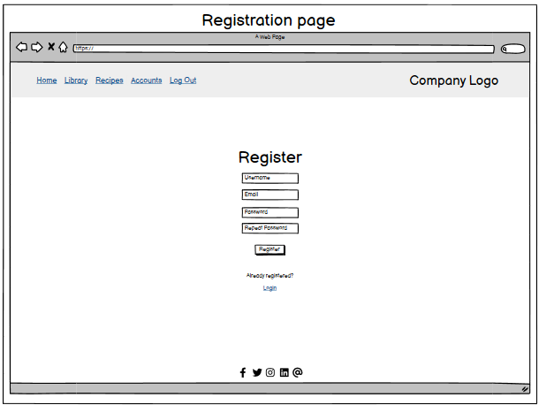

### Profile Pages

The profile page will allow the user to manage their profile as needed, requesting password resets, change their username or email address, granting them the ability to reset their library or recipes and delete their account entirely. 

Mobile

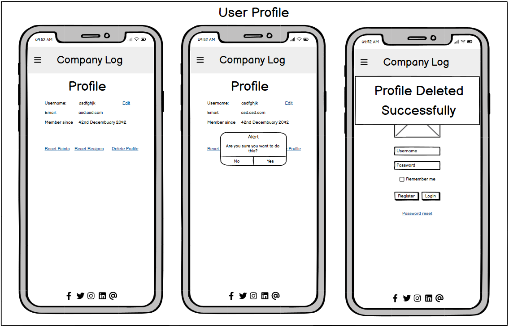

Desktop

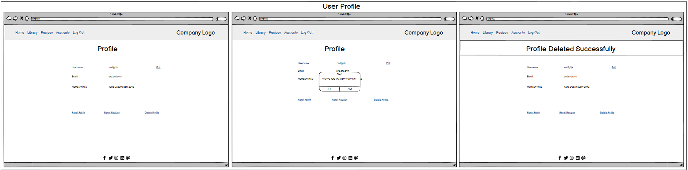

### List Display Option for Library and Recipe Pages. 

I had a couple of ideas for how to present the items for both the library and recipes lists - the most obvious one being a list of items for each. This could either be infinitely scrolling or use pagination to handle longer lists. 

Mobile

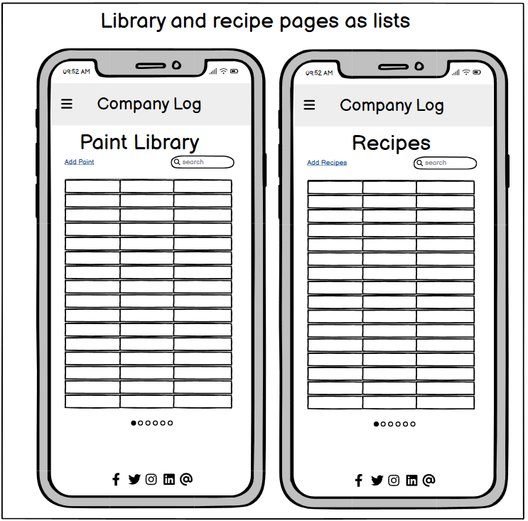

Desktop

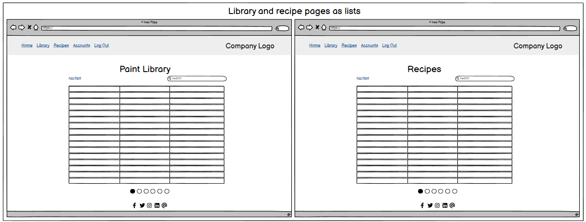

### Cards Option for Library and Recipe Pages

The alternative to the list to show the user their library or recipes was to use cards, allowing for a slightly cleaner and more mobile friendly look, due to the cards presenting a larger interaction surface than a list would. Again much like the lists this could either infinitely scroll or allow for pagination for large library/recipe collection handling. 

Mobile

Desktop

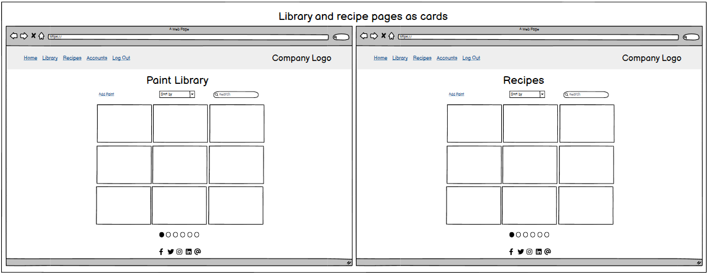

### Separate pages option for paint library

I had a couple of ideas for how to handle showing the individual paints for the library, one was to simply have each paint as its own page, this provides the maximum amount of room on smaller devices to show information. It may also be easier to handle in terms of building. The accordion at the bottom of the page will show some simple details about each recipe mentioned and will function as another path to get to the specific recipe in question. The wireframes also show what it should look like when deleting, editing and successfully editing the page. If I choose to use a 4 table DB, when entering a paint name it would be useful if this started to auto-complete based off the data in the stock list, when when selected could autofill all the other fields, which the user could then edit and manipulate as needed before saving. 

Mobile

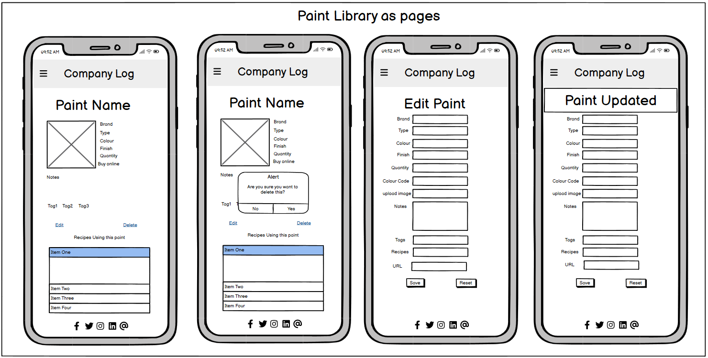

Desktop

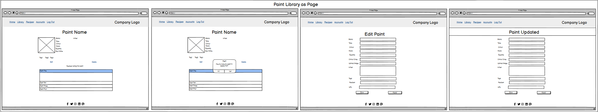

### Modal option for paint library

The other option, which I think is more visually pleasing, but potentially more limiting in terms of space would be to use some form of modal when selecting the paint. The wireframes also show what it should look like when deleting, editing and successfully editing the page.

Mobile

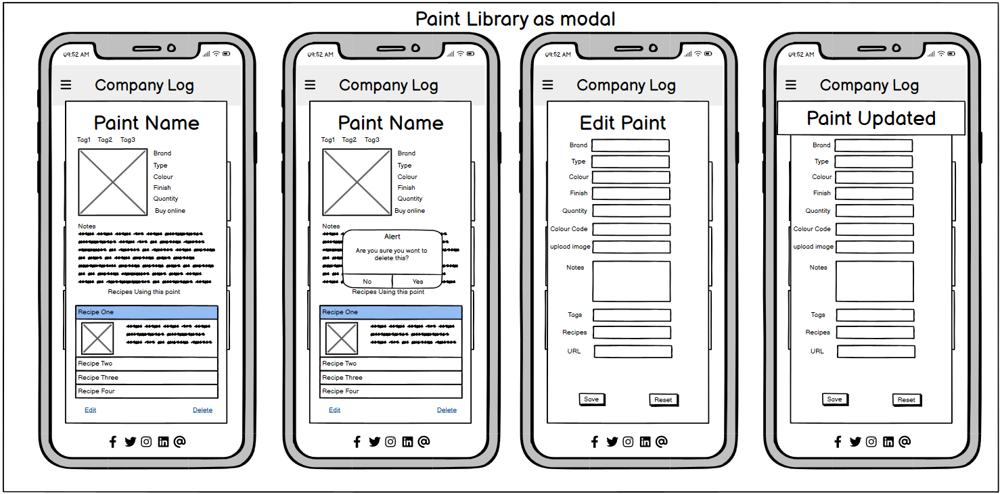

Desktop

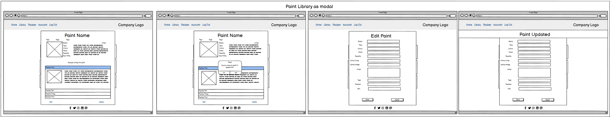

### Separate pages option for recipes

Much like with the paint library, I thought it would be worth while to mock up a couple of options for how the recipe items should look when accessed. Again, having these rendered as single pages allows for the most amount of room to be used for the content on smaller screens. In this case, the accordion is being used to show each stage of the paint recipe and will contain simple instructions and images. The images should be able to be expanded via modals or light boxes. Again, the images show deletion alerts, the edit screen and an update confirmation.  

Mobile

Desktop

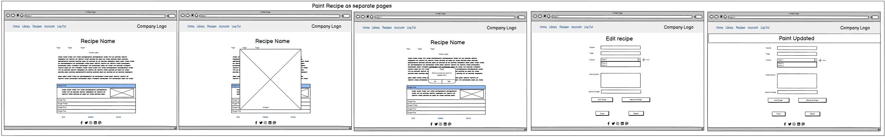

### Modal option for recipes

Much like with the paint library, I tested what this could look like containing the same data in a modal, which again may be more aesthetically pleasing but has other considerations which make it less ideal, including less space to work with, possible complexity of code, etc. 

Mobile

Desktop

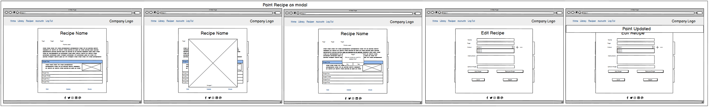

### Custom 404

The custom 404 functions as a way of handling users who may end up in places that they shouldn't when accessing the site. This features the same core layout that features throughout the rest of the site and allows the user to navigate back to the home page or use the menu to get to other locations. 

Mobile

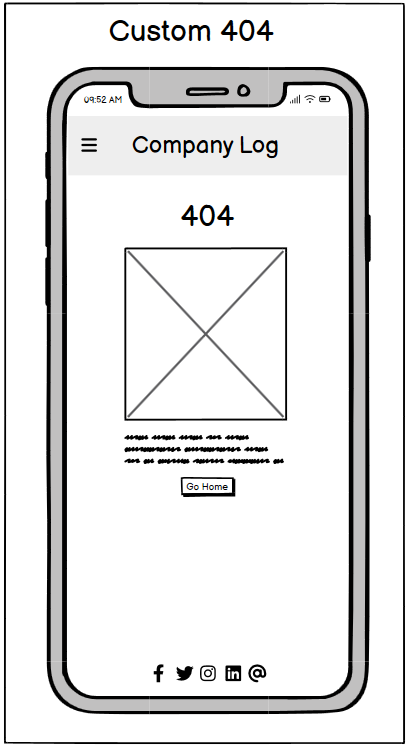

Desktop

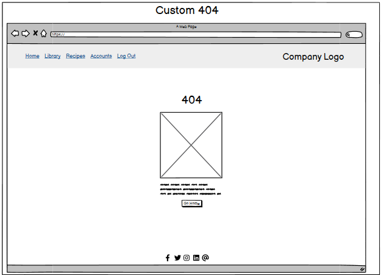

## ERD

3 Table ERD

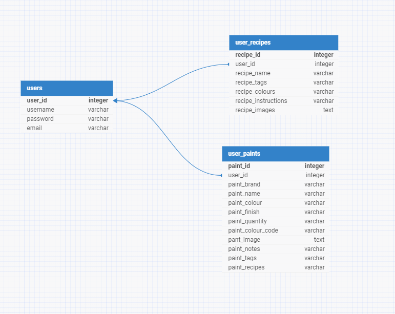

4 Table ERD

Final Table ERD

## Schema

I have a few possible options for this, depending on what is determined to be the best approach.

Option 1 - would consist of three tables: 
A user table where the user account information is stored, which would have hashed passwords etc which would have a one to many relationship with both the Paints and Recipes tables. 
A paints table where each users paint is stored, this would have a many to many relationship to Recipes. 
A recipes table, where each users paint recipes are stored. 

One issue with the above is that the Paints table could, over time become unwieldy, since the relationship being one to many implies theirs potential for paint duplication. I could make this many to many, but this could also introduce issues where users could add a paint for it to be then updated by another user, which may produce less than ideal outcomes. 

Option 2
Would be to allow the users to not only add their own paints, but to have a list of pre-existing paints that users can select from. Effectively giving me 4 tables. 
A user table which would have two one to many relationships with the user_paints and recipes tables. 
A default_paints table which would store a predetermined 'stock' list of paints which the users could pick from. 
A user_paints table where the users paints would be stored. This could store either references to the default_paints table, or have the data from that table copied to itself. Assuming we're referencing paints, this would need a many to one relationship to the default_paints table. 
A recipes table which contains the users recipes, which would have a many to many relationship with the user_paints table. 

Of the two options, I think the 4 table solution offers the most performant options with the least amount of repetition of data. 

Current version. 
Due to the relative complexity of the initial project plan, I have scaled back a little to focus on just the paint recipes section, since this requires 6 or 7 tables to get working how I would like it to. 

- user
This is the table where all the user data will be stored, such as username, password, email etc. 
  user_id - an auto incrementing field, which stores the tables primary key. 
  email - a text field, used for storing each users email address to allow for login and password reset functionality.
  username - a text field where the user could store their username which would be used to display personalised messaging as well as allow for login. 
  password - a text field for the users password. 

- recipes
This is where the users recipes will be stored. It will have a foreign key for the users table, to allow for a one to many relationship to the users table so each user may create many recipes. 
  recipe_Id - an auto incrementing field which stores the tables primary key. 
  user_id - the foreign key used for the one to many relationship to the users table. 
  recipe_name - a text field for storing the name of each recipe, eg 'Space Marine Captain', 'Dark Eldar Reavers' etc. 
  recipe_desc - a text field used to store a description of the recipe, where the user can describe what the recipe is for and any paints used in it. 

- recipe_stages
This table is for the each specific stage of the recipe. A recipe should consist of at least one stage and be able to extend as far as is needed to meet the users requirements. This has a one to many relationship with the recipes table. 
  stage_id - an auto incrementing field, which stores the tables primary key. 
  recipe_id - the foreign key to link to the recipes table for the one to many relationship since each recipe will have one or more stages.  
  stage_num - a numerical value the user can enter to delineate the order of stages. Eg stage 1, stage 2 etc. 
  instructions - text based instructions for each stage of the recipe. Eg - 'Apply a base coat of Dark Angels Green'
  is_final_stage - a boolean value where, when adding stages to the recipe, the user is able to confirm if the stage they are adding is the last stage of the recipe, which then flags any assigned image to this stage to be usable in the thumbnail for the recipe and the recipes description - effectively showing the finished product. 

- recipe_images
This table is used to store images for each stage of the recipe, ideally a placeholder image should be stored here if the user opts to not upload an image of their own. It has a one to many relationship to the recipe_stages table, allowing each stage to have multiple images if needed. 
  image_id - an auto incrementing field, which stores the tables primary key. 
  stage_id - the foreign key used to link to the recipe stages table for the one to many relationship, since each stage could have multiple images. 
  image_url - the URL string of the uploaded image, automatically inserted when the user uploads an image. 
  alt_text - a text string for the image alt text to ensure basic accessibility standards are met. 

- entity_tags   
This table isn't directly updatable by the user, instead its used to allow for a many to many relationship between the recipes table and the recipe_tags table. 
  recipe_id - a foreign key, linking to the recipes table. 
  tag_id - a foreign key linking to the tags table. 
  entity_type - this isn't used in the MVP release, which features just the users recipes - in the final version this will be auto filled with the entity that the tag relates to, eg 'paint', 'recipe', 'miniature' and so on. 

- recipe_tags
This table exists purely to store the tags that each user adds. Since it has a many to many relationship thanks to the recipe_tags table, each user can use any tag that is added in any recipe they may create, which should help limit potential data duplication as more users join the service. 
  tag_id - an auto incrementing field, which stores the tables primary key. 
  tag_name - a text field where the tag name will be stored. 

While i have larger plans around the ability to catalogue paints owned by a user and link them to their recipes, their is a chance due to time constraints that this may not make into an MVP release, as such the above schema is designed with a degree of adaptability in mind, allowing me to add in additional tables to handle other data, either via many to many relationships or one to many relationships.   
# Security and best Practices

# Features

# Bugs and Issues

# Technology

## Frameworks and Programs

- [ERD DB Designer](https://erd.dbdesigner.net/)

  - Used to help with ERD diagrams and understanding the DB relationships

- [Balsamiq](https://balsamiq.com/)

  - Wire-framing program.

- [VSCode](https://code.visualstudio.com/)

  - IDE of choice.  

- [Git](https://github.com/)

  - Used for version control, storage and deployment.  

# Testing and Validation

# Version control and Deployment

# Credits
