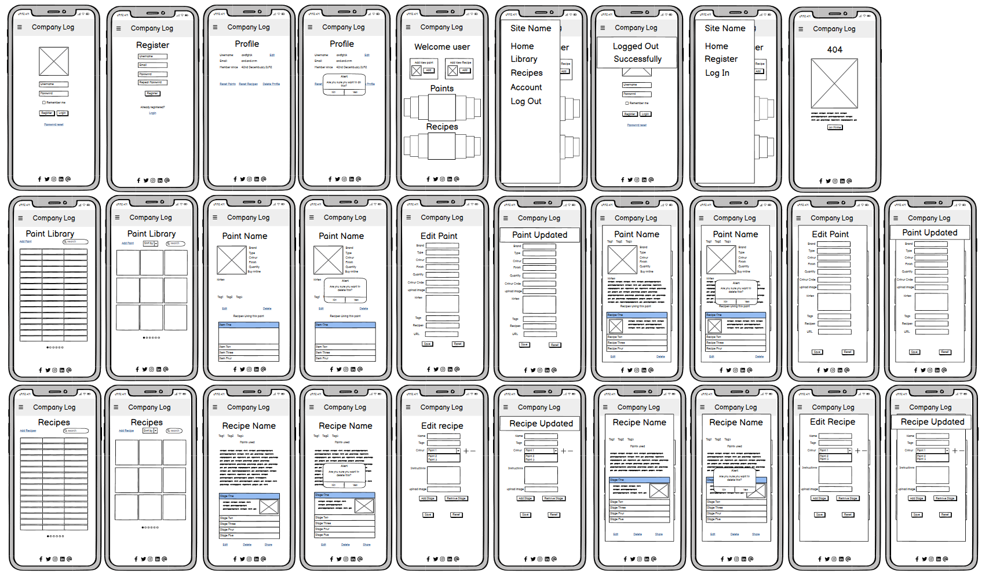

# **Colour Forge**

A paint catalogue and recipe book for miniature painters

# Contents

- [User Experience](#user-experience)

  - [Site Owner Goals](#site-owner-goals)
  - [A Visitors Goals](#visitor-goals)

- [User Stories](#user-stories)

  - [Account Registration and Authentication](#account-registration-and-authentication)
  - [Paint Collection Management](#paint-collection-management)
  - [Recipe Creation and Management](#recipe-creation-and-management)
  - [Viewing and Searching](#viewing-and-searching)    
  - [User Experience and Visuals](#user-experience-and-visuals)    
  - [Security and Error Handling](#security-and-error-handling)    
  - [Data Management](#data-management)    
  - [Administration](#administration)    
  - [Social Features](#social-features)    

- [Design](#design)

  - [Wireframes](#wireframes)
  - [Entity Relationship Diagram](#erd)
  - [Schema](#schema)

- [Security and best Practices](#security-and-best-practices)  

- [Features](#features)

- [Bugs and Issues](#bugs-and-issues)

- [Technology](#technology)

- [Testing](#testing-and-validation)

- [Version Control and Deployment](#version-control-and-deployment)

- [Credits](#credits)
  

# User Experience

## Site Owner goals

To store user data securely, particularly things like login credentials, using best practices like password hashes and other forms of encryption.

Ensure that the app is accessible and responsive over all devices, providing a mobile friendly design. 

Enable data management allowing users to add, edit and delete from their collections of paints and recipes. 

For the user interface to be simple and easy to use, allowing users to create and store recipes or add to their paint collection. 

To promote sharing and creativity by allowing users to document and share their painting methods with others. 

## Visitor Goals
Easily organise and track my paint collection, ensuring I know what I have available and what I may need to replace. 

Create and store paint recipes, so that I can replicate colour schemes and methods over the life of a painting project. 

To have a clean, user friendly interface to allow me to manage my paints and recipes without confusion. 

To be able to access my collection and recipes from any device so I can use the app while working on miniatures or while out shipping for paints. 

To quickly search and filters paints or recipes to find specific entries based on things like colour, type of paint or project. 

For my data to be securely stored so that I have no concerns about losing my recipes or any personal information that may be stored. 

To be able to easily share recipes with friends. 

# User Stories
## Account registration and authentication
- 1. As a user, I want to be able to register for an account so that I may save my paint collection and recipes. 
- 2. As a user, I want to log in securely to access my data. 
- 3. As a user, I want to be able to reset my password if I forget it
- 4. As a user, I want to be able to change my account details

## Paint Collection Management
- 1. As a user, I would like to be able to add new paints to my collection by entering details of the paint. 
- 2. As a user, I want to be able to edit details of any paints in my collection, such as quantity, if I need to replace it and so on. 
- 3. As a user, I would like to be able to delete paints that I no longer have or use. 
- 4. As a user, I want to be able to search and filter my paint collection. 
- 5. As a user, I would like to be able to add paints to my library from an existing list. 

## Recipe creation and Management. 
- 1. As a user, I would like to be able to create new recipes using paints from my Library. 
- 2. As a user, I want to add detailed step by step instructions to my recipes. 
- 3. As a user, I would like to upload images to help see how each stage of the recipe looks. 
- 4. As a user, I want to be able to add tags or other identifiers to recipes to help me organise them. 
- 5. As a user, I would like to be able to edit my recipes as I improve them or need to change paints used. 
- 6. As a user, I would like to be able to delete recipes that are no longer of use to me. 

## Viewing and Searching
- 1. As a user, I want to be able to search my library and recipes using keywords. 
- 2. As a user, I want to be able to see all recipes that may use a particular paint from my library. 

## User Experience and Visuals
- 1. As a user, I want the application to be clean and easy to navigate. 
- 2. As a user, I would like the application to be fully responsive so that it can be easily used regardless of the device I access it from. 

## Security and error handling. 
- 1. As a user, I want my password to be stored securely to protect my account. 
- 2. As a user, I would like that only I am able to modify or edit my library or recipes. 
- 3. As a user, I want to receive visual feedback or confirmation when I edit or delete a paint or recipe. 
- 4. As a user, I would like to be alerted when I try and submit an incomplete form, with an indication of what data may be missing.

## Data Management
- 1. As a user, I would like to be able to import my paint collection for faster entry. 
- 2. As a user, I would like to be able to export my collection and recipes so that I know i have a back up. 
- 3. As a user, I would like to be able to reset my library, recipes or both to allow me to start over if needed. 

## Administration
- 1. As an admin, I want to be able to manage user accounts, including editing and deletion. 

## Social features
- 1. As a user I would like to be able to have a link for my recipes so that I can share them with other users. 

## Site Visitor

# Design

## Wireframes:

Wireframes were created with Balsamiq software to provide rough mock-ups for layout.

Mobile Wireframes

## ERD

3 Table ERD

4 Table ERD

## Schema

I have a few possible options for this, depending on what is determined to be the best approach.

Option 1 - would consist of three tables: 
A user table where the user account information is stored, which would have hashed passwords etc which would have a one to many relationship with both the Paints and Recipes tables. 
A paints table where each users paint is stored, this would have a many to many relationship to Recipes. 
A recipes table, where each users paint recipes are stored. 

One issue with the above is that the Paints table could, over time become unwieldy, since the relationship being one to many implies theirs potential for paint duplication. I could make this many to many, but this could also introduce issues where users could add a paint for it to be then updated by another user, which may produce less than ideal outcomes. 

Option 2
Would be to allow the users to not only add their own paints, but to have a list of pre-existing paints that users can select from. Effectively giving me 4 tables. 
A user table which would have two one to many relationships with the user_paints and recipes tables. 
A default_paints table which would store a predetermined 'stock' list of paints which the users could pick from. 
A user_paints table where the users paints would be stored. This could store either references to the default_paints table, or have the data from that table copied to itself. Assuming we're referencing paints, this would need a many to one relationship to the default_paints table. 
A recipes table which contains the users recipes, which would have a many to many relationship with the user_paints table. 

Of the two options, I think the 4 table solution offers the most performant options with the least amount of repetition of data. 

# Security and best Practices

# Features

# Bugs and Issues

# Technology

## Frameworks and Programs

- [ERD DB Designer](https://erd.dbdesigner.net/designer/schema/1726781528-4-table-erd)

  - Used to help with ERD diagrams and understanding the DB relationships

- [Balsamiq](https://balsamiq.com/)

  - Wire-framing program.

- [VSCode](https://code.visualstudio.com/)

  - IDE of choice.  

- [Git](https://github.com/)

  - Used for version control, storage and deployment.  

# Testing and Validation

# Version control and Deployment

# Credits
