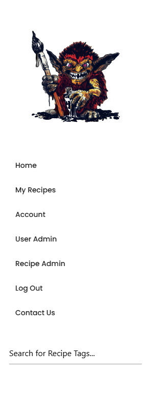

# **Colour Forge**

A paint library and painting recipe book for miniature painters. 

[The deployed website can be found here](https://colourforge.co.uk)


# Contents

[Site Concept](#site-concept)

  - [Site Owner Goals](#site-owner-goals)
  - [A Visitors Goals](#visitor-goals)

[User Stories](#user-stories)

  - [Account Registration and Authentication](#account-registration-and-authentication)
  - [Paint Collection Management](#paint-collection-management)
  - [Recipe Creation and Management](#recipe-creation-and-management)
  - [Viewing and Searching](#viewing-and-searching)    
  - [User Experience and Visuals](#user-experience-and-visuals)    
  - [Security and Error Handling](#security-and-error-handling)    
  - [Data Management](#data-management)    
  - [Administration](#administration)    
  - [Social Features](#social-features)   

[Scope](#scope) 

[Design](#design)

  - [Wireframes](#wireframes)
  - [Schema](#schema)
  - [UX](#ux)
  - [Colour Palette](#colour-palette)
  - [Typography](#typography)
  - [Images](#images)
  - [Icons](#icons)
  - [Features](#features)

[Code Design](#code-design)

[Future Features](#future-features)

[Security, Defensive Programming and best Practices](#security-defensive-programming-and-best-practices)  

[Technology](#technology)
  - [Frameworks and Programs](#frameworks-and-programs)

[Testing](#testing-and-validation)

 [Version Control and Deployment](#version-control-and-deployment)

  - [Repository Creation](#repo-creation)
  - [Cloning Locally](#cloning-locally)
  - [Adding and Updating Files on the Repo](#adding-and-updating-files-on-the-repo) 
  - [Working on Multiple Devices](#working-on-multiple-devices)
  - [Local Deployment](#local-deployment)
  - [PostGres DB Creation](#postgres-db-creation)
  - [Heroku Setup and Configuration](#heroku-set-up-and-configuration)

[Credits](#credits)

[Acknowledgements](#acknowledgements)


# Site Concept
Colour Forge is an online paint catalogue and recipe-tracking tool for miniature painters. It’s designed to help hobbyists organise their paint collections, allowing them to check what they have and avoid purchasing duplicate paints while shopping. The tool also allows users to create "recipes" (detailed guides on how to paint specific colours or miniatures) ensuring consistency and repeatability across multiple models.

This is a project that I've been contemplating for several years, which has caused some feature creep to occur, as well as the initial scope to be quite ambitious for an MVP project. Because of this, I had to scale back some planned functionality to focus on creating a working version for submission. 

A common issue for hobbyists like myself is keeping track of our paint collections to know what we need when we're at a hobby store, as well as remembering specific techniques for miniatures in a project that we've not worked on for a while.

This project aims to mitigate some of those issues by providing an accessible online resource for hobbyists. As such, the project’s goals and user stories reflect a more expansive project. Using MoSCoW prioritisation, I was able to shift features in and out of the MVP scope based on their priority and required effort—something I know is often necessary for development teams working on real-world applications.

To manage and prioritise tasks I created and used a Kanban board to help track specific parts of the project from conception to completion, which I used in conjunction with my MoSCoW board to help with planning and prioritisation. 

[My MoSCoW board can be found here](https://github.com/users/monkphin/projects/3/views/1)

[My Kanban board can be found here](https://github.com/users/monkphin/projects/1)


## Site Owner goals

- To store user data securely, particularly things like login credentials, using best practices like password hashes and other forms of encryption.
- Ensure that the app is accessible and responsive over all devices, providing a mobile-friendly design. 
- Enable data management allowing users to add, edit and delete from their collections of paints and recipes. 
- For the user interface to be simple and easy to use, allowing users to create and store recipes or add to their paint collection. 
- To promote sharing and creativity by allowing users to document and share their painting methods with others. 

## Visitor Goals
- Easily organise and track my paint collection, ensuring I know what I have available and what I may need to replace. 
- Create and store paint recipes, so that I can replicate colour schemes and methods over the life of a painting project. 
- To have a clean, user-friendly interface to allow me to manage my paints and recipes without confusion. 
- To be able to access my collection and recipes from any device so I can use the app while working on miniatures or while out shopping for paints. 
- To quickly search and filter paints or recipes to find specific entries based on things like colour, type of paint or project. 
- For my data to be securely stored so that I have no concerns about losing my recipes or any personal information that may be stored. 
- To be able to easily share recipes with friends. 

# User Stories
## Account registration and authentication
- 1. As a user, I want to be able to register for an account so that I may save my paint collection and recipes. 
- 2. As a user, I want to log in securely to access my data. 
- 3. As a user, I want to be able to reset my password if I forget it
- 4. As a user, I want to be able to change my account details

## Paint Collection Management
- 5. As a user, I would like to be able to add new paints to my collection by entering details of the paint. 
- 6. As a user, I want to be able to edit details of any paints in my collection, such as quantity, if I need to replace it and so on. 
- 7. As a user, I would like to be able to delete paints that I no longer have or use. 
- 8. As a user, I want to be able to search and filter my paint collection. 
- 9. As a user, I would like to be able to add paints to my library from an existing list. 

## Recipe creation and Management. 
- 10. As a user, I would like to be able to create new recipes using paints from my Library. 
- 11. As a user, I want to add detailed step-by-step instructions to my recipes. 
- 12. As a user, I would like to upload images to help see how each stage of the recipe looks. 
- 13. As a user, I want to be able to add tags or other identifiers to recipes to help me organise them. 
- 14. As a user, I would like to be able to edit my recipes as I improve them or need to change paints used. 
- 15. As a user, I would like to be able to delete recipes that are no longer of use to me. 

## Viewing and Searching
- 16. As a user, I want to be able to search my library and recipes using keywords. 
- 17. As a user, I want to be able to see all recipes that may use a particular paint from my library. 

## User Experience and Visuals
- 18. As a user, I want the application to be clean and easy to navigate. 
- 19. As a user, I would like the application to be fully responsive so that it can be easily used regardless of the device I access it from. 

## Security and error handling. 
- 20. As a user, I want my password to be stored securely to protect my account. 
- 21. As a user, I would like that only I can modify or edit my library or recipes. 
- 22. As a user, I want to receive visual feedback or confirmation when I edit or delete a paint or recipe. 
- 23. As a user, I would like to be alerted when I try to submit an incomplete form, with an indication of what data may be missing.

## Data Management
- 24. As a user, I would like to be able to import my paint collection for faster entry. 
- 25. As a user, I would like to be able to export my collection and recipes so that I know I have a backup. 

## Administration
- 26. As an admin, I want to be able to manage user accounts, including editing and deletion. 

## Social features
- 27. As a user, I would like to be able to have a link for my recipes so that I can share them with other users. 

# Scope
- Something that was highlighted from meetings with my mentor was that the initial concept I had may have been a little ambitious for the time frames given and the amount of work needed, so it was suggested that I scale back and add in features later as time is available, focusing on a core MVP to begin with. We decided that the MVP would centre around Paint Recipes, as this allowed for the implementation of multiple one-to-many relationships and a many-to-many relationship for Recipe Tags. It also helped to create a core focus around a common need amongst miniature painters: documenting their painting processes to remember specific techniques when revisiting projects after a break, as well as sharing these recipes with others. Since recipes are visible to non-logged-in users, we also decided to display all user recipes on the homepage, adding a social aspect that aligns with my long-term goals for the site.

- After implementing basic CRUD functionality for paint recipes, I chose to focus on user and site administration. While a paint library is useful, I felt it was secondary to providing the site owner with tools to assist users with account or recipe issues or to moderate recipes and remove users if necessary. This provides some essential enhancements to the social aspect of the site in addition to providing a safety net for the site owner, allowing them to ensure that shared content is suitable for the site and avoids potential legal issues. This administration functionality is still basic, focused on modifying and deleting content, but the core functionality is in place.

# Design
- The initial design needed to factor in the two core uses of the site, collating, cataloguing and editing a library of paints as well as creating, editing and sharing paint recipes. It also needs to support the ability to sign up for an account. Additional functionality would include some form of social sharing of recipes, either directly on the site, or indirectly via sharing links to other users or users who do not have an account yet, which should help to drive adoption as users share their recipes directly from the site.

- It needs to support all of the above while still being simple and easy to use, as well as fully responsive with an interface that allows users to read through and emulate paint recipes, ideally with images to support each stage to show the desired results of the specific section of the instructions being worked on. Recipes should be presented in a simple, non-distracting manner which allows the hobbyist to focus on the specific stage they're working on, while still letting them check the stage before and after the current one if needed.

# Wireframes:

Wireframes were created with Balsamiq software to provide rough mock-ups for layout.

### Homepage
The home page currently shows either a login page or a specific landing page, where users can add paints or recipes to their account, as well as showing a carousel of their library and recipes depending on if they're logged in when accessing the page or not.

<details>
<summary>Mobile</summary>

</details>

<details>
<summary>Desktop</summary>

</details>
<br>

### Side Menu

The side menu is specific to the mobile experience and will show either login/registration options for non-logged-in users, or more typical site navigation options for logged-in users.

<details>
<summary>Mobile</summary>

</details>
<br>

### Registration Page

The registration page is accessible both from the home page and the sidebar when the user is not logged in. It allows a user to register for an account.

<details>
<summary>Mobile</summary>

</details>

<details>
<summary>Desktop</summary>

</details>
<br>

### Profile Pages

The profile page will allow the user to manage their profile as needed, requesting password resets, changing their username or email address and granting them the ability to reset their library or recipes and delete their account entirely.

<details>
<summary>Mobile</summary>

</details>

<details>
<summary>Desktop</summary>

</details>
<br>

### Paint Library and Recipe Pages

I had a couple of ideas for how to present the items for both the library and recipe lists - the most obvious one is a list of items for each. This could either be infinitely scrolling or use pagination to handle longer lists.

 - The alternative to the list to show the user their library or recipes was to use cards, allowing for a slightly cleaner and more mobile-friendly look, due to the cards presenting a larger interaction surface than a list would. Again much like the lists this could either infinitely scroll or allow for pagination for large library/recipe collection handling. Ultimately, this was the option I chose, since I felt it best presented the data in a more visually appealing and rich manner. 

<details>
<summary>Mobile</summary>


</details>
<details>
<summary>Desktop</summary>


</details>
<br>


### Single Paint and Recipe pages. 
I had a couple of ideas for how to handle showing the individual paints for the library, one was to simply have each paint as its own page, this provides the maximum amount of room on smaller devices to show information. It may also be easier to handle in terms of building. The accordion at the bottom of the page will show some simple details about each recipe mentioned and will function as another path to get to the specific recipe in question. The wireframes also show what it should look like when deleting, editing and successfully editing the page. If I choose to use a 4-table DB, when entering a paint name it would be useful if this started to auto-complete based on the data in the stock list, when selected could autofill all the other fields, which the user could then edit and manipulate as needed before saving.

 - The other option, which I think is more visually pleasing, but potentially more limiting in terms of space would be to use some form of modal when selecting the paint. The wireframes also show what it should look like when deleting, editing and successfully editing the page.

 - Much like with the paint library, I thought it would be worthwhile to mock up a couple of options for how the recipe items should look when accessed. Again, having these rendered as single pages allows for the most amount of room to be used for the content on smaller screens. In this case, the accordion is being used to show each stage of the paint recipe and will contain simple instructions and images. The images should be able to be expanded via modals or light boxes. Again, the images show deletion alerts, the edit screen and an update confirmation.

 - I also tested what the recipe pages could look like containing the same data in a modal, which again may be more aesthetically pleasing but has other considerations which make it less ideal, including less space to work with, possible complexity of code, etc.

 - In both cases, I opted for single pages, rather than modals, this gave the content more room to breathe on smaller screens and allowed the use of modal pop-ups to show larger images for each recipe stage, as well as have a button to take the user directly to the full resolution version of the image in a new tab. 

<details>
<summary>Mobile</summary>


</details>

<details>
<summary>Desktop</summary>


</details>
<br>

### Custom 404

 The custom 404 functions as a way of handling users who may end up in places that they shouldn't when accessing the site. This features the same core layout that features throughout the rest of the site and allows the user to navigate back to the home page or use the menu to get to other locations.

 - In addition, I also added a custom 500, which was styled in much the same way. 

<details>
<summary>Mobile</summary>

</details>

<details>
<summary>Desktop</summary>

</details>
<br>

### Feature Creep
Due to feature creep, I added in a few additional pages that were thought to be beyond the scope, or not factored into the initial planning; such as the admin pages or the contact page. In cases where this occurred, I was able to fall back on existing wireframes and choices made around them to quickly get them looking like they were a cohesive part of the website without adding too much additional overhead or work such as needing to mock up new wireframes to ensure they fit the core design of the site. 


## Schema
I knew from the start that this would likely benefit more from a relational database, so choosing to use PostGresQL was a near-automatic choice. 
Initially, I had a few ideas for this but didn't fully take into account how the data would need to be handled within the database to ensure it was easily modifiable and manipulatable, as well as supporting the one-to-many and many-to-many relationships that I was going to need to take advantage of for the data being used.

 - These early attempts can be seen in the two below screenshots. 

<details>
<summary>Initial Concept ERDs</summary>


</details>

After talking my idea over with my mentor, it very quickly became apparent the two DB’s I’d mocked up were not going to be fit for purpose. As such, I redesigned the table to get something closely resembling what is in place currently, which can be found in the below screenshot. 

<details>
<summary>Final ERD</summary>

</details>

Due to the relative complexity of the initial project plan, I have scaled back a little to focus on just the paint recipes section, since this requires 6 tables to get working how I would like it to.

 - While working on the project, and adding in additional features such as administration rights, it was obvious that some of the tables would need some tweaks added over the original design, such as the ability for a user to be flagged as having administration privilege or adjusting the image table to take advantage of functionality I wasn't aware that Cloudinary offered. 

Below is the schema as it stands currently, along with an ERD diagram to demonstrate the tables and relationships. 

<details>
<summary>Updated ERD</summary>

</details>

### users 
This is the table where all the user data will be stored, such as username, password, email etc.

 - id - an auto-incrementing field, which stores the table's primary key to allow each user to be uniquely identified. 
 - email - a text field, used for storing each user's email address to allow for login and password reset functionality.
 - username - a text field where the user could store their username which would be used to display personalised messaging as well as allow for login.
 - password - a text field for the user’s password, which is stored in a hashed format to keep credentials secure.
 - is_admin - a Boolean field which is used to track if a user should have access to the admin features or not. 

### recipes
This is where the user's recipes will be stored. It will have a foreign key for the users table, to allow for a one-to-many relationship to the user's table so each user may create many recipes.

 - recipe_Id - an auto-incrementing field which stores the table's primary key.
 - user_id - the foreign key used for the one-to-many relationship to the users table.
 - recipe_name - a text field for storing the name of each recipe, e.g. 'Space Marine Captain', 'Dark Eldar Reavers', ‘Supermarine Spitfire’ etc.
 - recipe_desc - a text field used to store a description of the recipe, where the user can describe what the recipe is for and any paints used in it.

### recipe_stages
This table is for each specific stage of the recipe. A recipe should consist of at least one stage and be able to extend as far as is needed to meet the user's requirements. This has a one-to-many relationship with the recipes table.

 - stage_id - an auto-incrementing field, which stores the table's primary key.
 - recipe_id - the foreign key to link to the recipes table for the one-to-many relationship since each recipe will have one or more stages.
 - stage_num - a numerical value the user can enter to delineate the order of stages. Eg stage 1, stage 2 etc.
 - instructions - text-based instructions for each stage of the recipe. Eg - 'Apply a base coat of Dark Angels Green'
 - is_final_stage - a boolean value which is programmatically set by the website so the last stage added automatically is flagged as being the final stage and any image assigned to this stage becomes the recipe thumbnail on the website. 

### recipe_images
This table is used to store images for each stage of the recipe, ideally, a placeholder image should be stored here if the user opts to not upload an image of their own. It has a one-to-many relationship to the recipe_stages table, allowing each stage to have multiple images if needed.

 - image_id - an auto-incrementing field, which stores the table's primary key.
 - stage_id - the foreign key used to link to the recipe_stages table for the one-to-many relationship, since each stage could have multiple images.
 - image_url - the URL string of the uploaded image, automatically inserted when the user uploads an image.
 - thumbnail_url - the URL of the thumbnail generated when adding an image to Cloudinary.  
 - alt_text - a text string for the image alt text to ensure basic accessibility standards are met.
 - public_id - a text string, which was added later after I realised this would be an efficient way of handling image deletion to stop wasting space on Cloudinary

### entity_tags  
This table isn't directly editable by the user, instead it's used to allow for a many-to-many relationship between the recipes table and the recipe_tags table.

 - recipe_id - a foreign key, linking to the recipes table.
 - tag_id - a foreign key linking to the recipe_tags table.
 - entity_type - Although unused in the MVP release (which includes only recipes), this field is designed to identify the type of entity associated with each tag (e.g., "paint," "recipe," "miniature"). This will prevent recipe tags from appearing in the context of paints, for example. Including this field now allows for easier integration of the paint library functionality in the future, avoiding the need to modify or reassign existing tags.


### recipe_tags
This table exists purely to store the tags that each user adds. Since it has a many-to-many relationship thanks to the recipe_tags table, each user can use any tag that is added in any recipe they may create, which should help limit potential data duplication as more users join the service.

 - tag_id - an auto-incrementing field, which stores the table's primary key.
 - tag_name - a text field where the tag name will be stored.

While I have larger plans around the ability to catalogue paints owned by a user and link them to their recipes, there was a high chance due to time constraints that this would not make it into an MVP release, as such the above schema was designed with a degree of adaptability in mind, allowing me to add in additional tables to handle other data, either via many to many relationships or one to many relationships.  

# UX
- When a user first visits the site, they land on the home page which changes based on their login status. Non-logged-in users will see a carousel which features some of the site member's recipes, which they can browse to explore some of what the site has to offer They’re invited from both the nav bar and a button on the home page to either login or register and have a small bit of text which functions as a call to action to encourage them to register. 

- Once logged in the homepage displays a paginated list of user-contributed recipes. This is filtered to only show the current user's auto auto-created demo recipe to prevent the possibility of confusion that seeing multiple user's demo recipes could cause. The recipes are shown in a responsive card layout (3x2, 2x3 or 1x6, depending on screen size.) Each recipe card includes a thumbnail, title and creator - the thumbnail and title are both links to access the recipes page. Each card uses the Materialize ‘Card Reveal’ to show the recipe description. Recipes are freely viewable and fully shareable, allowing users to showcase their work elsewhere on the internet and potentially attract new users to the site when no registered users see them. The top of the page also includes a pair of cards, one to let the user create a new recipe from the home page, the other advertising the ability to add paint to a library, the button for this option is currently disabled due to the functionality not being implemented in the MVP release. 

 - The nav bar for logged-out users includes only the options to log in, register, view the About page, access the contact form and search the site's recipes via the recipes tags. After landing on the home page a new user may visit the About page to learn a little more about the site and what benefits it can offer. The contact form is publicly accessible to allow users to contact the admin in case of issues with their account as a self-serve password reset function is not yet implemented. Additionally keeping the form public allows none registered visitors to contact the admin with any questions they have before registration. 

 - For logged-in users the nav bar includes a ‘My Recipes’ section right after the home button, providing quick access to their recipe library. The My Recipes page displays the user's own recipes in the paginated list of up to 6 cards per page, which are arranged responsively based on device size. An 'Add Recipe' card is at the top of the page, ensuring that the ability to create new recipes is never more than a click or two away from wherever the user is on the site. 

 - The ‘Account’ page allows users to manage their account settings, including the ability to change their email address, password and delete their account. In all cases the user is required to enter their password, firstly to prevent accidental changes and secondly to safeguard against unauthorised edits if the page is left open.  

 - Additionally, there are Logout, Contact and Search options. Logout provides a user a way to safely log out. Contact functions the same as it does for non-logged-in users, presenting a simple contact form. The search button reveals a dropdown search bar to search for recipe tags, with search results rendering in the same card-based layout used so far.  

 - For admin accounts, there is an additional hidden menu, displaying a drop-down on larger screens and a list in the slide-out menu when on smaller screens. This menu allows admins to manage users and their recipes, giving them the ability to quickly fix account issues or remove problematic content. Both these pages use the same familiar card layout, with the user admin view resembling the Account page, displaying each user’s details in individual cards.

 - When adding a recipe, users see a simple form with a few required fields, including recipe name, description, and stage instructions. The Image and Image Description fields are optional, with the latter used for alt text. At the bottom are three buttons: "Add Stage," "Remove Stage," and "Add Recipe." The Add/Remove buttons let users add or delete stages, with deletion limited to stage 2 or higher to ensure the instructions field is always filled, tool tips exist on the disabled button to explain this. Removing a stage clears its contents since data isn’t saved until the “Add Recipe” button is clicked, storing the recipe in the database.

 - The Edit Recipe page is similar to the Add Recipe page, with a few key differences. Since the recipe exists in the database and the image is already on Cloudinary, the image and its description are displayed by default, replacing the "Add Image" and "Image Description" fields. There’s also a "Delete Image" button, which removes the image and brings back the "Add Image" and "Add Description" buttons, along with a cancel option, allowing users to revert to the existing image if they change their mind.

 - Additional features enhance the site’s UX, including modals for viewing larger recipe images and defensive modals to confirm actions like recipe deletion. Account deletion modals include a password field, with the delete button disabled until the text is entered. Admin-specific modals provide reminders when editing another user’s content and require password confirmation before proceeding. Users receive email notifications for account-level changes and flashed alert messages provide feedback on action success or failure, with tips for resolving issues like missing passwords. These elements create a user-friendly experience by providing feedback, reassurance, and protection against accidental actions.

# Colour Palette
 - The colour palette was chosen later in development, initially based on Materialize stock colours. These were darkened to improve contrast, especially for text readability, while keeping the colours simple and unobtrusive. 
 - A deep red is used for the top menu and footer, with darker shades for highlighted options, this same deep red is used when hovering over text links. 
 - Button colours align with their functions: blues and greens for "positive" or "neutral" actions like adding recipes and navigation, and reds for "negative" actions like deletion. This approach leverages familiar colour associations—green for go, red for stop—to enhance user experience.


# Typography
 - Like the colour palette, fonts were chosen later in development, as the initial focus was on core CRUD functionality. Three Google Fonts were selected to provide visual distinction between text, headings, and the nav bar. Each font is clean and sans-serif, ensuring readability across various devices and user types, including those in the neurodiverse community.


# Images
 - Local images are minimal, with most images provided by users. The only "static" images hosted on the site are the logo and images for the Add Paint and Add Recipe cards. All other images are hosted on Cloudinary, mainly user-generated, with three exceptions for the "demo recipe" created for new users: black-and-white and full-colour versions of the logo, and a single painted miniature image. Credits for these images are listed in the README.

 - The site logo, generously donated by a friend familiar with the project, is a nod to classic Citadel paint set character art from the ’90s and early ’00s, a design fondly remembered by many in the community.

# Icons
 - Icons on the site are provided by Font Awesome and are used for various features, including social links in the footer and icons that illustrate functionality on collapsible sections and drawers within recipe cards.

# Features
All of the features below have been designed with a mobile-first approach and are fully responsive, utilising a combination of custom CSS and the Materialize grid system to ensure the site adjusts and adapts to varying screen resolutions and device sizes.

 ## Navbar
<details>
<summary>Navbar</summary>


</details>

 The navbar is designed to be user-friendly and adapt to both mobile and desktop formats, On smaller screens the menu condenses into a hamburger menu, which users can tap to reveal a slide-out screen to show navigation links. It dynamically adjusts the links and options that are visible to a user based on whether they're logged in or not. This allows new users to not be too overwhelmed by options when they first access the site and be able to look around a little before deciding to join. 

 - Site Name: Functions as a link to the home page.
 - Responsive Navigation:
   - Desktop View:
     - Navigation options are displayed across the top of the site in a pinned navbar, which is always visible as the user scrolls. 
     - Specific features are available for logged-in users or administrators, including seeing the user's own recipes and access to administrative functionality. 
     - Navigation Options:
       - Not Logged In: Home, About, Login, Register, Contact Us, Search. 
       - Logged In: Home, My Recipes, Account, Logout, Contact Us, Search. 
       - Admins: All logged-in user functionality and access to admin panels. 
   - Mobile View: 
     - The top navigation menu is condensed to show only the site name and a hamburger menu. 
     - Tapping the hamburger menu reveals a slide-out navigation panel displaying the relevant options depending on the users logged in state and access levels. 
     - The slide out menu presents all options in a list format, removing the need for drop down menus. The list displays the site logo at the top.   

## Home Page
  ### Logged Out View
  The home page is typically going to be the first page a user encounters when accessing the site. If the user has not not signed in or is not registered they're shown a carousel which allows them to see a small selection of the sites users paint recipes. This feature helps new users understand what the site offers and provides encouragement to explore further. Additionally, the logged-out view displays prominent Login and register buttons, within the main content area, to ensure these are both easily accessible without requiring users to access the menu bar. 

  <details>
  <summary>Homepage Logged out</summary>
  
  
  </details>

  ### Logged In View
  When a user logs in, the homepage updates to display a set of Materialize cards. 
  The topmost two prominently show the Add Paints and Create Recipes functionality. Ensuring these are easily accessible to users. Currently, the Add Paints functionality has its button disabled, with text and a tool top to advice the feature is coming soon. 

  Additionally, the page showcases all paints submitted by the sites user base, with some basic filtering occurring to ensure that the auto-created 'Demo Recipe' that each account has added on sign-up is only visible if it belongs to the current user, this is to prevent potential confusion around the Demo Recipe. The page uses pagination to show just 6 recipes at a time to ensure the user doesn't get too overwhelmed. 

  <details>
  <summary>Home Page Logged In</summary>
  
  
  </details>

## About Page
The About page offers new visitors information about the site's core functions and features, highlighting the benefits for miniature painters who choose to sign up and use the service. It advertises the fact that any recipes on the site can be shared freely and be seen by anyone as well as suggesting some scenarios where the site could offer some useful functionality. 

<details>
<summary>About Page Logged out</summary>


</details>

## Login and Registration Pages
These pages are designed to be easy to use, offering a user a way to Register an account or Sign In to an existing one. On successful registration users are automatically logged in, streamlining the onboarding process and eliminating an additional step to log in. The login screen accepts both usernames and email addresses, offering flexibility and convenience to users by letting them use their preferred approach. 

  - Users are required to use passwords of at least 7 characters. The passwords are hashed prior to submission to the database and a tooltip is present on the registration form to outline requirements. 

  - Flashed messages are used to provide confirmation of success, failure and other information to users based on their actions. 


 - On registration a ‘Demo Recipe’ is added to the users account, created via the seed.py file. This demo recipe provides some basic information as to the core function of the recipes on the website and calls out features that may not be obvious at first glance. 

<br>
<details>
<summary>Login and Register Pages</summary>


</details>

## Contact Us Page
The Contact Us page features a simple contact form designed to allow users to easily contact the site's admins. To minimise spam the form is protected by Google's ReCaptcha service providing front-end security measures. The Contact Form is accessible and visible to both logged-out and logged-in users, providing a reliable method of receiving support or messaging the administrator for any reason. 

<br>
<details>
<summary>Contact Page</summary>


</details>

## My Recipes
Once a user has registered and logged into their account, they are able to access the My Recipes page. Similar to the logged-in view of the home page, it features an Add New Recipe card at the top of the page to provide users a second point to create and submit new paint recipes easily. 

 - Below this the page features a paginated view of the user's recipes, utilising the same cards rendered 6 at a time, which feature on the logged-in Home Page to ensure consistency and familiarity of experience to the users. 

<br>
<details>
<summary>My Recipes Page</summary>


</details>


 ## Account
 The Account Settings page enables the user to modify and update their account information. Currently, users can change their email address, update their password or delete their account. To ensure security and prevent unauthorised modifications any changes require users to enter their password to safeguard against accidental changes or unauthorised access from someone using the user's device unsupervised. 

  - Additionally, the Delete Account option incorporates a confirmation modal. This serves as an extra layer of protection against accidental deletions by prompting users to enter their passwords on the modal and ensuring that account deletion is intentional on the user's part. On confirmation, the user's account is permanently removed. 

<br>
<details>
<summary>User Deletion Modals</summary>


</details>
<br>
 Any changes the user makes to their account using this interface will trigger a flash message notifying them of the update. Additionally, an email notification available in both HTML and plaintext formats will be sent to advise of the changes This dual notification system serves as both a confirmation and a security measure, ensuring the user will always be aware of modifications to their account even if unauthorised changes occur. For email address updates notifications are sent to both the old and new address to keep the user fully informed. 

  - Further to this, the flash messaging system is used to alert the user to potential errors encountered when modifying their account, such as password mismatches or attempts to re-use their existing password. This immediate feedback assists users in understanding and resolving issues. 

<br>
<details>
<summary>Account Page</summary>


</details>

## Search
The final feature available to registered users on the navbar is the search box. To conserve space, the search functionality is integrated into a dropdown box, ensuring the navbar remains uncluttered. Users can search for recipes using recipe tags that may have been added to recipes and the results are rendered much like the user's My Recipes page or the Home Page, presenting the user with a list of cards based on the search results. The search query is also presented as the title of the page, to remind users of their specific search terms. This gives the user a quick way of searching for recipes that may be useful for the project they're working on. However, its effectiveness relies on consistent and accurate tagging of recipes by all users. 

<br>
<details>
<summary>Search</summary>



</details>

## Admin Panels
Access to the Admin Panel is restricted exclusively to users who have the 'is_admin' boolean field in the users table set to true. This administrative privilege allows authorised users to manage the site's user base and oversee the recipes submitted by community members. Administrators can perform a variety of tasks, including editing or deleting users' accounts, moderating recipe content and ensuring the overall integrity and quality of the platform. 

<br>
<details>
<summary>Admin Drop Down</summary>

</details>

### User Admin
The User Management page within the Admin Panel provides administrators with tools to oversee and manage all site users efficiently. This page features a list of all registered users accompanied by a search function, allowing admins to locate users by their username quickly.

 - Each user's account is displayed on an individual card, which mirrors the options, look and feel of the user's own Account page. Additionally, users also have the ability to toggle if a user is an admin or not, enabling the promotion and demotion of users to administrative roles without needing to resort to CLI operations to interface with the PostgreSQL DB. 

 - To ensure security and prevent accidental modification or unauthorised changes, all modifications that the admin can make require them to re-enter their passwords. Additionally, as an added layer of protection, administrators cannot demote or delete their own account while the is_admin status remains active to ensure that there is always at least one account active that can manage and support the site. 

- When an admin attempts to delete a user's account, a confirmation modal is triggered. This modal notifies the admin of the impending deletion and includes a password field to confirm the action, ensuring that the admin has thoroughly reviewed and understands the consequences before proceeding.

- Similar to the Account page, the User Management page utilises flash messages to provide immediate feedback on both successful and unsuccessful actions. These messages inform the admin of scenarios such as incorrect password entries or attempts to reuse an existing password. Additionally, any changes made to a user's account automatically generate an email notification to that user. This notification serves as a confirmation of the action taken, offering reassurance to users and ensuring transparency by informing them of any modifications to their accounts.

<br>
<details>
<summary>User Admin</summary>


</details>

### Recipe Admin
The Recipe Admin section provides administrators with a list of all the recipes on the site. The User Admin page also has a search box allowing the admin to search by recipe name. This again falls back on using the same, familiar card view that is prevalent throughout the website and allows the admin another method of accessing and administering the sites user’s recipes. 

 - While no action can be taken directly on this page, such as editing or deleting, it gives the admin a quick way to search for a user's recipes to investigate and correct issues that may have been raised to them. 

<br>
<details>
<summary>Recipe Admin</summary>


</details>
<br>
<details>
<summary>Admin Recipe Modals</summary>


</details>

## Recipe Page
One of the core functions of the site is its Recipe Pages, where users can read and view both their own and others' paint recipes. These pages are accessible to both logged-in, registered users and non-logged-in, non-registered visitors, allowing for the free sharing of recipes with the broader internet community. This openness aligns with the spirit of sharing painting methods and techniques to achieve specific results, which is present in the wider hobby community. Users can access a recipe page by clicking on the image or Recipe Name displayed on each recipe card. The Recipe Pages incorporate several Materialize components, including Chips, Modals, and Collapsibles, to enhance interactivity and user experience.

 - Chips are used to display the tags associated with each recipe, providing users with a clear understanding of the recipe's focus and categorization. Currently, these tags are primarily used for searching, enabling users to filter and locate recipes based on specific criteria. However, future iterations may expand the functionality of Chips, as detailed in the [Future Improvements](#future_improvements) section further into the ReadMe. 

<br>
<details>
<summary>Materialize Chips</summary>

</details>
<br>

 - When creating recipes, certain assumptions guide the presentation of images. Typically, each image represents the completion of a specific stage in creating an effect on a mini. For example the first stage usually involves applying an undercoat or the initial layer of paint, while the final stage showcases the completed effect after all painting steps are finished. Consequently, the recipe's image displayed on both the recipe card and at the top of the page is programmatically set to the image from the last stage of the recipe. This approach ensures that the displayed image accurately reflects the final appearance of the recipe, adhering to the common practices observed within the hobbyist community.

<br>
<details>
<summary>Description Cards</summary>

</details>
<br>

 - Directly below the recipe overview, the Recipe Instructions are presented in a collapsible list, with each stage of the recipe represented as an individual list item. Based on discussions with my mentor and insights from user testing, it became evident that users found it unclear how to interact with the collapsible list when all stages were initially closed upon loading the page. To address this, we implemented a design change where the first stage automatically opens when a user accesses the recipe, providing immediate guidance on how to navigate the instructions.

 - To further enhance usability and clarity, Font Awesome plus and minus icons have been integrated into the collapsible elements. These icons visually indicate the expandable and collapsible nature of each stage, helping users understand that they can click to reveal or hide additional information. Leveraging a Materialize pop-out functionality, the collapsible list smoothly expands and contracts the various stages as users interact with them, ensuring a seamless and intuitive user experience.

<br>
<details>
<summary>Old Collapsible Menu</summary>

</details>
<br>
<details>
<summary>Improved Collapsible Menu</summary>

</details>
<br>

 - Each stage within the Recipe Instructions includes an image alongside the specific instructions provided by the user for that particular step, such as "undercoat with black paint." This combination of visual and textual guidance ensures that users can clearly understand and follow each phase of the painting process. 

<br>
<details>
<summary>Expanded Recipe Stage</summary>

</details>
<br>

 - All images on this page are designed to open within a modal window upon being clicked, enabling users to view a higher-resolution version as needed. The modal includes a close button for easy dismissal and a "View Full Image" button, allowing users to access the original image in greater detail outside of the site interface. This functionality enhances the user experience by providing flexible viewing options, ensuring that users can examine images closely without disrupting their navigation flow.

<br>
<details>
<summary>Image Modals</summary>

</details>
<br>

 - At the bottom of the Recipe Page, users will find a set of navigation buttons designed to enhance usability and security:

<br>
<details>
<summary>Recipe Buttons</summary>

</details>
<br>

 - Back Button: Allows users to return to the previous page they navigated from, ensuring seamless navigation across the site.
Edit Button: Enables the recipe owner and site admins to modify the recipe details as needed.
Delete Button: Permits the recipe owner and site admins to remove the recipe from the site.
Visibility and Access Control: The Edit and Delete buttons are exclusively visible to the recipe owner and site admins, ensuring that only authorised individuals can make changes or remove content.

<br>
 - Modal Protections:

  - Delete Confirmation Modal: When a user clicks the Delete Button, a confirmation modal appears to warn them before the recipe is permanently deleted. This modal helps prevent accidental deletions by requiring explicit user confirmation.

<br>
<details>
<summary>Admin Recipe Modals</summary>

</details>
<br>

    - Admin-Specific Modal: If an admin attempts to Edit or Delete a recipe that they do not own, a specialised modal will notify them that the recipe belongs to another user. This modal additionally requires the admin to re-enter their password before proceeding, adding an extra layer of security to safeguard against unauthorised actions.

<br>
<details>
<summary>Admin Recipe Modals</summary>


</details>
<br>

Security and User Protection: These confirmation modals serve as essential security measures, protecting both regular users and admins from unintentional or unauthorised deletions. By requiring confirmation and password authentication, the system ensures that all critical actions are deliberate and secure.

<br>
<details>
<summary>Recipe Page</summary>


</details>
<br>

## Add Recipe Page. 
The Add Recipe page provides users with a straightforward form to create and submit new paint recipes. The form includes several required fields, ensuring that essential information is captured accurately:

 - Recipe Name: The title of the recipe.
 - Recipe Description: A brief overview of what the recipe aims to achieve.
 - Tags: Keywords that categorise the recipe, enhancing searchability. - Stage Instructions: Detailed instructions for each step of the painting process.
 - Stage Images: Visual representations of each stage to guide users.
 - Image Descriptions: Explanatory text accompanying each stage image.
Upon the initial load, users are presented with six fields in total: Recipe Name, Tags, Recipe Description, and the initial stage's Instructions, Image, and Image Description. This setup allows users to input comprehensive details for the first stage of their recipe.

Additionally, the form features several interactive buttons to facilitate recipe creation:

 - Add Image: Allows users to upload an image for the current stage.
 - Add Stage: Enables users to add additional stages to their recipe, expanding the painting process as needed.
 - Remove Stage: Provides the option to delete a previously added stage.
 - Add Recipe: Submits the completed form, creating the new recipe on the platform.

This user-friendly interface ensures that both novice and experienced hobbyists can efficiently document and share their painting techniques. The dynamic nature of the form, with options to add or remove stages, offers flexibility in detailing complex recipes, while the required fields maintain consistency and quality across all submissions.

<br>
<details>
<summary>Add Recipe Page</summary>


</details>
<br>

The Tags field utilises Awesomeplete, an autocomplete library, to display existing tags from the database as users begin typing. This functionality promotes the reuse of tags, thereby minimising database overhead by preventing the creation of duplicate tags. By using existing tags, the system ensures consistency in tag usage across the platform, enhancing both searchability and organisation of recipes. Additionally, since these tags are shared by all users across the site, they create standardisation of tags, making it easier for users to discover and categorise recipes effectively.

<br>
<details>
<summary>Autocomplete Tags</summary>

</details>
<br>

The Add Image button allows users to upload their images, supporting a variety of file types such as JPEG, GIF, and WebM. On the desktop, the file browser defaults to displaying image files, streamlining the selection process. When accessed on mobile devices, users are presented with options to open their photo library, take a new photo, or search for images using the device's file browser. The adjacent text field is none accessible and simply serves as a visual indicator that the image has been added to the recipe by having its file name populated when the image has been added.

 - The Image Description field is utilised to provide an Alt Tag for each uploaded image, enhancing both accessibility and SEO by describing the image content. While uploading an image is optional, when a user chooses not to add one, a placeholder image is automatically inserted. This ensures that the database maintains an entry for the image field, preserving the site's basic functionality. Additionally, if a user uploads an image without providing a description, the text "No Description Provided" is automatically added to the database to adhere to fundamental accessibility standards.

 - On desktop platforms, the dialogue box defaults to image files, and similarly, on mobile devices, it restricts selections to images only. 

<br>
<details>
<summary>Add Image</summary>

</details>
<br>

The user can add multiple stages using the 'Add Stage' Button. Testing shows there to be theoretically no upper limit to the number of stages available, allowing for some very complex recipes to be created. 

  - The remove button will only remove stages from the second stage onwards and as such is disabled until it is needed with a tooltip to explain why. Until the recipe is saved anything that is entered into a stage that the user deletes is lost since this is not written to the DB until the recipe is added using the Add recipe button. 
<br>
 <details>
<summary>Add/Remove Stage buttons</summary>


</details>
<br>

## Edit Recipe. 
Much like the Add Recipe page, the Edit Recipe page primarily consists of form fields. Instead of reiterating the core fields, here are the key differences:

 - Pre-Filled Fields: When editing an existing recipe, all current entries are displayed in their respective fields. This allows users to easily view and modify existing information.
 - Image Display: Any images associated with the recipe, including the default placeholder image, are rendered on the page. Unlike the Add Recipe page, which uses the Add Image/Add Description combination, the Edit Recipe page includes a Delete Image button.
 - Delete Image Functionality: Clicking the Delete Image button will hide the current image and reveal the Add Image and Image Description fields, enabling users to upload a new image if desired.
 - Cancel Button: An additional Cancel button is available when replacing an image. This button hides the Add Image/Add Description fields and restores the previously hidden image, allowing users to revert their changes if they change their minds.
These differences ensure that users can efficiently update their recipes while maintaining control over the associated images.

<br>
<details>
<summary>Edit Recipe Page</summary>


</details>

<details>
<summary>Edit Recipe Page Image</summary>


</details>
<br>

## 404/500/Unauthorised Access. 
The application includes 404 and 500 error handlers that display user-friendly pages when issues arise. These error pages maintain a consistent design with the rest of the site, featuring the site's mascot/logo and a simple button that redirects users back to the Home Page.

Additionally, all user-only and admin-only routes are secured with appropriate protections:

 - User-Only Routes: If a user is not logged in, they are redirected to the Login Page.
 - Admin-Only Routes: Users attempting to access admin panels without the necessary permissions are redirected to the Home Page.

These measures ensure that users have a seamless experience while maintaining the security and integrity of restricted areas. 

<br>
<details>
<summary>404 Page</summary>

</details>
<br>

## Footer
The Footer includes links to the site's various social media platforms. Currently, these are dummy links that redirect users to the respective platforms' homepages. 

<br>
<details>
<summary>Footer</summary>


</details>
<br>

## Flash Messages 
Good design ensures that users are aware of their actions through visual feedback, whether direct (e.g., updating a page) or indirect (e.g., flashing a message). Flash messages appear in the following situations:

 - Success and Information Messages:
    - Registration Success
    - Login Success
    - Logout success
    - Account updates (e.g., email, password changes)
    - Admin-level changes to an account (e.g., promotions, detail modifications)
    - Account or user deletion
    - Successfully sending an email via the form
    - Adding or updating a recipe

 - Fail Messages:
    - Registration failures (e.g., existing user/email, password mismatches)
    - Unauthorised access attempts (not logged in or lacking admin privileges)
    - Login failures
    - Account update failures (e.g., missing information, using existing details, missing password confirmation)
    - Admin-level changes failures (e.g., missing admin password, using admin's own password for another user)
    - Incorrect password entries
    - Failed searches (no matches or no search term entered)
    - Failed email submissions from the mail form

Additionally, some forms have required fields, triggering browser-level notifications when users need to fill them in or enter incorrect data types.

## Protected Routes
Many routes on the site are secured to prevent unauthorised access. Sections intended for logged-in users are inaccessible to those who are not authenticated, while admin sections are restricted exclusively to admin users. Additionally, the URLs for these protected areas are not publicly advertised, providing an extra layer of security through URL obscurity. This approach ensures that sensitive areas remain secure and accessible only to authorised individuals.

## Emails
Emails are sent through Gmail's SMTP servers, providing a reliable way for users to contact the site admin. This system ensures that users receive confirmations when they make changes, and admins can notify users about any actions taken. These email notifications offer assurance and keep users informed about their interactions with the platform.

Emails are sent in the following situations: 
 - User-Initiated
   - Welcoming a new user.
   - Email Change
   - Password Change
   - A user sends an email to the admin via the contact form. 
   - Account Deletion

 - Admin Initiated
   - User Password Change
   - User Email Change
   - Admin State Change
   - User Account Deletion. 

<br>
<details>
<summary>Email Screen shots</summary>


</details>
<br>
<details>
<summary>Admin generated email Screen shots</summary>


</details>
<br>

# Code Design

While developing the initial routes for adding and editing recipes, I encountered routes that were overly large and cumbersome to debug. To address this, I began refactoring by breaking these two routes into helper functions. This approach not only simplified debugging but also enhanced code maintainability. I organised these helper functions into their own file, ensuring a separation of concerns between functions and the routes that drive the front end of the website.

As I integrated additional features, such as user authentication, I continued this level of segmentation by creating dedicated Auth and Admin files for authentication and administration routes, respectively. Similarly, other functions like email handling and demo recipe creation were organised into separate modules. This approach ensures that each feature and function is relatively modular, making the codebase more manageable and scalable as the project grows. To date, only the routes file has had any form of refactoring applied to it. However the other routes and functions are overall much simpler and easier to maintain while than the routes for recipe handling were. 

# Future Features
As mentioned earlier, several features had to be postponed due to time constraints and relative complexity. These deferred features are documented on the [Kanban](https://github.com/users/monkphin/projects/1/views/1) board under the 'Future Improvements' section. Additionally, during the project, a few ideas emerged organically that would require further research before implementation or were beyond the initial scope. These ideas are also documented below.

 - Paint Library
The most notable future enhancement is the addition of a Paint Library. Although originally planned, this feature was deferred to ensure timely project completion. The Paint Library would enable users to add Paints they own to help track what paints they have or may need to acquire, allow usage tracking so users know when to order more, have links to vendors allowing users to quickly click through to a selection of companies who will be able to sell and ship paints to them. 
<br>

 - Global Paint Library. 
Pre-populate a table with paints from popular vendors, including details like paint names, colours, and bottle volumes. Users can quickly add paints to their library from this list or input custom paints, promoting consistent data handling and easier library management.
<br>

- Linking the paint library to Recipes
Enable users to see which paints are used in each recipe and view all recipes that utilise a specific paint, enhancing discoverability and organisation.
<br>

- Full ReCaptcha functionality
Implement backend ReCaptcha to complement the existing frontend ReCaptcha, further reducing spam submissions from forms.
<br>

- Automatic Tag removal
Automatically delete tags that are no longer associated with any recipes to maintain a clean and efficient database.
<br>

- Colour Combinations. 
Introduce the ability to catalogue colour triads (complementary paints for shades, core colours, and highlights) to help users maintain consistency in their painting techniques.
<br>

- Chips function as links
Extend the tags feature so that clicking on a tag in a recipe displays all recipes sharing that tag, providing an intuitive way to explore related content.
<br>

- Visible Personal pages
Create personal pages for users where they can showcase their entire collection of recipes, fostering a more social and community-driven platform.
<br>

- Messaging or Commenting functions. 
Enable users to communicate directly within the site to share recipes, suggest improvements, and provide feedback, enhancing community interaction.
<br>

- Multiple Images per stage
Support multiple images for each stage in a recipe to display different angles or variations of an effect, improving instructional clarity. 
<br>

- Image previews on upload 
Implement image previews upon upload, replacing the current text field notification to enhance user experience. I have found [the following](https://codepen.io/Ahmed_B_Hameed/pen/yayevp) which may help achieve this. 
<br>

- Reordering of stages
Allow users to reorder stages within a recipe, enabling them to adjust the sequence without removing and re-adding stages.
<br>

- Self Serve password reset
I initially thought this may be something I could implement in time, however from what I've been reading it would require another table to handle password reset tokens, which felt like I was adding more complexity than needed for the time being. More info on how I was looking to approach this can be found [here](https://supertokens.com/blog/implementing-a-forgot-password-flow)
<br>

- Project progress tracking. 
Introduce tools for users to create and track paint projects, log the number of minis painted, and set goals and milestones, aiding in project management.
<br>

- Setting Recipes to be private. 
Allow users to mark certain recipes as private, preventing them from being publicly visible while still logging the recipe details.
<br>

- Highlighted Recipes. 
Enable featured recipe tags to display selected recipes on the home page for both logged-in and logged-out users, showcasing standout content.
<br>

- Adjusting how directly linked recipe URLs are formed. 
Modify URLs to use recipe names instead of recipe_id and ensure that shared links display the recipe's final stage image consistently.
<br>

- Custom Recipe Stage Titles 
Having stage titles rendered on the recipe page could be nice so a user knows what they're about to look at before the stage is revealed, potentially allowing them to prep, or at the very least anticipate each stage and its potential needs. This would require the recipe form to be adapted to include stage titles as well as handling what happens if they're not filled in, assuming they're optional. 

# Security, Defensive Programming and best Practices
 - Password Security 
 User passwords are hashed using SHA-512 encryption. Using SHA-512 provides an added layer of protection against brute-force attacks. This decision ensures that user credentials are safeguarded with robust encryption, enhancing overall site security.
<br>

  ```
  password=generate_password_hash(
      password1,
      method='pbkdf2:sha512'
      )
  ```

 - Account Change Notification
 Users receive email notifications for any account-level changes, including those initiated by administrators. This ensures that users are consistently informed about modifications to their accounts, providing transparency and enhancing trust in the platform.

<br>
<details>
<summary>Email Screen shots</summary>


</details>
<br>
<details>
<summary>Admin generated email Screen shots</summary>


</details>
<br>

 - Action Feedback
 Users are notified of the success or failure of their actions through flash alerts. These alerts include reasons for any failures, helping users understand and rectify issues promptly.

<br>
<details>
<summary>Examples of flashed messages</summary>
<summary>Examples of flashed messages</summary>


</details>
<br>

 - Modal Based Deletion Protection 
 To prevent accidental deletion, modals have been implemented for deleting accounts and recipes, creating a two-stage deletion process. For administrators performing actions on items they do not own, a specific admin-centric modal is presented. This modal highlights that the action affects another user's recipe or account and requires the admin to re-enter their password as a final confirmation. Similarly, for account deletion, the modal used requires users to enter their password ensuring deliberate and secure actions. 

<br>
<details>
<summary>User Deletion Modals</summary>


</details>
<br>

 - Route Access Control
 Many routes on the website are protected and require users to be either logged in or possess administrator privileges. Unauthorised access attempts result in redirection to appropriate pages, such as the login page for unauthenticated users or the home page for users lacking sufficient access rights. This ensures that sensitive areas of the site remain secure and accessible only to authorised individuals.

Logged in User only routes. 
  ```
  @routes.route("/recipes")
  @login_required
  def recipes():
  ```

Global restriction on all routes in the admin file. 
  ```
  @admin.before_request
  def restricted_access():
      if not current_user.is_authenticated:
          flash('Please log in to access the admin area!', category='error')
          return redirect(url_for('auth.login'))
      elif not current_user.is_admin:
          flash(
              'You are not authorised to access the admin area!',
              category='error'
          )
          return redirect(url_for('routes.home'))
  ```

# Technology
## Frameworks and Programs
 ### Languages
 - [HTML](https://www.w3schools.com/html/) - used to create the front end of the website.
 - [CSS](https://developer.mozilla.org/en-US/docs/Web/CSS) - Used to style the website. 
 - [Javascript](https://developer.mozilla.org/en-US/docs/Web/javascript) - Used for front-end interactions and adjustments. 
 - [Python](https://www.python.org/) - The backend programming language. 

 ### Version Control and Deploying. 
 - [Github](https://github.com/) - Used to store the website's codebase in a repo. 
 - [Git](https://git-scm.com/) - A CLI based tool used for version control and uploading to Github. 
 - [Heroku](https://www.heroku.com/) - Hosting the final deployed version of the website. 
 - [GitHub Projects](https://github.com/) - used to help plan and manage my project. 

 ### Frameworks 
 - [Materialise](https://materializecss.com/) - a Front end library used to provide some templating and layout, as well as some Javascript-powered features such as modals, carousels and so on. 
 - [Flask](https://flask.palletsprojects.com/) - The Python framework that powers the site. 
 - [Awesomeplete](https://projects.verou.me/awesomplete/) - Used to provide auto-complete functions for Tags

 ### Database
 - [PostGreSQL](https://www.postgresql.org/) - A relational database used to store the data for the site. 

 ### Coding Environment 
 - [VSCode](https://code.visualstudio.com/) - My IDE of choice. 

 ### Other Tools and Utilities
 - [ERD DB Designer](https://erd.dbdesigner.net/) - Used to help with ERD diagrams and understanding the DB relationships
 - [Balsamiq](https://balsamiq.com/) - Wire-framing program.
 - [Djecrety](https://djecrety.ir/) - Used to generate secret keys.
 - [Cloudinary](https://cloudinary.com/users/login) - Used to host image files
 - [Cloudflare](https://cloudfalre.com) - Used for DNS and caching to aid performance. 
 - [OVH](https://ovh.com) - Used to provide the domain name. 
 - [Google](https://google.com) - Used to provide the contact form Captcha and Mail services. 
 - [Chrome Dev Tools]() - Used to help analyse performance, responsiveness and tweak CSS in a live situation to ensure accurate adjustments. 
 - [WAVE](https://wave.webaim.org/) - Used for accessibility testing
 - [Google Fonts](https://fonts.google.com/) - Used to import fonts to the style sheet. 
 - [Techsini](https://techsini.com/) - Mockup generator
 - [Favicon.io](https://favicon.io/favicon-converter/) - Used to generate Favicons. 

# Testing and Validation

Testing is covered in the following document: [Testing And Validation](TESTING.md)

# Version control and Deployment

The live site is deployed on Heroku, configured to automatically update from GitHub with every commit. It currently utilises a PostgreSQL relational database provided by Code Institute. Upon project completion and marking, I plan to migrate the database to a Heroku-hosted PostgreSQL instance to allow me to continue developing and running the site as an ongoing project.

## Repo Creation

A new repo was generated using the Code Institutes ci-fill-template using the below steps:

1. Navigate to https://github.com/Code-Institute-Org/ci-full-template
2. Click the green 'Use this template' button and select 'Create a new repository'
3. On the newly loaded page, in the text field enter a name for the repo, in this case, Colour Forge was entered.
4. An optional description can be added in the text box below this. In this instance, this was left blank.
5. Select the visibility as either public or private. Since this needs to be visible for assessment and marking, the default 'Public' option was left checked.
6. Click the Create repository button and wait for a few moments, once this has been cloned into your account the page will reload and you'll be presented with the code space for the repo.

## Cloning Locally

I work with VSCode, so use the built-in CLI to run the commands needed to clone the repo to my local machine for editing. 

1. In VSCode, I opened the Terminal window, by visiting the 'Terminal' menu in VSCode and selecting 'New Terminal'
2. Within this terminal window, I made sure I was in the correct folder for where I wanted to store my work, if this was not correct I would have used the bash command cd to navigate to the correct folder. In this case, ~/Code, which is a folder called 'Code' in my logged-in user Home Folder.
3. In a web browser, I navigated to the GitHub repository for the project and clicked on the green '<> Code' button, this presented me with several options for cloning. I selected the 'HTTPS' option and copied the URL in the text field.
4. In Visual Studio Code’s terminal, I typed git clone https://github.com/monkphin/Colour-Forge.git and pressed enter, which cloned the repo to my local machine as shown by the below output.
 
  ```
  darren@localhost MINGW64 ~/Code (main)
  $ git clone https://github.com/monkphin/Colour-Forge.git
  Cloning into 'Colour-Forge'...
  remote: Enumerating objects: 12, done.
  remote: Counting objects: 100% (12/12), done.
  remote: Compressing objects: 100% (12/12), done.
  remote: Total 12 (delta 0), reused 8 (delta 0), pack-reused 0
  Receiving objects: 100% (12/12), 5.68 KiB | 830.00 KiB/s, done.
  ```

5. Once this had finished cloning I used cd to navigate into the relevant folder - in this case, cd Colour-Forge
   
  ```
  darren@localhost MINGW64 ~/Code (main)
  $ cd Colour-Forge/
  darren@localhost MINGW64 ~/Code/Colour-Forge (main)
  ```
6. I am now able to work on the project on my local machine.

I used the ability to clone locally to allow me to work on several devices throughout the creation of the app and its readme file. It's worth noting that at several points I was working on the project on a computer provided by my employer as part of our allocated "10% Time" where we're allowed to focus on studying and personal development. Any commits made from this device will show my work GitHub profile (Movonkphin) as being responsible for them.

## Adding and Updating Files on the Repo. 

Much like all previous instructions this will be carried out via CLI. 

1. Once you are ready to upload a new or a changed file, within the terminal type: 

  ``` 
  git add -A
  ```
to add multiple files or

  ```
  git add filename.extension
  ```
to add a single file. 
This adds the file to the current staging area. 

eg: 

  ```
  darre@Anton MINGW64 ~/Code/Colour-Forge (main)
  $ git add -A 
  ```
It's worth being aware that using git add -a will update all files, so to avoid sending private or secret data you may need to create a .gitignore file, which will contain a list of files that you want git to not upload to GitHub when using git add commands. 

eg 

  ```
  core.Microsoft*
  core.mongo*
  core.python*
  env.py
  __pycache__/
  *.py[cod]
  node_modules/
  .github/
  cloudinary_python.txtsendgrid.env
  sendgrid.env
  testmail.py
  reset_db.py
  ```

2. Once you are ready to commit the change from staging use the following command 

  ```
  git commit -m 'description of the changes made' 
  ```

This creates the commit, ready to be pushed to Github and will show some output in terms of what the commit message is and what files have been changed and how. 

eg: 
  ```
  darre@Anton MINGW64 ~/Code/Colour-Forge (main)
  $ git commit -m "moved bugs section to the testing file"
  [main adf960b] moved the bugs section to the testing file
  2 files changed, 104 insertions(+), 109 deletions(-)
  ```

3. Finally, to push the changes to git type 
  ```
  git push
  ```
This should generate some output to confirm the actions being taken to transfer the files to GitHub. 
eg: 

  ```
  darre@Anton MINGW64 ~/Code/Colour-Forge (main)
  $ git push
  Enumerating objects: 7, done.
  Counting objects: 100% (7/7), done.
  Delta compression using up to 24 threads
  Compressing objects: 100% (4/4), done.
  Writing objects: 100% (4/4), 5.26 KiB | 5.26 MiB/s, done.
  Total 4 (delta 3), reused 0 (delta 0), pack-reused 0 (from 0)
  remote: Resolving deltas: 100% (3/3), completed with 3 local objects.
  To https://github.com/monkphin/Colour-Forge.git
  1e666b6..adf960b  main -> main
  ```

### Working on Multiple Devices
Assuming you have already cloned the repo to any other computers you may want to work on the code on, you need to ensure that you have the latest version of the code. Luckily this is relatively simple, using a single command.

  ```
  git pull
  ```
This will show some output to show what files its downloading from github as well as any changes or adjustments made to files that are stored locally and need to be updated
eg

  ```
  darre@Anton MINGW64 ~/Code/Colour-Forge (main)
  $ git pull
  Updating 99514e9..1e666b6
  Fast-forward
  colourforge/templates/admin.html                   | 398 ++++++++++-----------
  .../templates/admin_recipe_search_results.html     |  85 +++--
  .../templates/admin_user_search_results.html       |   4 +-
  colourforge/templates/contact.html                 |   1 -
  colourforge/templates/edit_recipe.html             |  12 -
  colourforge/templates/emails/account_deletion.html |  22 +-
  .../templates/emails/admin_account_deletion.html   |  22 +-
  .../templates/emails/admin_email_change.html       |  30 +-
  .../templates/emails/admin_password_change.html    |  36 +-
  colourforge/templates/emails/email_change.html     |  23 +-
  colourforge/templates/emails/form_email.html       |  16 +-
  colourforge/templates/emails/password_change.html  |  36 +-
  colourforge/templates/emails/welcome.html          |  12 +-
  colourforge/templates/login.html                   |  20 +-
  colourforge/templates/recipe_page.html             |  35 +-
  colourforge/templates/tag_search_results.html      | 163 ++++-----
  docs/html-testing/error-pages.png                  | Bin 0 -> 11393 bytes
  .../html-testing/loggedin-account-admin-search.png | Bin 0 -> 11437 bytes
  docs/html-testing/loggedin-account-admin.png       | Bin 0 -> 11316 bytes
  docs/html-testing/loggedin-account.png             | Bin 0 -> 11534 bytes
  docs/html-testing/loggedin-edit-recipe.png         | Bin 0 -> 11357 bytes
  docs/html-testing/loggedin-home.png                | Bin 0 -> 11433 bytes
  docs/html-testing/loggedin-my-recipes.png          | Bin 0 -> 11813 bytes
  docs/html-testing/loggedin-recipe-admin-search.png | Bin 0 -> 11207 bytes
  docs/html-testing/loggedin-recipe-admin.png        | Bin 0 -> 11641 bytes
  docs/html-testing/loggedin-recipe-page.png         | Bin 0 -> 11505 bytes
  docs/html-testing/loggedin-tag-search.png          | Bin 0 -> 11638 bytes
  docs/html-testing/loggedout-about.png              | Bin 0 -> 11883 bytes
  docs/html-testing/loggedout-contact.png            | Bin 0 -> 11770 bytes
  docs/html-testing/loggedout-home.png               | Bin 0 -> 14535 bytes
  docs/html-testing/loggedout-login.png              | Bin 0 -> 11708 bytes
  docs/html-testing/loggedout-register.png           | Bin 0 -> 11870 bytes
  32 files changed, 460 insertions(+), 455 deletions(-)
  create mode 100644 docs/html-testing/error-pages.png
  create mode 100644 docs/html-testing/loggedin-account-admin-search.png
  create mode 100644 docs/html-testing/loggedin-account-admin.png
  create mode 100644 docs/html-testing/loggedin-account.png
  create mode 100644 docs/html-testing/loggedin-edit-recipe.png
  create mode 100644 docs/html-testing/loggedin-home.png
  create mode 100644 docs/html-testing/loggedin-my-recipes.png
  create mode 100644 docs/html-testing/loggedin-recipe-admin-search.png
  create mode 100644 docs/html-testing/loggedin-recipe-admin.png
  create mode 100644 docs/html-testing/loggedin-recipe-page.png
  create mode 100644 docs/html-testing/loggedin-tag-search.png
  create mode 100644 docs/html-testing/loggedout-about.png
  create mode 100644 docs/html-testing/loggedout-contact.png
  create mode 100644 docs/html-testing/loggedout-home.png
  create mode 100644 docs/html-testing/loggedout-login.png
  create mode 100644 docs/html-testing/loggedout-register.png
  ```

## Local Deployment
For testing reasons it is beneficial to have the site be able to run locally. As mentioned, you can clone the repo to a machine you are working on, allowing you to access the codebase that exists on GitHub. 
Local deployment allows for the testing of modified files before uploading them to GitHub, to ensure the code does what you expect it to, helping minimise the number of commits needed and ensure fewer errors are committed. 

 - We've already covered cloning a repo above. However, you may also need to pull any modules you're using. This can be done with the below command. 
  ```
  pip install requirements -r requirements.txt
  ```
 
Once the required modules are imported, you will also need to ensure you have a local env.py file, since this should never be uploaded to GitHub and can be set to be ignored using the .gitignore file as previously mentioned.
This file needs to be at the root level of your project and should include the environment variables needed to ensure the application can run. 

  ```
  import os

  os.environ.setdefault("IP", "0.0.0.0")
  os.environ.setdefault("PORT", "5000")
  os.environ.setdefault("SECRET_KEY", "insert secret key")
  os.environ.setdefault("DEBUG", "True")
  os.environ.setdefault("DEVELOPMENT", "True")
  os.environ.setdefault("DB_URL", "insert DB URL")
  ```

In the above file we're using a development and debug-enabled environment, this can be useful to allow for debug messages to be pushed to the console. But should never be used in a live production environment since it can create a security risk. 

## PostGres DB Creation

To create the Postgres DB, I used the Code Institute provided Database hosting service, located here: https://dbs.ci-dbs.net/

It provides a guided setup process, which is outlined below. 

 - 1 enter your email address in the field provided
 - 2 Wait for the tool to create the DB
 - 3 Wait for the email to be sent. 

<br>
<details>
<summary>The three DB Creation stage</summary>


</details>
<br>

Once the email has been received this will confirm the details of your new database. 


## Heroku Set up and Configuration. 
As mentioned this project is hosted on Heroku, a service that allows developers to host applications and websites using tools such as containerisation to create lightweight, isolated servers on the internet, which Heroku refers to as 'Dynos'. 

The below steps outline how to create a Heroku Dyno, once you have an account with them. 

 - Click on 'New' in the drop-down in the top-right of the Heroku Dashboard and select 'create new app' from the menu that appears. 


 - Choose a unique app name and choose a region that fits your requirements, typically the one that's geographically closest to you, then click on the 'Create App' button. 


- Once the next page loads, your dyno is created. However, there are further steps that may be needed to get the app to work. 
- As part of the development process of the app, you will have likely created an env.py file, which stores various pieces of data needed to run the application, such as database URLs, usernames, keys and so on. This information will need to be configured in Heroku. 
- In the tabbed page that will appear after the Dyno has been created, click the 'settings' tab. 


Within the settings screen, scroll down until you see the 'reveal config vars' button, click this to show a form that allows you to enter any variables you may have. 


Examples of these include:

| key          |   value         |
| ------------ | --------------- |
| IP           |  0.0.0.0        |  
| PORT         |    5000         |
| DB_URL       | url of DB       |
| SECRET_KEY   | users key       |
| OTHER VALUES | set as required |

 - Once this has been saved, you need to create two additional files in your IDE. 
    - requirements.txt
    - profile

The requirements file is used to ensure any imported modules that may be used by your app are included whenever the Dyno is deployed, including things like 'Math', 'Cloudinary', 'Flask' and so on. 
The Procfile is used to tell the Dyno how to start your python application, in this case using the command 'web: python run.py'

 - To generate the requirements file, simply issue the following command:
  ```
  pip freeze -- local > requirements.txt
  ```
The requirements file will need to be updated any time new modules and imports are added to your codebase to ensure it can run the required external functions you may be calling on. 

 - Creating the Procfile can be done either manually, by creating the Procfile itself and then editing its contents in a text editor or IDE or via CLI. 
 - To create via CLI simply issue the below command, assuming your flask app is launched from run.py, otherwise, this will need to be changed to whatever this file is called, e.g. app.py. 
  ''' 
  echo web: python app.py > Procfile
  '''

 - To deploy your code on Heroku, you can either use the Heroku terminal, or alternatively configure the app on Heroku to auto deploy whenever you push a commit to github. 
 - For automatic deployments, within Herokus website, click on the Deployment tab, click 'Connect to Github, choose your account in the dropdown if it's not already there and fill in the name of the repo you wish to deploy from. 


 - Once you have selected the appropriate repo, Heroku will spend a few moments connecting to it and if it is successful display the following:


- This will now allow you to set up auto deploys if you should so choose to, which will allow Heroku to automatically update on changes to the GitHub repo to do this, simply click the 'Enable Automatic Deploys' button.  


 - Alternatively below this is a manual deployment option, which requires you to click the 'Deploy Branch' button each time you're ready to deploy.


Finally, you can, as mentioned, use the Heroku CLI. Where previously you would need to select the GitHub option on the Deploy page, you can simply leave this set to 'Heroku Git' since this is the default setting. 

 - To use the Heroku terminal, you need to login to it using the following command: 
  ```
  $ heroku login
  ```
 - You will then need to set the remote for Heroku. 
  ```
  $ heroku git:remote -a insert-your-app-name
  ```
 - Once done, after using the typical Git-based add, commit and push commands you can deploy to Heroku directly using the following: 
  ```
  $ git push heroku main
  ```

# Credits
 - [Tim Nelsons Task Manager Project](https://github.com/Code-Institute-Solutions/TaskManagerAuth/tree/main)    
  This was used as an initial jumping-off point for the layout of the site and is very much baked into the overall look and feel I am using       
 - [Elixer Forum](https://elixirforum.com/t/how-to-use-a-js-library-like-awesomplete-within-a-liveview/32251/9)    
  This provided a lot of the JavaScript used to get Awesomeplete working. I can take no credit for the Javascript in place for this functionality 
 - [minifreakstudios](https://minifreakstudios.com/painting/commissioned-painting-for-warhammer-minis/)    
   Placeholder image for Recipes.
 - [GettyImages](https://www.gettyimages.co.uk/)    
   Placeholder image for Paint Library. 
 - [Adam Nicol](https://adnicol.weebly.com/#/)    
   Kind donation of 'Rummy Nate' the mascot and logo of the site. 

# Acknowledgements
 - [Iuliia Konovalova](https://github.com/IuliiaKonovalova), my Code Institute Mentor for your help, insight and advice throughout this project. 
 - The fine community built around [The Fluffenhammer](https://www.thefluffenhammer.com/) for tolerating me going on about this so much in discord and constantly asking if they could test functionality - some of the issues found would still be there if not for you gents. 
 - My incredibly patient wife for putting up with me vanishing for hours at a time while I worked on this over the last couple of months
 - My workmates for putting up with me heavily leaning on my 10% time at work between internal project work to get a bit more time to focus on this. 