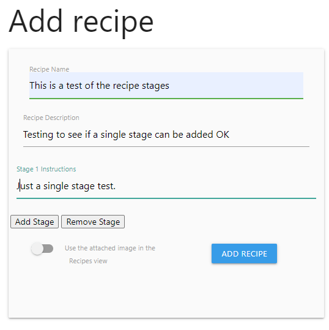
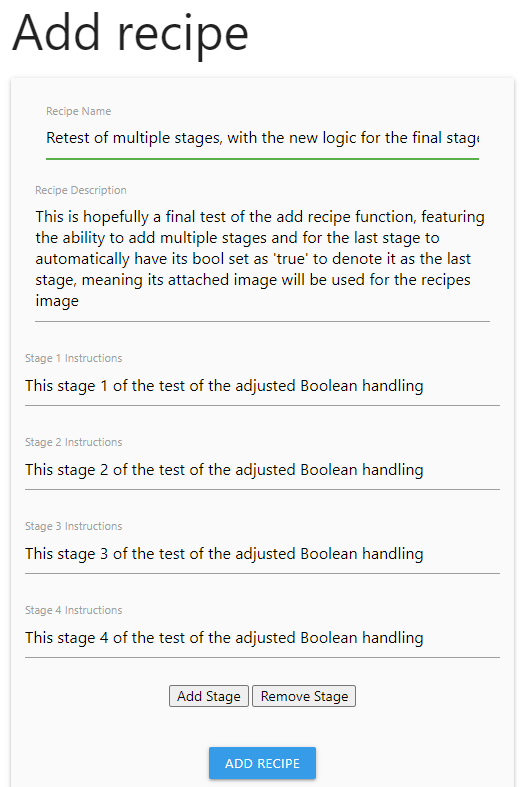

# **Colour Forge**

A paint catalogue and recipe book for miniature painters

# Contents

- [User Experience](#user-experience)

  - [Site Owner Goals](#site-owner-goals)
  - [A Visitors Goals](#visitor-goals)

- [User Stories](#user-stories)

  - [Account Registration and Authentication](#account-registration-and-authentication)
  - [Paint Collection Management](#paint-collection-management)
  - [Recipe Creation and Management](#recipe-creation-and-management)
  - [Viewing and Searching](#viewing-and-searching)    
  - [User Experience and Visuals](#user-experience-and-visuals)    
  - [Security and Error Handling](#security-and-error-handling)    
  - [Data Management](#data-management)    
  - [Administration](#administration)    
  - [Social Features](#social-features)    

- [Design](#design)

  - [Wireframes](#wireframes)

    - [Homepage](#homepage)
    - [Side Menu](#side-menu)
    - [Registration Page](#registration-page)
    - [Profile Pages](#profile-pages)
    - [List Display Option for Library and Recipe Pages](#list-display-option-for-library-and-recipe-pages)
    - [Cards Option for Library and Recipe Pages](#cards-option-for-library-and-recipe-pages)
    - [Separate Pages Option for Paint library](#separate-pages-option-for-paint-library)
    - [Modal Option for Paint library](#modal-option-for-paint-library)
    - [Separate Pages Option for Recipes](#separate-pages-option-for-recipes)
    - [Modal Option for Recipes](#modal-option-for-recipes)
    - [Custom 404](#custom-404)

  - [Entity Relationship Diagram](#erd)
  - [Schema](#schema)

- [Security and best Practices](#security-and-best-practices)  

- [Features](#features)

Tags, these were a challenge to get to work correctly due to not only the need for the many to many relationship to work, but also to have them be able to be re-used by users once they'd been entered so to have exiting tags presented as they were being typed. I tried a few alternative approaches to this, including using [Materialize Tags Input](https://henrychavez.github.io/materialize-tags/) as well as a few other tagging tools I found online, but was unable to get to work fully. Eventually I found [this Reddit Thread](https://www.reddit.com/r/flask/comments/25zjtb/af_can_someone_show_me_how_to_build_json_object/) along with this [Stackoverflow thread](https://stackoverflow.com/questions/62894961/problem-with-materialize-chips-autocomplete) and this [Github Issue](https://github.com/Dogfalo/materialize/issues/6401) which all helped me understand what was needed to get this working. 

- [Bugs and Issues](#bugs-and-issues)

Found an issue when creating the edit recipe page, where when an image was using placeholders, so had no entry in the DB, since I was just populating these via the HTML it would generate the following Werkzeug error: UndefinedError
jinja2.exceptions.UndefinedError: sqlalchemy.orm.collections.InstrumentedList object has no element 0
While falling back to rendering a placeholder file locally is fine, I couldn't quite work out how to skip over none existent DB entries when loading the edit page for recipes that had no images. As such, I adjusted the image handling logic in the routes.py file so that it would insert a URL string into the images table when the user didn't submit an image, allowing this to be loaded and rendered from the Jinja insertions on the edit page. While this works, I will be leaving the HTML fall backs in place as a safety net, though these shouldn't ever be needed, since unless the connection to the DB goes down then the site should always see the entry and if the DB connection fails, the recipes wont be loading anyway. 

Found an issue late in development where when updating a single stage of a multistage recipe, the stages would reorder. This seems very hit and miss where it doesn't always seem to occur on recipe editing. 
open_punch_bath_8981=> select * from recipe_stages where recipe_id = 53;

This was the recipe before editing. 
 stage_id | recipe_id | stage_num | instructions | is_final_stage 
----------+-----------+-----------+--------------+----------------
      135 |        53 |         1 | Testing 1    | f
      136 |        53 |         2 | Testing 2    | f
      137 |        53 |         3 | Testing 3    | t
(3 rows)

This was it after
open_punch_bath_8981=> select * from recipe_stages where recipe_id = 53;
 stage_id | recipe_id | stage_num |           instructions           | is_final_stage 
----------+-----------+-----------+----------------------------------+----------------
      136 |        53 |         2 | Testing 2                        | f
      135 |        53 |         1 | Testing 1\r                     +| f
          |           |           | \r                              +| 
          |           |           | this should move to stage 2 or 3 | 
      137 |        53 |         3 | Testing 3                        | t
(3 rows)

A quick fix to this was to force a sort on the for loop on any pages that render the recipe stages to ensure that the user sees them in the correct order, irrespective of what order the recipe is in the DB. While this isn't a fix of the underlying issue, it does provide a quick, short term user facing resolution to the issue to allow me time to properly investigate and resolve the underlying issue. Even if/wheen I resolve the under lying issue this can also happily remain in the HTML for the foreseeable future, since it's a useful fallback in-case of other issues which may cause reordering of stages that I may miss or may crop up as I develop the site further, or as I continue to refine and refactor the code. 

Jinja for loop before the fix       
Jinja for loop after the fix        

- [Technology](#technology)

  - [Frameworks and Programs](#frameworks-and-programs)

- [Testing](#testing-and-validation)

- [Version Control and Deployment](#version-control-and-deployment)

- [Credits](#credits)
  

# User Experience

## Site Owner goals

- To store user data securely, particularly things like login credentials, using best practices like password hashes and other forms of encryption.
- Ensure that the app is accessible and responsive over all devices, providing a mobile friendly design. 
- Enable data management allowing users to add, edit and delete from their collections of paints and recipes. 
- For the user interface to be simple and easy to use, allowing users to create and store recipes or add to their paint collection. 
- To promote sharing and creativity by allowing users to document and share their painting methods with others. 

## Visitor Goals
- Easily organise and track my paint collection, ensuring I know what I have available and what I may need to replace. 
- Create and store paint recipes, so that I can replicate colour schemes and methods over the life of a painting project. 
- To have a clean, user friendly interface to allow me to manage my paints and recipes without confusion. 
- To be able to access my collection and recipes from any device so I can use the app while working on miniatures or while out shipping for paints. 
- To quickly search and filters paints or recipes to find specific entries based on things like colour, type of paint or project. 
- For my data to be securely stored so that I have no concerns about losing my recipes or any personal information that may be stored. 
- To be able to easily share recipes with friends. 

# User Stories
## Account registration and authentication
- 1. As a user, I want to be able to register for an account so that I may save my paint collection and recipes. 
- 2. As a user, I want to log in securely to access my data. 
- 3. As a user, I want to be able to reset my password if I forget it
- 4. As a user, I want to be able to change my account details

## Paint Collection Management
- 1. As a user, I would like to be able to add new paints to my collection by entering details of the paint. 
- 2. As a user, I want to be able to edit details of any paints in my collection, such as quantity, if I need to replace it and so on. 
- 3. As a user, I would like to be able to delete paints that I no longer have or use. 
- 4. As a user, I want to be able to search and filter my paint collection. 
- 5. As a user, I would like to be able to add paints to my library from an existing list. 

## Recipe creation and Management. 
- 1. As a user, I would like to be able to create new recipes using paints from my Library. 
- 2. As a user, I want to add detailed step by step instructions to my recipes. 
- 3. As a user, I would like to upload images to help see how each stage of the recipe looks. 
- 4. As a user, I want to be able to add tags or other identifiers to recipes to help me organise them. 
- 5. As a user, I would like to be able to edit my recipes as I improve them or need to change paints used. 
- 6. As a user, I would like to be able to delete recipes that are no longer of use to me. 

## Viewing and Searching
- 1. As a user, I want to be able to search my library and recipes using keywords. 
- 2. As a user, I want to be able to see all recipes that may use a particular paint from my library. 

## User Experience and Visuals
- 1. As a user, I want the application to be clean and easy to navigate. 
- 2. As a user, I would like the application to be fully responsive so that it can be easily used regardless of the device I access it from. 

## Security and error handling. 
- 1. As a user, I want my password to be stored securely to protect my account. 
- 2. As a user, I would like that only I am able to modify or edit my library or recipes. 
- 3. As a user, I want to receive visual feedback or confirmation when I edit or delete a paint or recipe. 
- 4. As a user, I would like to be alerted when I try and submit an incomplete form, with an indication of what data may be missing.

## Data Management
- 1. As a user, I would like to be able to import my paint collection for faster entry. 
- 2. As a user, I would like to be able to export my collection and recipes so that I know i have a back up. 
- 3. As a user, I would like to be able to reset my library, recipes or both to allow me to start over if needed. 

## Administration
- 1. As an admin, I want to be able to manage user accounts, including editing and deletion. 

## Social features
- 1. As a user I would like to be able to have a link for my recipes so that I can share them with other users. 

## Site Visitor

# Design

## Wireframes:

Wireframes were created with Balsamiq software to provide rough mock-ups for layout.

### Homepage

The home page currently shows either a login page, or a specific landing page, where users can add paints or recipes to their account, as well as showing a carousel of their library and recipes depending on if they're logged in when accessing the page or not. 

Mobile

Desktop

### Side Menu

The side menu is specific to the mobile experience and will show either login/registration options for none logged in users, or more typical site navigation options for logged in users.  

Mobile

### Registration Page

The registration page is accessible both from the home page and side bar when the user is not logged in. It allows a user to register for an account.  

Mobile

Desktop

### Profile Pages

The profile page will allow the user to manage their profile as needed, requesting password resets, change their username or email address, granting them the ability to reset their library or recipes and delete their account entirely. 

Mobile

Desktop

### List Display Option for Library and Recipe Pages. 

I had a couple of ideas for how to present the items for both the library and recipes lists - the most obvious one being a list of items for each. This could either be infinitely scrolling or use pagination to handle longer lists. 

Mobile

Desktop

### Cards Option for Library and Recipe Pages

The alternative to the list to show the user their library or recipes was to use cards, allowing for a slightly cleaner and more mobile friendly look, due to the cards presenting a larger interaction surface than a list would. Again much like the lists this could either infinitely scroll or allow for pagination for large library/recipe collection handling. 

Mobile

Desktop

### Separate pages option for paint library

I had a couple of ideas for how to handle showing the individual paints for the library, one was to simply have each paint as its own page, this provides the maximum amount of room on smaller devices to show information. It may also be easier to handle in terms of building. The accordion at the bottom of the page will show some simple details about each recipe mentioned and will function as another path to get to the specific recipe in question. The wireframes also show what it should look like when deleting, editing and successfully editing the page. If I choose to use a 4 table DB, when entering a paint name it would be useful if this started to auto-complete based off the data in the stock list, when when selected could autofill all the other fields, which the user could then edit and manipulate as needed before saving. 

Mobile

Desktop

### Modal option for paint library

The other option, which I think is more visually pleasing, but potentially more limiting in terms of space would be to use some form of modal when selecting the paint. The wireframes also show what it should look like when deleting, editing and successfully editing the page.

Mobile

Desktop

### Separate pages option for recipes

Much like with the paint library, I thought it would be worth while to mock up a couple of options for how the recipe items should look when accessed. Again, having these rendered as single pages allows for the most amount of room to be used for the content on smaller screens. In this case, the accordion is being used to show each stage of the paint recipe and will contain simple instructions and images. The images should be able to be expanded via modals or light boxes. Again, the images show deletion alerts, the edit screen and an update confirmation.  

Mobile

Desktop

### Modal option for recipes

Much like with the paint library, I tested what this could look like containing the same data in a modal, which again may be more aesthetically pleasing but has other considerations which make it less ideal, including less space to work with, possible complexity of code, etc. 

Mobile

Desktop

### Custom 404

The custom 404 functions as a way of handling users who may end up in places that they shouldn't when accessing the site. This features the same core layout that features throughout the rest of the site and allows the user to navigate back to the home page or use the menu to get to other locations. 

Mobile

Desktop

## ERD

3 Table ERD

4 Table ERD

Final Table ERD

## Schema

I have a few possible options for this, depending on what is determined to be the best approach.

Option 1  
This would consist of three tables:  
 - A user table where the user account information is stored, which would have hashed passwords etc which would have a one to many relationship with both the Paints and Recipes tables.  
 - A paints table where each users paint is stored, this would have a many to many relationship to Recipes.  
 - A recipes table, where each users paint recipes are stored.  
 
One issue with the above is that the Paints table could, over time become unwieldy, since the relationship being one to many implies theirs potential for paint duplication. I could make this many to many, but this could also introduce issues where users could add a paint for it to be then updated by another user, which may produce less than ideal outcomes. 

Option 2 
Would be to allow the users to not only add their own paints, but to have a list of pre-existing paints that users can select from. Effectively giving me 4 tables.  
 - A user table which would have two one to many relationships with the user_paints and recipes tables.  
 - A default_paints table which would store a predetermined 'stock' list of paints which the users could pick from.  
 - A user_paints table where the users paints would be stored. This could store either references to the default_paints table, or have the data from that table copied to itself. Assuming we're referencing paints, this would need a many to one relationship to the default_paints table.  
 - A recipes table which contains the users recipes, which would have a many to many relationship with the user_paints table. 

Of the two options, I think the 4 table solution offers the most performant options with the least amount of repetition of data. 

Final version.  
Due to the relative complexity of the initial project plan, I have scaled back a little to focus on just the paint recipes section, since this requires 6 tables to get working how I would like it to. 

user  
This is the table where all the user data will be stored, such as username, password, email etc.  
 - user_id - an auto incrementing field, which stores the tables primary key.  
 - email - a text field, used for storing each users email address to allow for login and password reset functionality. 
 - username - a text field where the user could store their username which would be used to display personalised messaging as well as allow for login.  
 - password - a text field for the users password. 

recipes 
This is where the users recipes will be stored. It will have a foreign key for the users table, to allow for a one to many relationship to the users table so each user may create many recipes.  
 - recipe_Id - an auto incrementing field which stores the tables primary key.  
 - user_id - the foreign key used for the one to many relationship to the users table.  
 - recipe_name - a text field for storing the name of each recipe, eg 'Space Marine Captain', 'Dark Eldar Reavers' etc.  
 - recipe_desc - a text field used to store a description of the recipe, where the user can describe what the recipe is for and any paints used in it.  

recipe_stages 
This table is for the each specific stage of the recipe. A recipe should consist of at least one stage and be able to extend as far as is needed to meet the users requirements. This has a one to many relationship with the recipes table.  
 - stage_id - an auto incrementing field, which stores the tables primary key.  
 - recipe_id - the foreign key to link to the recipes table for the one to many relationship since each recipe will have one or more stages.   
 - stage_num - a numerical value the user can enter to delineate the order of stages. Eg stage 1, stage 2 etc.  
 - instructions - text based instructions for each stage of the recipe. Eg - 'Apply a base coat of Dark Angels Green' 
 - is_final_stage - a boolean value where, when adding stages to the recipe, the user is able to confirm if the stage they are adding is the last stage of the recipe, which then flags any assigned image to this stage to be usable in the thumbnail for the recipe and the recipes description - effectively showing the finished product. 

recipe_images 
This table is used to store images for each stage of the recipe, ideally a placeholder image should be stored here if the user opts to not upload an image of their own. It has a one to many relationship to the recipe_stages table, allowing each stage to have multiple images if needed.  
 - image_id - an auto incrementing field, which stores the tables primary key.  
 - stage_id - the foreign key used to link to the recipe stages table for the one to many relationship, since each stage could have multiple images.  
 - image_url - the URL string of the uploaded image, automatically inserted when the user uploads an image.  
 - alt_text - a text string for the image alt text to ensure basic accessibility standards are met.  
 - public_id - a text string, which was added later after I realised this would be an efficient way of handling image deletion to stop wasting space on Cloudinary 

entity_tags    
This table isn't directly updatable by the user, instead its used to allow for a many to many relationship between the recipes table and the recipe_tags table.  
 - recipe_id - a foreign key, linking to the recipes table.  
 - tag_id - a foreign key linking to the tags table.  
 - entity_type - this isn't used in the MVP release, which features just the users recipes - in the final version this will be auto filled with the entity that the tag relates to, eg 'paint', 'recipe', 'miniature' and so on. 

recipe_tags 
This table exists purely to store the tags that each user adds. Since it has a many to many relationship thanks to the recipe_tags table, each user can use any tag that is added in any recipe they may create, which should help limit potential data duplication as more users join the service.  
 - tag_id - an auto incrementing field, which stores the tables primary key.  
 - tag_name - a text field where the tag name will be stored.  

While i have larger plans around the ability to catalogue paints owned by a user and link them to their recipes, their is a chance due to time constraints that this may not make into an MVP release, as such the above schema is designed with a degree of adaptability in mind, allowing me to add in additional tables to handle other data, either via many to many relationships or one to many relationships.   
# Security and best Practices

# Features

# Bugs and Issues

Found an odd bug when using the chips feature from Materialize, where it was causing the stage counter to jump from 1 to 3 when adding a new stage. Removing the javascript needed for Chips to be initialized I found the behaviour worked as expected. The easiest fix here was to hard set the stageCount to 1, then increment/decrement it as part of the function to add/remove each stage as needed. This issue also made me realise that the ID tags being assigned were not unique as they're supposed to be, so I corrected this using Jinja to append the stage number to the ID tag for each new stage added by Javascript. 

I decided part way through developing the edit functionality to split out the varying functions needed to drive each page, in an effort to encourage more DRY like behaviour allowing for reuse of code. When trying to amalgamate both initial DB entry and editing an existing entry into a single function, this kept having issues, causing me to split these out into their own create and edit functions. While the code is now easier to maintain, since the various app routes and functions are smaller and simpler it does remove some element of adhering to DRY practices, since as things stand, most of the functions are essentially limited to single app routes using them with a few exceptions, such as image uploading. 

While developing the edit function, I realised that I was leaving images on Cloudinary that were no longer needed, since I hadn't built any logic to remove these. As such where stage deletion or image changes were handled, I added in functions to also delete the image from Cloudinary using the images public ID. 

# Technology

## Frameworks and Programs

- [ERD DB Designer](https://erd.dbdesigner.net/)

  - Used to help with ERD diagrams and understanding the DB relationships

- [Balsamiq](https://balsamiq.com/)

  - Wire-framing program.

- [VSCode](https://code.visualstudio.com/)

  - IDE of choice.  

- [Git](https://github.com/)

  - Used for version control, storage and deployment.  

- [Djecrety](https://djecrety.ir/)

 - Used to generate secret Key

 - [Cloudinary](https://cloudinary.com/users/login)

 - Used to host image files

# Testing and Validation

## Use based functionality testing
While working on building basic functionality. It occurred to me that I would ideally need to test each specific function as I brought it online. As such, I commented out the majority of the models.py file and reduced it to just the recipes table with no relationships. I then created a new file called reset_db.py whose function was effectively purely to tear down and rebuild the db to save me having to do this manually each time I needed to online a new feature for testing. This way, I could keep my data clean and fresh each time a new feature was added. This idea came about because I dove in and created the entire DB schema with all relationships in place which when trying to test just adding a recipe name and description caused errors since I had nothing in place to ensure the foreign keys were being updated and that the data was fully linked and working, which caused Werkzueg errors to occur constantly. I also added some limited print output the function to ensure the data was being correctly captured before sending to the DB. 

Button debounce
While working on getting edit functionality fully online I decided to publish the app to Heroku to allow me to get some user testing as things were moving forwards. This very quickly highlighted an issue where a user could submit the same recipe multiple times which I' hadn't factored for. A simple button disable function was implmented in the Javascript to prevent this from occurring. Initially this is only on the add_recipe page, but ideally it needs to be implemented on all pages that have a form/button that allows a user to modify the database. Several examples for how to do this via Jquery were found, with [this stack overflow](https://stackoverflow.com/questions/97962/debounce-clicks-when-submitting-a-web-form) article being particularly useful 

### add recipe

basic functionality to write to the recipes table

Output of writing to the recipes table 

Recipe Name: This is a test of the add recipe function 
Recipe Description: Testing the ability to add recipes. Nothing to see here. Once this works I will start to build the recipes page to show the stored data. 
127.0.0.1 - - [29/Sep/2024 16:46:15] "POST /add_recipe HTTP/1.1" 302 - 
127.0.0.1 - - [29/Sep/2024 16:46:15] "GET /recipes HTTP/1.1" 200 - 
127.0.0.1 - - [29/Sep/2024 16:46:15] "GET /static/css/style.css HTTP/1.1" 304 - 
127.0.0.1 - - [29/Sep/2024 16:46:15] "GET /static/images/logo.png HTTP/1.1" 304 - 
127.0.0.1 - - [29/Sep/2024 16:46:15] "GET /static/js/script.js HTTP/1.1" 304 - 

Recipes table contents 
open_punch_bath_8981=> \dt 
           List of relations 
 Schema |  Name   | Type  |    Owner
--------+---------+-------+-------------
 public | recipes | table | urbqgoc5q8y
(1 row) 
 
open_punch_bath_8981=> select * from recipes; 
 recipe_id |                recipe_name                |                                                                recipe_desc
-----------+-------------------------------------------+-------------------------------------------------------------------------------------------------------------------------------------------
         1 | This is a test of the add recipe function | Testing the ability to add recipes. Nothing to see here. Once this works I will start to build the recipes page to show the stored data.
(1 row)

Output of writing to the recipe and recipe_stages tables

Recipe Name: This is a test of the recipe stages 
Recipe Description: Testing to see if a single stage can be added OK 
2 
Instructions List: ['Just a single stage test. '] 
Is Final Stage?: None 
127.0.0.1 - - [29/Sep/2024 21:22:27] "POST /add_recipe HTTP/1.1" 302 - 
127.0.0.1 - - [29/Sep/2024 21:22:27] "GET /recipes HTTP/1.1" 200 - 
127.0.0.1 - - [29/Sep/2024 21:22:28] "GET /static/css/style.css HTTP/1.1" 304 - 
127.0.0.1 - - [29/Sep/2024 21:22:28] "GET /static/images/logo.png HTTP/1.1" 304 - 
127.0.0.1 - - [29/Sep/2024 21:22:28] "GET /static/js/script.js HTTP/1.1" 304 - 

open_punch_bath_8981=> \dt 
              List of relations
 Schema |     Name      | Type  |    Owner
--------+---------------+-------+-------------
 public | recipe_stages | table | urbqgoc5q8y
 public | recipes       | table | urbqgoc5q8y
(2 rows) 
 
open_punch_bath_8981=> select * from recipes; 
 recipe_id |             recipe_name             |                   recipe_desc
-----------+-------------------------------------+--------------------------------------------------
         1 | This is a test of the recipe stages | Testing to see if a single stage can be added OK
(1 row)

open_punch_bath_8981=> select * from recipe_stages;
 stage_id | recipe_id | stage_num |        instructions        | is_final_stage 
----------+-----------+-----------+----------------------------+----------------
        1 |         1 |         1 | Just a single stage test.  | f
(1 row)

basic functionality to write to the recipes table and add multiple stages to the recipes_stages table

 
Recipe Name: Testing adding 2 stages 
Recipe Description: This is a test of 2 stages 
3 
Instructions List: ['This is the first stage.', 'This is the second stage. '] 
Is Final Stage?: None 
127.0.0.1 - - [29/Sep/2024 21:25:01] "POST /add_recipe HTTP/1.1" 302 - 
127.0.0.1 - - [29/Sep/2024 21:25:01] "GET /recipes HTTP/1.1" 200 - 
127.0.0.1 - - [29/Sep/2024 21:25:02] "GET /static/images/logo.png HTTP/1.1" 304 - 
127.0.0.1 - - [29/Sep/2024 21:25:02] "GET /static/js/script.js HTTP/1.1" 304 - 
127.0.0.1 - - [29/Sep/2024 21:25:02] "GET /static/css/style.css HTTP/1.1" 304 - 
 
open_punch_bath_8981=> select * from recipes; 
 recipe_id |       recipe_name       |        recipe_desc
-----------+-------------------------+----------------------------
         1 | Testing adding 2 stages | This is a test of 2 stages
(1 row) 
 
open_punch_bath_8981=> select * from recipe_stages; 
 stage_id | recipe_id | stage_num |        instructions        | is_final_stage 
----------+-----------+-----------+----------------------------+----------------
        1 |         1 |         1 | This is the first stage.   | f
        2 |         1 |         2 | This is the second stage.  | f
(2 rows)

Output of writing to the recipe and recipe_stages tables and testing the Boolean

Recipe Name: Testing three stages with a final stage 
Recipe Description: This is a test of all functions added so far, recipe name, recipe description, multiple recipe stages and finally if the final stage bool is honoured.  
4 
Instructions List: ['This is stage 1 of the third test', 'This is stage 2 of the third test', 'This is stage 3 of the third test'] 
Is Final Stage?: on 
127.0.0.1 - - [29/Sep/2024 21:28:22] "POST /add_recipe HTTP/1.1" 302 - 
127.0.0.1 - - [29/Sep/2024 21:28:22] "GET /recipes HTTP/1.1" 200 - 
127.0.0.1 - - [29/Sep/2024 21:28:22] "GET /static/css/style.css HTTP/1.1" 304 - 
127.0.0.1 - - [29/Sep/2024 21:28:22] "GET /static/images/logo.png HTTP/1.1" 304 - 
127.0.0.1 - - [29/Sep/2024 21:28:22] "GET /static/js/script.js HTTP/1.1" 304 - 
 
open_punch_bath_8981=> select * from recipes; 
 recipe_id |               recipe_name               |                                                                       recipe_desc
-----------+-----------------------------------------+---------------------------------------------------------------------------------------------------------------------------------------------------------
         1 | Testing three stages with a final stage | This is a test of all functions added so far, recipe name, recipe description, multiple recipe stages and finally if the final stage bool is honoured.
(1 row) 
 
open_punch_bath_8981=> select * from recipe_stages; 
 stage_id | recipe_id | stage_num |           instructions            | is_final_stage 
----------+-----------+-----------+-----------------------------------+----------------
        1 |         1 |         1 | This is stage 1 of the third test | t
        2 |         1 |         2 | This is stage 2 of the third test | t
        3 |         1 |         3 | This is stage 3 of the third test | t

It seemed this assigned true to all stages, rather than just the last. This caused me to rethink how this should be handled, either giving the user an option per stage, which seems like too clunky a solution. Or to automatically assume the last stage added is the last stage of the instructions, which would make more sense since this is where we would normally expect the image used in the card for the recipe to be selected from. 

Output of writing to the recipe and recipe_stages tables and testing the new Boolean logic

 
Recipe Name: Retest of multiple stages, with the new logic for the final stage added 
Recipe Description: This is hopefully a final test of the add recipe function, featuring the ability to add multiple stages and for the last stage to automatically have its bool set as 'true' to denote it as the last stage, meaning its attached image will be used for the recipes image 
5 
Instructions List: ['This stage 1 of the test of the adjusted Boolean handling', 'This stage 2 of the test of the adjusted Boolean handling', 'This stage 3 of the test of the adjusted Boolean handling', 'This stage 4 of the test of the adjusted Boolean handling'] 
Is Final Stage?: None 
127.0.0.1 - - [29/Sep/2024 21:43:16] "POST /add_recipe HTTP/1.1" 302 - 
127.0.0.1 - - [29/Sep/2024 21:43:16] "GET /recipes HTTP/1.1" 200 - 
127.0.0.1 - - [29/Sep/2024 21:43:17] "GET /static/js/script.js HTTP/1.1" 304 - 
127.0.0.1 - - [29/Sep/2024 21:43:17] "GET /static/css/style.css HTTP/1.1" 304 - 
127.0.0.1 - - [29/Sep/2024 21:43:17] "GET /static/images/logo.png HTTP/1.1" 304 - 
 
open_punch_bath_8981=> select * from recipes; 
 recipe_id |                               recipe_name                               |                                                                                                                                recipe_desc
-----------+-------------------------------------------------------------------------+---------------------------------------------------------------------------------------------------------------------------------------------------------------------------------------------------------------------------------------------------------------------------
         1 | Testing three stages with a final stage                                 | This is a test of all functions added so far, recipe name, recipe description, multiple recipe stages and finally if the final stage bool is honoured.
         2 | Retest of multiple stages, with the new logic for the final stage added | This is hopefully a final test of the add recipe function, featuring the ability to add multiple stages and for the last stage to automatically have its bool set as 'true' to denote it as the last stage, meaning its attached image will be used for the recipes image
(2 rows) 
 
open_punch_bath_8981=> select * from recipe_stages; 
 stage_id | recipe_id | stage_num |                       instructions                        | is_final_stage 
----------+-----------+-----------+-----------------------------------------------------------+----------------
        1 |         1 |         1 | This is stage 1 of the third test                         | t
        2 |         1 |         2 | This is stage 2 of the third test                         | t
        3 |         1 |         3 | This is stage 3 of the third test                         | t
        4 |         2 |         1 | This stage 1 of the test of the adjusted Boolean handling | f
        5 |         2 |         2 | This stage 2 of the test of the adjusted Boolean handling | f
        6 |         2 |         3 | This stage 3 of the test of the adjusted Boolean handling | f
        7 |         2 |         4 | This stage 4 of the test of the adjusted Boolean handling | f

Output of writing to the recipe and recipe_stages tables and testing the fix Boolean logic

 
Recipe Name: Test of adjusted logic for Bool handling 
Recipe Description: THis is hopefully a final test for the adjusted Boolean logic 
3 
Instructions List: ['Stage 1 of the adjusted logic test', 'Stage 2 of the adjusted logic test'] 
Is Final Stage?: None 
127.0.0.1 - - [29/Sep/2024 21:55:34] "POST /add_recipe HTTP/1.1" 302 - 
127.0.0.1 - - [29/Sep/2024 21:55:34] "GET /recipes HTTP/1.1" 200 - 
127.0.0.1 - - [29/Sep/2024 21:55:34] "GET /static/css/style.css HTTP/1.1" 304 - 
127.0.0.1 - - [29/Sep/2024 21:55:34] "GET /static/images/logo.png HTTP/1.1" 304 - 
127.0.0.1 - - [29/Sep/2024 21:55:34] "GET /static/js/script.js HTTP/1.1" 304 - 
127.0.0.1 - - [29/Sep/2024 21:55:39] "GET /static/css/style.css HTTP/1.1" 304 - 
 
open_punch_bath_8981=> select * from recipes; 
 recipe_id |                               recipe_name                               |                                                                                                                                recipe_desc
-----------+-------------------------------------------------------------------------+---------------------------------------------------------------------------------------------------------------------------------------------------------------------------------------------------------------------------------------------------------------------------
         1 | Testing three stages with a final stage                                 | This is a test of all functions added so far, recipe name, recipe description, multiple recipe stages and finally if the final stage bool is honoured.
         2 | Retest of multiple stages, with the new logic for the final stage added | This is hopefully a final test of the add recipe function, featuring the ability to add multiple stages and for the last stage to automatically have its bool set as 'true' to denote it as the last stage, meaning its attached image will be used for the recipes image
         3 | Testing adjusted logic for last stage check                             | Adjusted logic check for final stage logic
         4 | Test of adjusted logic for Bool handling                                | THis is hopefully a final test for the adjusted Boolean logic
(4 rows) 
 
open_punch_bath_8981=> select * from recipe_stages; 
 stage_id | recipe_id | stage_num |                       instructions                        | is_final_stage 
----------+-----------+-----------+-----------------------------------------------------------+----------------
        1 |         1 |         1 | This is stage 1 of the third test                         | t
        2 |         1 |         2 | This is stage 2 of the third test                         | t
        3 |         1 |         3 | This is stage 3 of the third test                         | t
        4 |         2 |         1 | This stage 1 of the test of the adjusted Boolean handling | f
        5 |         2 |         2 | This stage 2 of the test of the adjusted Boolean handling | f
        6 |         2 |         3 | This stage 3 of the test of the adjusted Boolean handling | f
        7 |         2 |         4 | This stage 4 of the test of the adjusted Boolean handling | f
        8 |         4 |         1 | Stage 1 of the adjusted logic test                        | f
        9 |         4 |         2 | Stage 2 of the adjusted logic test                        | t
(9 rows)

Output of writing to the recipe, recipe_stages tables, uploading to Cloudinary and finally writing the results of the upload to the recipe_images table

 
Recipe Name: This is a test of adding the images to Cloudinary and the DB 
Recipe Description: Testing of image upload for a single stage 
1 
Instructions List: ['This is the first and only stage. The Bool should be true. Their should be an image URL and Thumbnail URL. '] 
Is Final Stage?: None 
Image names: [<FileStorage: 'hero-image.png' ('image/png')>] 
127.0.0.1 - - [30/Sep/2024 18:04:08] "POST /add_recipe HTTP/1.1" 302 - 
127.0.0.1 - - [30/Sep/2024 18:04:08] "GET /recipes HTTP/1.1" 200 - 
127.0.0.1 - - [30/Sep/2024 18:04:08] "GET /static/css/style.css HTTP/1.1" 304 - 
127.0.0.1 - - [30/Sep/2024 18:04:08] "GET /static/images/logo.png HTTP/1.1" 304 - 
127.0.0.1 - - [30/Sep/2024 18:04:08] "GET /static/js/script.js HTTP/1.1" 304 - 
 
open_punch_bath_8981=> SELECT * FROM recipes; 
 recipe_id |                         recipe_name                          |                recipe_desc
-----------+--------------------------------------------------------------+--------------------------------------------
         1 | This is a test of adding the images to Cloudinary and the DB | Testing of image upload for a single stage
(1 row)

open_punch_bath_8981=> SELECT * FROM recipe_stages; 
 stage_id | recipe_id | stage_num |                                                instructions                                                 | is_final_stage
----------+-----------+-----------+-------------------------------------------------------------------------------------------------------------+----------------
        1 |         1 |         1 | This is the first and only stage. The Bool should be true. Their should be an image URL and Thumbnail URL.  | t
(1 row)

open_punch_bath_8981=> SELECT * FROM recipe_images; 
 image_id | stage_id |                                       image_url                                        |                                        thumbnail_url                                         |                                 alt_text
----------+----------+----------------------------------------------------------------------------------------+----------------------------------------------------------------------------------------------+--------------------------------------------------------------------------
        1 |        1 | https://res.cloudinary.com/dlmbpbtfx/image/upload/v1727715847/eupydc07vwmej3en6xbs.png | http://res.cloudinary.com/dlmbpbtfx/image/upload/c_fill,h_100,w_100/eupydc07vwmej3en6xbs.jpg | This is a hero image for the Pokebattler website for my second project.
(1 row)

Output of writing to the recipe, recipe_stages tables, uploading to Cloudinary and finally writing the results of the upload to the recipe_images table

 
Recipe Name: This is a test of adding multiple images 
Recipe Description: Will try for three images this time over 4 stages 
1 
Instructions List: ['This is the first stages image', 'This is the second stages image', 'The third stage will have no alt_text added', 'This will have no image attached '] 
Is Final Stage?: None 
Image names: [<FileStorage: '404-page-desktop.png' ('image/png')>] 
127.0.0.1 - - [30/Sep/2024 18:12:03] "POST /add_recipe HTTP/1.1" 302 - 
127.0.0.1 - - [30/Sep/2024 18:12:03] "GET /recipes HTTP/1.1" 200 - 
127.0.0.1 - - [30/Sep/2024 18:12:03] "GET /static/css/style.css HTTP/1.1" 304 - 
127.0.0.1 - - [30/Sep/2024 18:12:03] "GET /static/images/logo.png HTTP/1.1" 304 - 
127.0.0.1 - - [30/Sep/2024 18:12:03] "GET /static/js/script.js HTTP/1.1" 304 - 

127.0.0.1 - - [30/Sep/2024 18:04:08] "GET /static/js/script.js HTTP/1.1" 304 - 
 
open_punch_bath_8981=> SELECT * FROM recipes; 
 recipe_id |                         recipe_name                          |                    recipe_desc
-----------+--------------------------------------------------------------+---------------------------------------------------
         1 | This is a test of adding the images to Cloudinary and the DB | Testing of image upload for a single stage
         2 | This is a test of adding multiple images                     | Will try for three images this time over 4 stages
(2 rows)

open_punch_bath_8981=> SELECT * FROM recipe_stages; 
 stage_id | recipe_id | stage_num |                                                instructions                                                 | is_final_stage 
----------+-----------+-----------+-------------------------------------------------------------------------------------------------------------+----------------
        1 |         1 |         1 | This is the first and only stage. The Bool should be true. Their should be an image URL and Thumbnail URL.  | t
        2 |         2 |         1 | This is the first stages image                                                                              | f
(2 rows)

open_punch_bath_8981=> SELECT * FROM recipe_images; 
 image_id | stage_id |                                       image_url                                        |                                        thumbnail_url                                         |                                 alt_text
----------+----------+----------------------------------------------------------------------------------------+----------------------------------------------------------------------------------------------+--------------------------------------------------------------------------
        1 |        1 | https://res.cloudinary.com/dlmbpbtfx/image/upload/v1727715847/eupydc07vwmej3en6xbs.png | http://res.cloudinary.com/dlmbpbtfx/image/upload/c_fill,h_100,w_100/eupydc07vwmej3en6xbs.jpg | This is a hero image for the Pokebattler website for my second project.
        2 |        2 | https://res.cloudinary.com/dlmbpbtfx/image/upload/v1727716322/tnp1ssx1ac3gjs8blb0g.png | http://res.cloudinary.com/dlmbpbtfx/image/upload/c_fill,h_100,w_100/tnp1ssx1ac3gjs8blb0g.jpg | Sad Pikachu!
(2 rows)
(1 row)

The above only seemed to add a single image of the several that were input. On inspection, I'd missed creating the images and alt text entries as arrays. 

Output of writing to the recipe, recipe_stages tables, uploading to Cloudinary and finally writing the results of the upload to the recipe_images table

 
Recipe Name: Testing multiple image uploads 
Recipe Description: This is a test 
3 
Instructions List: ['Stage 1', 'Stage 2', 'Stage 3'] 
Is Final Stage?: None 
Image names: ['404-page-desktop.png', 'hero-image.png', 'Screenshot 2024-06-16 123914.png'] 
alt text: ['Sad pika', 'Hero Image', 'Local Map'] 
127.0.0.1 - - [30/Sep/2024 22:17:19] "POST /add_recipe HTTP/1.1" 302 - 
127.0.0.1 - - [30/Sep/2024 22:17:19] "GET /recipes HTTP/1.1" 200 - 
127.0.0.1 - - [30/Sep/2024 22:17:19] "GET /static/css/style.css HTTP/1.1" 304 - 
127.0.0.1 - - [30/Sep/2024 22:17:19] "GET /static/images/logo.png HTTP/1.1" 304 - 
127.0.0.1 - - [30/Sep/2024 22:17:19] "GET /static/js/script.js HTTP/1.1" 304 - 
 
open_punch_bath_8981=> SELECT * FROM recipes; 
 recipe_id |          recipe_name           |  recipe_desc   
-----------+--------------------------------+----------------
         1 | Testing multiple image uploads | This is a test
(1 row)

open_punch_bath_8981=> SELECT * FROM recipe_stages; 
 stage_id | recipe_id | stage_num | instructions | is_final_stage 
----------+-----------+-----------+--------------+----------------
        1 |         1 |         1 | Stage 1      | f
        2 |         1 |         2 | Stage 2      | f
        3 |         1 |         3 | Stage 3      | t
(3 rows)

open_punch_bath_8981=> SELECT * FROM recipe_images; 
 image_id | stage_id |                                       image_url                                        |                                        thumbnail_url                                         |  alt_text  
----------+----------+----------------------------------------------------------------------------------------+----------------------------------------------------------------------------------------------+------------
        1 |        1 | https://res.cloudinary.com/dlmbpbtfx/image/upload/v1727731037/zcs4iirp7kqhspzje4lv.png | http://res.cloudinary.com/dlmbpbtfx/image/upload/c_fill,h_100,w_100/zcs4iirp7kqhspzje4lv.jpg | Sad pika
        2 |        2 | https://res.cloudinary.com/dlmbpbtfx/image/upload/v1727731037/ixa63ye6aszg97ls8vvu.png | http://res.cloudinary.com/dlmbpbtfx/image/upload/c_fill,h_100,w_100/ixa63ye6aszg97ls8vvu.jpg | Hero Image
        3 |        3 | https://res.cloudinary.com/dlmbpbtfx/image/upload/v1727731038/ocke1j24jnwolatvzmb3.png | http://res.cloudinary.com/dlmbpbtfx/image/upload/c_fill,h_100,w_100/ocke1j24jnwolatvzmb3.jpg | Local Map
(3 rows)

Output of testing unexpected behaviours, such as not filling in all fields, forgetting to add alt-text (image description), forgetting to add an image, etc.

 
Recipe Name: Test of not adding data to all fields for multiple stages 
Recipe Description: Some stages will have all fields filled. Some will not. 
5 
Instructions List: ['Stage 1 - this is the control and will have data in all fields ', 'Stage 2 - this will only have the instructions ', 'Stage 3 - This will just be an image', "Stage 4 - this is a possible, but unlikely scenario where an image description is added for an image alt. Once i've wired up the default placeholder image this should be overwritten so I may need logic for this. ", 'Stage 5 - this needed to be filled in to submit, as expected'] 
Is Final Stage?: None 
Image names: ['Screenshot 2024-06-08 021116.png', '', 'Screenshot 2024-09-12 223744.png', '', 'Screenshot 2024-07-25 202904.png'] 
alt text: ['The Thing', '', '', 'I forgot to add an image', "Phone Mock-up - In this instance I'm testing adding images and no Instructions"] 
127.0.0.1 - - [30/Sep/2024 22:28:38] "POST /add_recipe HTTP/1.1" 302 - 
127.0.0.1 - - [30/Sep/2024 22:28:38] "GET /recipes HTTP/1.1" 200 - 
127.0.0.1 - - [30/Sep/2024 22:28:39] "GET /static/css/style.css HTTP/1.1" 304 - 
127.0.0.1 - - [30/Sep/2024 22:28:39] "GET /static/images/logo.png HTTP/1.1" 304 - 
127.0.0.1 - - [30/Sep/2024 22:28:39] "GET /static/js/script.js HTTP/1.1" 304 - 
 
open_punch_bath_8981=> SELECT * FROM recipes; 
 recipe_id |                        recipe_name                        |                       recipe_desc
-----------+-----------------------------------------------------------+----------------------------------------------------------
         1 | Testing multiple image uploads                            | This is a test
         2 | Test of not adding data to all fields for multiple stages | Some stages will have all fields filled. Some will not.
(2 rows)

open_punch_bath_8981=> SELECT * FROM recipe_stages; 
 stage_id | recipe_id | stage_num |                                                                                                     instructions                                                                                                     | is_final_stage 
----------+-----------+-----------+----------------------------------------------------------------------------------------------------------------------------------------------------------------------------------------------------------------------+----------------
        1 |         1 |         1 | Stage 1                                                                                                                                                                                                              | f
        2 |         1 |         2 | Stage 2                                                                                                                                                                                                              | f
        3 |         1 |         3 | Stage 3                                                                                                                                                                                                              | t
        4 |         2 |         1 | Stage 1 - this is the control and will have data in all fields                                                                                                                                                       | f
        5 |         2 |         2 | Stage 2 - this will only have the instructions                                                                                                                                                                       | f
        6 |         2 |         3 | Stage 3 - This will just be an image                                                                                                                                                                                 | f
        7 |         2 |         4 | Stage 4 - this is a possible, but unlikely scenario where an image description is added for an image alt. Once i've wired up the default placeholder image this should be overwritten so I may need logic for this.  | f
        8 |         2 |         5 | Stage 5 - this needed to be filled in to submit, as expected                                                                                                                                                         | t
(8 rows)

open_punch_bath_8981=> SELECT * FROM recipe_images; 
 image_id | stage_id |                                       image_url                                        |                                        thumbnail_url                                         |                                   alt_text
----------+----------+----------------------------------------------------------------------------------------+----------------------------------------------------------------------------------------------+-------------------------------------------------------------------------------
        1 |        1 | https://res.cloudinary.com/dlmbpbtfx/image/upload/v1727731037/zcs4iirp7kqhspzje4lv.png | http://res.cloudinary.com/dlmbpbtfx/image/upload/c_fill,h_100,w_100/zcs4iirp7kqhspzje4lv.jpg | Sad pika
        2 |        2 | https://res.cloudinary.com/dlmbpbtfx/image/upload/v1727731037/ixa63ye6aszg97ls8vvu.png | http://res.cloudinary.com/dlmbpbtfx/image/upload/c_fill,h_100,w_100/ixa63ye6aszg97ls8vvu.jpg | Hero Image
        3 |        3 | https://res.cloudinary.com/dlmbpbtfx/image/upload/v1727731038/ocke1j24jnwolatvzmb3.png | http://res.cloudinary.com/dlmbpbtfx/image/upload/c_fill,h_100,w_100/ocke1j24jnwolatvzmb3.jpg | Local Map
        4 |        4 | https://res.cloudinary.com/dlmbpbtfx/image/upload/v1727731716/jwrsx0hlqixuxl2k1fdc.png | http://res.cloudinary.com/dlmbpbtfx/image/upload/c_fill,h_100,w_100/jwrsx0hlqixuxl2k1fdc.jpg | The Thing
        5 |        6 | https://res.cloudinary.com/dlmbpbtfx/image/upload/v1727731717/ytwtbmoc6wmrxenzk5fj.png | http://res.cloudinary.com/dlmbpbtfx/image/upload/c_fill,h_100,w_100/ytwtbmoc6wmrxenzk5fj.jpg |
        6 |        8 | https://res.cloudinary.com/dlmbpbtfx/image/upload/v1727731718/xeynhlcgz4jbzuysjg34.png | http://res.cloudinary.com/dlmbpbtfx/image/upload/c_fill,h_100,w_100/xeynhlcgz4jbzuysjg34.jpg | Phone Mockup - In this instance I'm testing adding images and no Instructions
(6 rows)

The above test, while initially using 6 stages for testing, also let me test what would happen if I removed a stage using the remove button before submitting, since the 5th and 6th stages were both initially intended to have the instructions empty, with the sixth stage having just the images alt-text added. Since both stages were unable to be submitted as empty as per design this meant that stage 6 was no longer needed, allowing me to prove the removal of a stage stops it being submitted. 

Testing writing to all tables needed for adding a recipe, recipes, recipe_stages, recipe_images, recipe_tags and entity_tags  

 
Recipe Name: Dark Angels Desaturated Power Armour 
Recipe Description: This is a simple 3-4 paint recipe for very dark, very desaturated Dark Angels power armour 
1 
Instructions List: ['Undercoat the model with a flat black paint. ', "Using Caliban Green as a base coat, heavily drybrush the model - while we want to cover as much as we can, it's not a huge deal if the recesses are missed since the black will provide natural shadows where it is left. ", "using Loren Forest we now need to give the mini a much lighter drybrush, this can happily go over flat panels on the armour too, sinInstructions List: ['Undercoat the model with a flat black paint. ', "Using Caliban Green as a base coat, heavily drybrush the model - while we want to cover as much as we can, it's not a huge deal if the recesses are missed since the black will provide natural shadows where it is left. ", "using Loren Forest we now need to give the mini a much lighter drybrush, this can happily go over flat panels on the armour too, since we'll be cleaning this up in the next stage a little and it will help provide a more organic-looking highlight to the miniature. ", 'Next up, we cover the model in Coelia Greenshade once its dried this should start to filter the lighter Loren forest coat and pull it down to be a little closer to the Dark Angels Green base coat. '] 
Is Final Stage?: None 
Image names: ['404-page-desktop.png', 'game-wave.png', 'hero-image.png', 'jest.png'] 
alt text: ['Undercoated Dark Angel', 'Base coat', 'First Highlight', 'Wash'] 
Full form content ImmutableMultiDict([('recipe_name', 'Dark Angels Desaturated Power Armour'), ('recipe_desc', 'This is a simple 3-4 paint recipe for very dark, very desaturated Dark Angels power armour'), ('tags', 'Dark Angels,Warhammer,Space Marines,Power Armour,Desaturated'), ('instructions[]', 'Undercoat the model with a flat black paint. '), ('instructions[]', "Using Caliban Green as a base coat, heavily drybrush the model - while we want to cover as much as we can, it's not a huge deal if the recesses are missed since the black will provide natural shadows where it is left. "), ('instructions[]', "using Loren Forest we now need to give the mini a much lighter drybrush, this can happily go over flat panels on the armour too, since we'll be cleaning this up in the next stage a little and it will help provide a more organic-looking highlight to the miniature. "), ('instructions[]', 'Next up, we cover the model in Coelia Greenshade once its dried this should start to filter the lighter Loren forest coat and pull it down to be a little closer to the Dark Angels Green base coat. '), ('image_desc[]', 'Undercoated Dark Angel'), ('image_desc[]', 'Base coat'), ('image_desc[]', 'First Highlight'), ('image_desc[]', 'Wash')]) 
 
open_punch_bath_8981=> \dt 
              List of relations
 Schema |     Name      | Type  |    Owner    
--------+---------------+-------+-------------
 public | entity_tags   | table | urbqgoc5q8y
 public | recipe_images | table | urbqgoc5q8y
 public | recipe_stages | table | urbqgoc5q8y
 public | recipe_tags   | table | urbqgoc5q8y
 public | recipes       | table | urbqgoc5q8y
(5 rows)

open_punch_bath_8981=> select * from recipes; 
 recipe_id |             recipe_name              |                                        recipe_desc
-----------+--------------------------------------+--------------------------------------------------------------------------------------------
         1 | Dark Angels Desaturated Power Armour | This is a simple 3-4 paint recipe for very dark, very desaturated Dark Angels power armour
(1 row)

open_punch_bath_8981=> select * from recipe_stages; 
 stage_id | recipe_id | stage_num |                                                                                                                               instructions                                                                                                                               | is_final_stage 
----------+-----------+-----------+--------------------------------------------------------------------------------------------------------------------------------------------------------------------------------------------------------------------------------------------------------------------------+----------------
        1 |         1 |         1 | Undercoat the model with a flat black paint.                                                                                                                                                                                                                             | f
        2 |         1 |         2 | Using Caliban Green as a base coat, heavily drybrush the model - while we want to cover as much as we can, it's not a huge deal if the recesses are missed since the black will provide natural shadows where it is left.                                                | f
        3 |         1 |         3 | using Loren Forest we now need to give the mini a much lighter drybrush, this can happily go over flat panels on the armour too, since we'll be cleaning this up in the next stage a little and it will help provide a more organic-looking highlight to the miniature.  | f
        4 |         1 |         4 | Next up, we cover the model in Coelia Greenshade once its dried this should start to filter the lighter Loren forest coat and pull it down to be a little closer to the Dark Angels Green base coat.                                                                     | t
(4 rows)

open_punch_bath_8981=> select * from recipe_images; 
 image_id | stage_id |                                       image_url                                        |                                        thumbnail_url                                         |        alt_text        
----------+----------+----------------------------------------------------------------------------------------+----------------------------------------------------------------------------------------------+------------------------
        1 |        1 | https://res.cloudinary.com/dlmbpbtfx/image/upload/v1727987873/q5i2ftplla6udtqxdlob.png | http://res.cloudinary.com/dlmbpbtfx/image/upload/c_fill,h_100,w_100/q5i2ftplla6udtqxdlob.jpg | Undercoated Dark Angel
        2 |        2 | https://res.cloudinary.com/dlmbpbtfx/image/upload/v1727987876/afcihcowy0sjo7jvtzx1.png | http://res.cloudinary.com/dlmbpbtfx/image/upload/c_fill,h_100,w_100/afcihcowy0sjo7jvtzx1.jpg | Base coat
        3 |        3 | https://res.cloudinary.com/dlmbpbtfx/image/upload/v1727987877/bc4onemhmikj4otzngk2.png | http://res.cloudinary.com/dlmbpbtfx/image/upload/c_fill,h_100,w_100/bc4onemhmikj4otzngk2.jpg | First Highlight
        4 |        4 | https://res.cloudinary.com/dlmbpbtfx/image/upload/v1727987878/g5ccnr4thoblvveatmpq.png | http://res.cloudinary.com/dlmbpbtfx/image/upload/c_fill,h_100,w_100/g5ccnr4thoblvveatmpq.jpg | Wash
(4 rows)

open_punch_bath_8981=> select * from recipe_tags; 
 tag_id |   tag_name    
--------+---------------
      1 | Dark Angels
      2 | Warhammer
      3 | Space Marines
      4 | Power Armour
      5 | Desaturated
(5 rows)

open_punch_bath_8981=> select * from entity_tags; 
 recipe_id | tag_id | entity_type 
-----------+--------+-------------
         1 |      1 | recipe
         1 |      2 | recipe
         1 |      3 | recipe
         1 |      4 | recipe
         1 |      5 | recipe
(5 rows)

# Version control and Deployment

# Credits

Placeholder image for recipes from https://minifreakstudios.com/painting/commissioned-painting-for-warhammer-minis/

