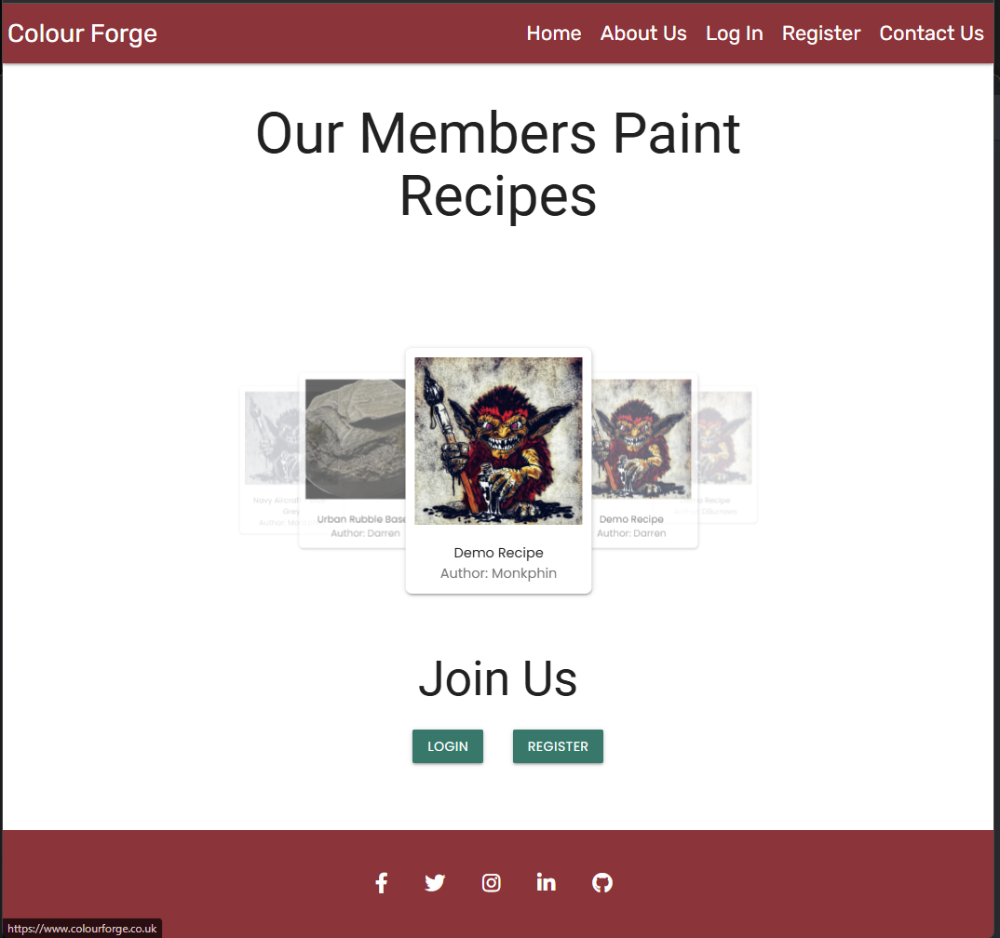

# **Colour Forge**

A paint library and painting recipe book for miniature painters. 

[The deployed website can be found here](https://colourforge.co.uk)


# Contents

[Site Concept](#site-concept)

  - [Site Owner Goals](#site-owner-goals)
  - [A Visitors Goals](#visitor-goals)

[User Stories](#user-stories)

  - [Account Registration and Authentication](#account-registration-and-authentication)
  - [Paint Collection Management](#paint-collection-management)
  - [Recipe Creation and Management](#recipe-creation-and-management)
  - [Viewing and Searching](#viewing-and-searching)    
  - [User Experience and Visuals](#user-experience-and-visuals)    
  - [Security and Error Handling](#security-and-error-handling)    
  - [Data Management](#data-management)    
  - [Administration](#administration)    
  - [Social Features](#social-features)   

[Scope](#scope) 

[Design](#design)

  - [Wireframes](#wireframes)
  - [Schema](#schema)
  - [UX](#ux)
  - [Colour Palette](#colour-palette)
  - [Typography](#typography)
  - [Images](#images)
  - [Icons](#icons)
  - [Features](#features)

[Security, Defensive Programming and best Practices](#security-defensive-programming-and-best-practices)  

[Technology](#technology)
  - [Frameworks and Programs](#frameworks-and-programs)

[Testing](#testing-and-validation)

 [Version Control and Deployment](#version-control-and-deployment)

  - [Repository Creation](#repo-creation)
  - [Cloning Locally](#cloning-locally)
  - [Adding and Updating Files on the Repo](#adding-and-updating-files-on-the-repo) 
  - [Working on Multiple Devices](#working-on-multiple-devices)
  - [Local Deployment](#local-deployment)
  - [PostGres DB Creation](#postgres-db-creation)
  - [Heroku Set up and Configuration](#heroku-set-up-and-configuration)

[Credits](#credits)
[Acknowledgements](#acknowledgements)


# Site Concept
Colour Forge is an online paint catalogue and recipe tracking tool for miniature painters. It’s designed to help hobbyists organize their paint collections, allowing them to check what they have and avoid purchasing duplicate paints while shopping. The tool also allows users to create "recipes" (detailed guides on how to paint specific colors or miniatures) ensuring consistency and repeatability across multiple models.

This is a project that I've been contemplating for several years, which has caused a some feature creep to occur, as well as the the initial scope to be a quite ambitious for an MVP project. Because of this, I had to scale back some planned functionality to focus on creating a working version for submission. 

A common issue for hobbyists like myself is keeping track of our paint collections to know what we need when we're at a hobby store, as well as remembering specific techniques for miniatures in a project that we've not worked on for a while.

The aim of this project is to help mitigate some of those issues by providing an accessible online resource for hobbyists. As such, the project’s goals and user stories reflect a more expansive project. Using MoSCoW prioritization, I was able to shift features in and out of the MVP scope based on their priority and required effort—something I know is often necessary for development teams working on real-world applications.

To manage and prioritize tasks I created and used a Kanban board to help track specific parts of the project from conception to completion, which I used in conjunction with my MoSCoW board to help with planning and prioritisation. 

[My MoSCoW board can be found here](https://github.com/users/monkphin/projects/3/views/1)

[My Kanban board can be found here](https://github.com/users/monkphin/projects/1)


## Site Owner goals

- To store user data securely, particularly things like login credentials, using best practices like password hashes and other forms of encryption.
- Ensure that the app is accessible and responsive over all devices, providing a mobile friendly design. 
- Enable data management allowing users to add, edit and delete from their collections of paints and recipes. 
- For the user interface to be simple and easy to use, allowing users to create and store recipes or add to their paint collection. 
- To promote sharing and creativity by allowing users to document and share their painting methods with others. 

## Visitor Goals
- Easily organise and track my paint collection, ensuring I know what I have available and what I may need to replace. 
- Create and store paint recipes, so that I can replicate colour schemes and methods over the life of a painting project. 
- To have a clean, user-friendly interface to allow me to manage my paints and recipes without confusion. 
- To be able to access my collection and recipes from any device so I can use the app while working on miniatures or while out shipping for paints. 
- To quickly search and filter paints or recipes to find specific entries based on things like colour, type of paint or project. 
- For my data to be securely stored so that I have no concerns about losing my recipes or any personal information that may be stored. 
- To be able to easily share recipes with friends. 

# User Stories
## Account registration and authentication
- 1. As a user, I want to be able to register for an account so that I may save my paint collection and recipes. 
- 2. As a user, I want to log in securely to access my data. 
- 3. As a user, I want to be able to reset my password if I forget it
- 4. As a user, I want to be able to change my account details

## Paint Collection Management
- 5. As a user, I would like to be able to add new paints to my collection by entering details of the paint. 
- 6. As a user, I want to be able to edit details of any paints in my collection, such as quantity, if I need to replace it and so on. 
- 7. As a user, I would like to be able to delete paints that I no longer have or use. 
- 8. As a user, I want to be able to search and filter my paint collection. 
- 9. As a user, I would like to be able to add paints to my library from an existing list. 

## Recipe creation and Management. 
- 10. As a user, I would like to be able to create new recipes using paints from my Library. 
- 11. As a user, I want to add detailed step by step instructions to my recipes. 
- 12. As a user, I would like to upload images to help see how each stage of the recipe looks. 
- 13. As a user, I want to be able to add tags or other identifiers to recipes to help me organise them. 
- 14. As a user, I would like to be able to edit my recipes as I improve them or need to change paints used. 
- 15. As a user, I would like to be able to delete recipes that are no longer of use to me. 

## Viewing and Searching
- 16. As a user, I want to be able to search my library and recipes using keywords. 
- 17. As a user, I want to be able to see all recipes that may use a particular paint from my library. 

## User Experience and Visuals
- 18. As a user, I want the application to be clean and easy to navigate. 
- 19. As a user, I would like the application to be fully responsive so that it can be easily used regardless of the device I access it from. 

## Security and error handling. 
- 20. As a user, I want my password to be stored securely to protect my account. 
- 21. As a user, I would like that only I am able to modify or edit my library or recipes. 
- 22. As a user, I want to receive visual feedback or confirmation when I edit or delete a paint or recipe. 
- 23. As a user, I would like to be alerted when I try to submit an incomplete form, with an indication of what data may be missing.

## Data Management
- 24. As a user, I would like to be able to import my paint collection for faster entry. 
- 25. As a user, I would like to be able to export my collection and recipes so that I know I have a backup. 

## Administration
- 26. As an admin, I want to be able to manage user accounts, including editing and deletion. 

## Social features
- 27. As a user I would like to be able to have a link for my recipes so that I can share them with other users. 

# Scope
- Something that was highlighted from meetings with my mentor was that the initial concept I had may have been a little ambitious for the time frames given and the amount of work needed, so it was suggested that I scale back and add in features later as time is available. It was suggested that I scale back, focusing on a core MVP, with the option to add features later as time permits. We decided that the MVP would center around Paint Recipes, as this allowed for the implementation of multiple one-to-many relationships and a many-to-many relationship for Recipe Tags. It also helped to create a core focus around a common need amongst miniature painters:documenting their painting processes to remember specific techniques when revisiting projects after a break, as well as sharing these recipes with others. Since recipes are visible to non-logged-in users, we also decided to display all user recipes on the homepage, adding a social aspect that aligns with my long-term goals for the site.

- After implementing basic CRUD functionality for paint recipes, I chose to focus on user and site administration. While a paint library is useful, I felt it was secondary to providing the site owner with tools to assist users with account or recipe issues, or to moderate recipes and remove users if necessary. This provides some essential enhancements to the social aspect of the site in addition to providing a safety net for the site owner, allowing them to ensure that shared content is suitable for the site and avoids potential legal issues. This administration functionality is still basic, focused on modifying and deleting content, but the core functionality is in place.

# Design
- The initial design needed to factor in the two core uses of the site, collating, cataloguing and editing a library of paints as well as creating, editing and sharing paint recipes. It also needs to support the ability to sign up for an account. Additional functionality would include some form of social sharing of recipes, either directly on the site, or indirectly via sharing links to other users or users who do not have an account yet, which should help to drive adoption as users share their recipes directly from the site.

- It needs to support all of the above while still being simple and easy to use, as well as fully responsive with an interface that allows users to read through and emulate paint recipes, ideally with images to support each stage to show the desired results of the specific section of the instructions being worked on. Recipes should be presented in a simple, non distracting manner which allows the hobbyist to focus on the specific stage they're working on, while still letting them check the stage before and after the current one if needed.

# Wireframes:

Wireframes were created with Balsamiq software to provide rough mock-ups for layout.

### Homepage
The home page currently shows either a login page or a specific landing page, where users can add paints or recipes to their account, as well as showing a carousel of their library and recipes depending on if they're logged in when accessing the page or not.

<details>
<summary>Mobile</summary>

</details>

<details>
<summary>Desktop</summary>

</details>
<br>

### Side Menu

The side menu is specific to the mobile experience and will show either login/registration options for non-logged-in users, or more typical site navigation options for logged-in users.

<details>
<summary>Mobile</summary>

</details>
<br>

### Registration Page

The registration page is accessible both from the home page and the sidebar when the user is not logged in. It allows a user to register for an account.

<details>
<summary>Mobile</summary>

</details>

<details>
<summary>Desktop</summary>

</details>
<br>

### Profile Pages

The profile page will allow the user to manage their profile as needed, requesting password resets, changing their username or email address, granting them the ability to reset their library or recipes and delete their account entirely.

<details>
<summary>Mobile</summary>

</details>

<details>
<summary>Desktop</summary>

</details>
<br>

### Paint Library and Recipe Pages

I had a couple of ideas for how to present the items for both the library and recipes lists - the most obvious one being a list of items for each. This could either be infinitely scrolling or use pagination to handle longer lists.

The alternative to the list to show the user their library or recipes was to use cards, allowing for a slightly cleaner and more mobile-friendly look, due to the cards presenting a larger interaction surface than a list would. Again much like the lists this could either infinitely scroll or allow for pagination for large library/recipe collection handling. Ultimately, this was the option I chose, since I felt it best presented the data in a more visually appealing and rich manner. 

<details>
<summary>Mobile</summary>


</details>
<details>
<summary>Desktop</summary>


</details>
<br>


### Single Paint and Recipe pages. 
I had a couple of ideas for how to handle showing the individual paints for the library, one was to simply have each paint as its own page, this provides the maximum amount of room on smaller devices to show information. It may also be easier to handle in terms of building. The accordion at the bottom of the page will show some simple details about each recipe mentioned and will function as another path to get to the specific recipe in question. The wireframes also show what it should look like when deleting, editing and successfully editing the page. If I choose to use a 4 table DB, when entering a paint name it would be useful if this started to auto-complete based on the data in the stock list, when selected could autofill all the other fields, which the user could then edit and manipulate as needed before saving.

The other option, which I think is more visually pleasing, but potentially more limiting in terms of space would be to use some form of modal when selecting the paint. The wireframes also show what it should look like when deleting, editing and successfully editing the page.

Much like with the paint library, I thought it would be worthwhile to mock up a couple of options for how the recipe items should look when accessed. Again, having these rendered as single pages allows for the most amount of room to be used for the content on smaller screens. In this case, the accordion is being used to show each stage of the paint recipe and will contain simple instructions and images. The images should be able to be expanded via modals or light boxes. Again, the images show deletion alerts, the edit screen and an update confirmation.

I also tested what the recipe pages could look like containing the same data in a modal, which again may be more aesthetically pleasing but has other considerations which make it less ideal, including less space to work with, possible complexity of code, etc.

In both cases, I opted for single pages, rather than modals, this gave the content more room to breath on smaller screens and allowed the use of modal pop ups to show larger images for each recipe stage, as well as have a button to take the user directly to the full resolution version of the image in a new tab. 

<details>
<summary>Mobile</summary>


</details>

<details>
<summary>Desktop</summary>


</details>
<br>

### Custom 404

The custom 404 functions as a way of handling users who may end up in places that they shouldn't when accessing the site. This features the same core layout that features throughout the rest of the site and allows the user to navigate back to the home page or use the menu to get to other locations.

In addition, I also added a custom 500, which was styled in much the same way. 

<details>
<summary>Mobile</summary>

</details>

<details>
<summary>Desktop</summary>

</details>
<br>

### Feature Creep
Due to feature creep, I added in a few additional pages that were thought to be beyond scope, or not factored into the initial planning; such as the admin pages or the contact page. In cases where this occurred I was able to fall back on existing wireframes and choices made around them to quickly get them looking like they were a cohesive part of the website without adding too much additional overhead or work such as needing to mock up new wireframes to ensure they fit the core design of the site. 


## Schema
I knew from the start that this would likely benefit more from a relational database, so choosing to use PostGresQL was a near automatic choice. 
Initially I had a few ideas for this, but didn't fully take into account how the data would need to be handled within the database to ensure it was easily modifiable and manipulatable, as well as supporting the one-to-many and many-to-many relationships that I was going to need to take advantage of for the data being used.

These early attempts can be seen in the two below screenshots. 

<details>
<summary>Initial Concept ERDs</summary>


</details>

After talking my idea over with my mentor, it very quickly became apparent the two DB’s I’d mocked up were not going to be fit for purpose. As such, I redesigned the table to get something closely resembling what is in place currently, which can be found in the below screenshot. 

<details>
<summary>Final ERD</summary>

</details>

Due to the relative complexity of the initial project plan, I have scaled back a little to focus on just the paint recipes section, since this requires 6 tables to get working how I would like it to.

While working on the project, and adding in additional features such as administration rights, it was obvious that some of the tables would need some tweaks added over the original design, such as the ability for a user to be flagged as having administration privilege or adjusting the image table to take advantage of functionality I wasn't aware that Cloudinary offered. 

Below is the schema as it stands currently, along with an ERD diagram to demonstrate the tables and relationships. 

<details>
<summary>Updated ERD</summary>

</details>

### users 
This is the table where all the user data will be stored, such as username, password, email etc.

 - id - an auto-incrementing field, which stores the table's primary key to allow each user to be uniquely identified. 
 - email - a text field, used for storing each user's email address to allow for login and password reset functionality.
 - username - a text field where the user could store their username which would be used to display personalised messaging as well as allow for login.
 - password - a text field for the user’s password, which is stored in a hashed format to keep credentials secure.
 - is_admin - a Boolean field which is used to track if a user should have access to the admin features or not. 

### recipes
This is where the user's recipes will be stored. It will have a foreign key for the users table, to allow for a one-to-many relationship to the user's table so each user may create many recipes.

 - recipe_Id - an auto-incrementing field which stores the table's primary key.
 - user_id - the foreign key used for the one-to-many relationship to the users table.
 - recipe_name - a text field for storing the name of each recipe, e.g. 'Space Marine Captain', 'Dark Eldar Reavers', ‘Supermarine Spitfire’ etc.
 - recipe_desc - a text field used to store a description of the recipe, where the user can describe what the recipe is for and any paints used in it.

### recipe_stages
This table is for each specific stage of the recipe. A recipe should consist of at least one stage and be able to extend as far as is needed to meet the user's requirements. This has a one-to-many relationship with the recipes table.

 - stage_id - an auto-incrementing field, which stores the table's primary key.
 - recipe_id - the foreign key to link to the recipes table for the one-to-many relationship since each recipe will have one or more stages.
 - stage_num - a numerical value the user can enter to delineate the order of stages. Eg stage 1, stage 2 etc.
 - instructions - text-based instructions for each stage of the recipe. Eg - 'Apply a base coat of Dark Angels Green'
 - is_final_stage - a boolean value which is programmatically set by the website so the last stage added automatically is flagged as being the final stage and any image assigned to this stage becomes the recipe thumbnail on the website. 

### recipe_images
This table is used to store images for each stage of the recipe, ideally, a placeholder image should be stored here if the user opts to not upload an image of their own. It has a one-to-many relationship to the recipe_stages table, allowing each stage to have multiple images if needed.

 - image_id - an auto-incrementing field, which stores the table's primary key.
 - stage_id - the foreign key used to link to the recipe_stages table for the one-to-many relationship, since each stage could have multiple images.
 - image_url - the URL string of the uploaded image, automatically inserted when the user uploads an image.
 - thumbnail_url - the URL of the thumbnail generated when adding an image to Cloudinary.  
 - alt_text - a text string for the image alt text to ensure basic accessibility standards are met.
 - public_id - a text string, which was added later after I realised this would be an efficient way of handling image deletion to stop wasting space on Cloudinary

### entity_tags  
This table isn't directly editable by the user, instead it's used to allow for a many-to-many relationship between the recipes table and the recipe_tags table.

 - recipe_id - a foreign key, linking to the recipes table.
 - tag_id - a foreign key linking to the recipe_tags table.
 - entity_type - Although unused in the MVP release (which includes only recipes), this field is designed to identify the type of entity associated with each tag (e.g., "paint," "recipe," "miniature"). This will prevent recipe tags from appearing in the context of paints, for example. Including this field now allows for easier integration of the paint library functionality in the future, avoiding the need to modify or reassign existing tags.


### recipe_tags
This table exists purely to store the tags that each user adds. Since it has a many-to-many relationship thanks to the recipe_tags table, each user can use any tag that is added in any recipe they may create, which should help limit potential data duplication as more users join the service.

 - tag_id - an auto-incrementing field, which stores the table's primary key.
 - tag_name - a text field where the tag name will be stored.

While I have larger plans around the ability to catalogue paints owned by a user and link them to their recipes, there was a high chance due to time constraints that this would not make into an MVP release, as such the above schema was designed with a degree of adaptability in mind, allowing me to add in additional tables to handle other data, either via many to many relationships or one to many relationships.  

# UX
- When a user first visits the site, the land on the home page which changes based on their login status. Non-logged-in users, will see a carousel which feature some of the site members recipes, which they can browse to explore some of what the site has to offer They’re invited from both the nav bar and a button on the home page to either log in or register and have a small bit of text which functions as a call to action to encourage them to register. 

- Once logged in the homepage displays a paginated list of user contributed recipes. This is filtered to only show the current users auto created demo recipe to prevent the possibility of confusion that seeing multiple users demo recipes could cause. The recipes are shown in a responsive card layout (3x2, 2x3 or 1x6, depending on screen size.) Each recipe card includes a thumbnail, title and creator - the thumbnail and title are both links to access the recipes page. Each card uses the Materialize ‘Card Reveal’ to show the recipes description. Recipes are freely viewable and fully shareable, allowing users to showcase their work elsewhere on the internet and potentially attract new users to the site when none registered users see them. The top of the page also includes a pair of cards, one to let the user create a new recipe from the home page, the other advertising the ability to add paint to a library, the button for this option is currently disabled due to the functionality not being implemented in the MVP release. 

 - The nav bar for logged-out users includes only the options to log in, register, view the about page, access the contact form and search the sites recipes via the recipes tags. After landing on the home page a new user may visit the about page to learn a little more about the site and what benefits it can offer. The contact form is publicly accessible to allow users to contact the admin in case of issues with their account as a self-serve password reset function is not yet implemented. Additionally keeping the form public allows none registered visitors to contact the admin with any questions they have prior to registration. 

 - For logged-in users the nav bar includes a ‘My Recipes’ section right after the home button, providing quick access to their recipe library. The My Recipes page displays the user's own recipes in paginated list of up to 6 cards per page, which are arranged responsively based on device size. An 'Add Recipe' card is at the top of the page, ensuring that the ability to create new recipes is never more than a click or two away from wherever the user is on the site. 

 - The ‘Account’ page allows users to manage their account settings, including the ability to change their email address, password and delete their account. In all cases the user is required to enter their password, firstly to prevent accidental changes and secondly to safeguard against unauthorised edits if the page is left open.  

 - Additionally there are Logout, Contact and Search options. Logout provides a user a way to safely log out. Contact functions the same as it does for non logged in users, presenting a simple contact form. The search button reveals a dropdown search bar to search for recipe tags, with search results rendering in the same card based layout used so far.  

 - For admin accounts, there is an additional hidden menu, displayed a drop-down larger screens and a list in the slide out menu when on smaller screens. This menu allowing admins to manage users and their recipes, giving them the ability to quickly fix account issues or remove problematic content. Both these pages use the same familiar card layout, with the user admin view resembling the Account page, displaying each user’s details in individual cards.

 - When adding a recipe, users see a simple form with a few required fields, including recipe name, description, and stage instructions. The Image and Image Description fields are optional, with the latter used for alt text. At the bottom are three buttons: "Add Stage," "Remove Stage," and "Add Recipe." The Add/Remove buttons let users add or delete stages, with deletion limited to stage 2 or higher to ensure the instructions field is always filled, tool tips exist on the disabled button to explain this. Removing a stage clears its contents since data isn’t saved until the “Add Recipe” button is clicked, storing the recipe in the database.

 - The Edit Recipe page is similar to the Add Recipe page, with a few key differences. Since the recipe exists in the database and the image is already on Cloudinary, the image and its description are displayed by default, replacing the "Add Image" and "Image Description" fields. There’s also a "Delete Image" button, which removes the image and brings back the "Add Image" and "Add Description" buttons, along with a cancel option, allowing users to revert to the existing image if they change their mind.

 - Additional features enhance the site’s UX, including modals for viewing larger recipe images and defensive modals to confirm actions like recipe deletion. Account deletion modals include a password field, with the delete button disabled until text is entered. Admin-specific modals provide reminders when editing another user’s content and require password confirmation before proceeding. Users receive email notifications for account-level changes, and flashed alert messages provide feedback on action success or failure, with tips for resolving issues like missing passwords. These elements create a user-friendly experience by providing feedback, reassurance, and protection against accidental actions.

# Colour Palette
 - The color palette was chosen later in development, initially based on Materialize stock colors. These were darkened to improve contrast, especially for text readability, while keeping the colors simple and unobtrusive. 
 - A deep red is used for the top menu and footer, with darker shades for highlighted options, this same deep red is used when hovering over text links. 
 - Button colors align with their functions: blues and greens for "positive" or "neutral" actions like adding recipes and navigation, and reds for "negative" actions like deletion. This approach leverages familiar color associations—green for go, red for stop—to enhance user experience.


# Typography
 - Like the color palette, fonts were chosen later in development, as initial focus was on core CRUD functionality. Three Google Fonts were selected to provide visual distinction between text, headings, and the nav bar. Each font is clean and sans-serif, ensuring readability across various devices and user types, including those in the neurodiverse community.


# Images
 - Local images are minimal, with most images provided by users. The only "static" images hosted on the site are the logo and images for the Add Paint and Add Recipe cards. All other images are hosted on Cloudinary, mainly user-generated, with three exceptions for the "demo recipe" created for new users: black-and-white and full-color versions of the logo, and a single painted miniature image. Credits for these images are listed in the README.

 - The site logo, generously donated by a friend familiar with the project, is a nod to classic Citadel paint set character art from the ’90s and early ’00s, a design fondly remembered by many in the community.

# Icons
 - Icons on the site are provided by Font Awesome and are used for various features, including social links in the footer and icons that illustrate functionality on collapsible sections and drawers within recipe cards.

# Features
 All the below features have been designed with mobile first in mind and are fully responsive using a mix of custom CSS and the materialize grid system to enable the site to adjust and adapt to varying screen resolutions and device sizes. 

 ## Navbar
<details>
<summary>Navbar</summary>


</details>

 The navbar is designed to be relatively simple to use and adapt to both mobile and desktop formats, with the navbar switching to a sliding in based format on smaller screens. It adapts the links and options that are visible to a user based on if they're logged in or not. This allows new users to not be too overwhelmed by options when they first access the site and be able to look around a little before deciding to join. 

 - The name of the site, which also functions as a link to the home page. 

 - Responsive Navigation, on the desktop the various navigation options are visible across the top of the site at all times. With a few additional features for logged in users or site admins, which feature drop down options for search or accessing the various site admin functions. 

   - If a user is not logged in all they will see is Home, About, Login, Register and Contact. 
   -  If a user is logged in they will see options for Home, My Recipes, Account, Logout, Contact Us and Search. 
   -  If a user is an admin, in addition to all the options a logged in user sees they will also see the Admin Panels option.

 - On mobile devices such as tablets and laptops the top navigation menu is condensed and just shows the site name and a burger menu. Clicking on this will cause the navigation bar to slide out and show the same options listed above depending on if the user is logged in or not. This slide out menu takes advantage of being more of a list to do away with the need of drop down menus and also show the site logo at the top. 

## Home Page
  ### Logged Out View
  The home page is, in most cases, going to be the first page a user sees. If the user has not not signed in or is not registered they're shown a carousel which allows them to see a small selection of the sites users paint recipes, this can help to show a new user some of what the site has to offer to them. The logged out view also includes a login and register button so they're kept in the eyeline of the user as they're looking over the main content, without them needing to look for the options in the menu bar. 

  <details>
  <summary>Homepage Logged out</summary>
  
  
  </details>

  ### Logged In View
  When the user has logged in the homepage adjusts what it shows, this time showing them a set of cards - the two topmost both advertise the ability to add paints to their library or to create paint recipes, ensuring these are both quickly accessible. In addition the page will also display all the paint recipes that the site's user base has added, effectively creating a limited social function. This allows any registered user to be able to see other users paint recipes, something which can be quite useful when looking for inspiration and ideas or when trying to work out how to create a specific effect on a miniature. This list is paginated so will show 6 recipes per page. 

  <details>
  <summary>Home Page Logged In</summary>
  
  
  </details>

## About Page
The about page offers new visitor information about the core function and features of the site, giving them reasons why they as a miniature painter may want to sign up and use the service. It advertises the fact that any recipes they create can be shared freely and be seen by anyone as well as suggesting some scenarios where the site could offer some useful functionality. 

<details>
<summary>About Page Logged out</summary>


</details>

## Login and Registration Pages
These pages are somewhat self explanatory, offering a user a way to register an account and sign in to an account if they have one. On registration the user will be automatically logged in, since a personal bugbear of mine is signing up for something to then have to log in to use the site. Similarly the login screen will take both usernames and email addresses, since I personally hate trying to login to a website with a username, only to find that it requires my email and vice versa. 

<details>
<summary>Login and Register Pages</summary>


</details>

## Contact Page
The contact page is a simple contact form, which is partly protected by Google's ReCaptcha service via front end based protections. (I struggled to get the backend protections working correctly) to try to mitigate some of the spam I was getting once I put this online. It offers a simple way for a user to contact the site admin to ask any questions they may have as well as ask for support in situations where they may be locked out of their account for some reason. As such this is visible to both logged in and logged out users. 

<details>
<summary>Contact Page</summary>


</details>

## My Recipes
This page is available once the user has registered for an account and is logged in. Much like the logged in view of the home page, it presents the user with a set of cards. Specifically an option to add a new recipe at the top of the page with a paginated view of the users own recipes below this. Much like the home page this will show 6 recipes per page before the user needs to move to the next one via pagination. 

<details>
<summary>My Recipes Page</summary>


</details>


 ## Account
 This page allows the user to modify and change their account, initially this is limited to just changing their email, password and deleting their account. Any change made will require their password to ensure that the changes are not made in error or are not able to be made by someone else using the user's device without supervision. The delete button features a modal to notify the user they are about to delete their account - this is to add another layer of protection to prevent finger slips or other possible accidents, once the user confirms they wish to delete their account on the modal the account is deleted. 

 <details>
<summary>User Deletion Modals</summary>


</details>

 Any changes the user makes to their account with this screen will flash a message to advise the user of the change. In addition an email which can send both HTML and plaintext messages to advise of the change and provide a layer of confirmation as well as a layer of security, since the user will always be aware of changes to their account even if someone else changes it, this includes changes to emails, since both the old and new address are sent the same email to ensure the user is updated. 

 The flash function is also used to advise the user of any errors in modifying their account, such as password mismatches, using their existing password as a new password and so on. 

<details>
<summary>Account Page</summary>


</details>

## Search
The final option available to registered users on the nav bar not covered so far is the search box. This uses a dropdown box to minimise the amount of space it takes up on the navbar. This allows users to search for any recipe tags that may have been applied, displaying the results on a page much like the users My Recipes page or the Home Page, presenting the user with a list of paginated cards based on the search results. It also uses the search query as the title of the page to remind the user what they searched for. This gives the user a quick way of searching for recipes that may be useful for the project they're working on. Though it's predicated on good tag usage by all users across the site. 

<details>
<summary>Search</summary>


</details>

## Admin Panels
This is only visible to users who have the 'is_admin' boolean on the users table set to true, allowing them to administer the site's users and the site users' recipes. 

 <details>
<summary>Admin Drop Down</summary>

</details>

### User Admin
This presents a list of all site users as well as a search function where the admin can search for a user by username. 
The page shows each user's account in a card, with the same options that are available in the 'Account' page showing for each user's card. It also has the additional option to toggle if someone is an admin or not, to allow users to be promoted to support the admin in looking after the website via an easy to use GUI option, rather than requiring them to use CLI based commands to promote a user. Much like with the Account page, all updates that can be adjusted require the admins password to enact. As an added layer of security, admin accounts cannot demote themselves or delete their own accounts while they're admins, this is to ensure that the site always has at least one admin available to provide support where needed. The delete button triggers a modal that highlights that the admin is about to delete a user's account with the password field moved to this view in order to ensure the admin has read and understands the warning given. 

Much like with the Account page feedback is provided to the admin via the medium of flashed messages, these trigger both on successful and unsuccessful actions - with messages covering scenarios like incorrect passwords, passwords matching the admins password and so on. Additionally any changes the admin makes to a users account will generate an email to that user to update them as to the current situation on their account, this provides a layer of reassurance to users that admins have carried out an action if one was requested. It also ensures that admins cannot take malicious action against an account without the users being aware. 

 <details>
<summary>User Admin</summary>


</details>

### Recipe Admin
The Recipe Admin section presents a list of all the recipes on the site and much like the User Admin page also has a search box allowing the admin to search by recipe name. This again falls back on using the same, familiar card view that is prevalent throughout the website and allows the admin another method of accessing and administering users recipes. While no action can be taken directly in this page it gives the admin a quick way to search for a user's recipes to investigate and correct issues that may have been raised to them. 

<details>
<summary>Recipe Admin</summary>


</details>

 <details>
<summary>Admin Recipe Modals</summary>


</details>

## Recipe Page
One of the core functions of the site is its recipe pages, these are where the users can read and look at the recipes they or other users create. These are able to be viewed by non- logged in, non-registered users also, allowing recipes to be freely shared with the wider internet, since hobbyists are often more than happy to share painting methods and approaches to how to achieve specific results. The recipe pages are accessed by clicking on the image on each recipe card and have several Materialize features such as Chips, Modals and Collapsibles. 

There are a few assumptions made around how recipes will be created here. Generally when images are used to show how to create a specific effect on a mini, each image would be assumed to be once the stage has been completed. So the first stage would invariably be an undercoat or the first layer of paint, with the last stage being what the effect looks like once all painting has been completed. As such the recipe's image on its card and at the top of the page is programmatically set to use the image from the last stage of the recipe, since this should always be how the recipe looks once its completed based on commonly observed behaviour within the hobby community. 

<details>
<summary>Description Cards</summary>

</details>


Chips are used to show which tags a recipe may have attached to it. Currently these are only used for searching, however I have ideas for them in future iterations which I will cover in the [Future Improvements](#future_improvements) section below. The card below the chips shows the completed recipe. As previously stated this is taken from the last stage of the recipe itself, since this will generally show how the recipe looks once the last stage has been completed. It also includes the name of the recipe creator as well as a brief description so the creator and any viewers know what the recipe is trying to achieve. 

<details>
<summary>Materialize Chips</summary>

</details>


Directly below this we have the recipe instructions themselves with each stage being a list item in a collapsible list. Discussions with my mentor and user testing suggested that it wasn't always obvious what the function of the list was, since initially all stages were closed on load. This resulted in a slight change of approach where on accessing the recipe the first stage is automatically opened. Font Awesome plus and minus icons were used with the collapsible to help impart how the collapsible functions to a visitor, since the collapsible is using the pop out function that Materialize provides, effectively expanding and contracting the various items into the list as the user clicks on them. 

<details>
<summary>Old Collapsible Menu</summary>

</details>

<details>
<summary>Improved Collapsible Menu</summary>

</details>

Each stage contains an image and the specific instructions entered by the user for that particular stage, such as 'undercoat with black paint'. 

<details>
<summary>Expanded Recipe Stage</summary>

</details>

All images on this page will open in a modal when clicked, allowing the user to see a higher resolution version of the image as needed. This modal includes a close button and a button allowing the user to open the original image in a new tab in case they need to see this in much more detail than the site allows for. 

<details>
<summary>Image Modals</summary>

</details>

The bottom of the page features a back button, which takes the user to the page they came to the recipe from, an edit button allowing the user to edit the recipe and a delete button. The edit and delete buttons are only visible to the recipe owner and site admins. The delete button will pop a modal to warn a user before they're able to delete the recipe. If an admin uses either the edit or delete buttons and the recipe is not theirs, the modal will highlight that user belongs to another user and requires the admin's password before they can proceed. Both these modals offer a layer of protection against accidental deletion by both users and admins. 

<details>
<summary>Recipe Page</summary>


</details>

## Add Recipe Page. 
The add recipe page features a fairly simple form, allowing the user to create a new recipe. It has several required fields including the Recipe Name, the Recipe Description and the Stage Instructions. On first load the user is presented with 6 fields in total, the title, tags and description; and the fields required to add a stage, consisting of the first stages instructions, the stage one image and the image description. In addition there are a few buttons present - Add Image, Add Stage, Remove Stage and Add Recipe. 

<details>
<summary>Add Recipe Page</summary>


</details>

 The Tags field uses Awesomeplete to present existing tags that are in the database to the user as they start to enter characters, this allows tags to be reused and should hopefully minimise DB overhead by allowing users to use existing tags rather than having to enter new ones each time. These tags are shared by all users across the site. 

<details>
<summary>Autocomplete Tags</summary>

</details>

 The Add Image button and Stage x image field will both allow a user to add their own images, this supports multiple image types such as Jpeg, GIF, WebM etc with the file browse window defaulting to showing images. When accessed on a phone this will give an option to open your photo library and select from there, take a photo or, if your phone has a file browser to search for images from that. 

 The Image Description field is used to provide an Alt Tag to be associated with the image. 

 The user is not required to add an image to add the recipe. If they choose not to, a placeholder image is added automatically to ensure that not only does the DB have an entry for the field, but to ensure that basic functionality of the site is not compromised. If the user adds an image but does not provide a description, the test 'No Description Provided' is added to the DB automatically to ensure basic accessibility is adhered to. 

 The image uploader is designed in a way that when selecting images, the desktop dialogue box will default to image files. Similarly on mobile this defaults to images only, with me being unable to select videos to upload, it may be useful to allow videos at a later point however. 

 <details>
<summary>Add Image</summary>

</details>

 The user can add multiple stages using the 'Add Stage' Button testing shows there to be no upper limit to the number of stages available, allowing for some very complex recipes to be created. 

 The remove button will only remove stages from the second stage onwards and as such is disabled until it is needed. Until the recipe is saved anything that is entered into a stage that the user deletes is lost since this is not written to the DB until the recipe is added using the Add recipe button. 

 <details>
<summary>Add/Remove Stage buttons</summary>


</details>

## Edit Recipe. 
Much like the Add Recipe page this consists predominantly of form fields, so rather than recover the core fields I'll cover the differences. 

Since we're editing an existing recipe the app will show any and all existing entries in their respective fields, allowing the user to see each field's text as needed to make adjusting and editing easier. The other obvious difference is the fact that any images attached to the recipe, including the default placeholder image are also rendered. This is in place of the Add Image/Add Description combination seen on the Add Recipe page, there is also a delete image button, which will hide the image from view and instead show the button and fields from the add recipe page, allowing the user to add a new image. There is also an added cancel button in case the user changes their mind about replacing the image which simply hides the fields and unhides the previously hidden image. 

 <details>
<summary>Edit Recipe Page</summary>


</details>

 <details>
<summary>Edit Recipe Page Image</summary>

</details>

## 404/500/Unauthorised Access. 
There are 404 and 500 error handlers that present a friendly page to the user when issues occur that trigger these. These are designed to fit the common appearance of the rest of the site, with a fairly minimal look featuring the site's mascot/logo and a simple button to get the user back to the home page. In addition all user only for admin only routes have protections in place that will redirect the user to either the login page if they're not logged in, or to the home page if they try to access the admin panels but do not have the required level of access.  
 
<details>
<summary>404 Page</summary>

</details>

## Footer
The footer provides a few links to the various socials that will belong to the site. These are all currently dummy links which take you to the relevant websites homepage. 

<details>
<summary>Footer</summary>


</details>

## Flash Messages 
Part of good design is ensuring the user is aware of the actions they take via visual feedback, be it direct feedback such as updating a page, or indirect such as flashing a message. 
Flash messages will appear in the following situations: 
  - Success and Information Messages
    - Registration success 
    - Login Success. 
    - Logout Success
    - Updating their account, for example emails, passwords etc. 
    - Admin level changes to an account, such as promotion, detail changes etc. 
    - Account or User deletion.
    - Successfully sending an email via the form. 
    - Adding or updating a recipe

  - Fail Messages
    - Registration failures due to the user/email already existing, password mismatches etc. 
    - When trying to access an area they don't have access to - be it either through not being logged in, or not being an admin
    - Failure to login.
    - Being unable to update account details due to not entering the information, using existing details, forgetting to add the password confirmation etc. 
    - Admin level changes to an account failing, such as not entering the admin password, using the admin's own password for the user etc. 
    - Not entering or entering the wrong password. 
    - Failed searches due to no matches or no search term entered. 
    - Failure to send an email from the mail form. 
 
Some of the forms are set to be required, so will present tooltips to show when they need to be filled in also. 

## Protected Routes
As mentioned earlier many routes on the site are protected against being accessed by unauthorised users, with only the sections of the site visible to logged out users accessible to someone who is logged out and the admin sections only accessible to admin users. Additionally since the URLs are not advertised on the site to these areas when a user is not logged in or not admin, there is a relative level of additional protection in place via obscurity of URLs. 

## Emails
Finally we have the emails. These are sent via Gmail's servers using their SMTP functionality. These provide users an easy way to reach out to the site admin as well as providing a layer of assurance and reassurance that any changes the users take have been actioned and any actions the admin takes is done in a way that the users are kept informed. 

Emails are sent in the following situations: 
 - User Initiated
   - Welcoming a new user.
   - Email Change
   - Password Change
   - A user sends an email to the admin via the contact form. 
   - Account Deletion

 - Admin Initiated
   - User Password Change
   - User Email Change
   - User Account Deletion. 

# Future Features
As mentioned early in this document I have had to cut several features due to time or relative complexity. These are documented on the [Kanban](https://github.com/users/monkphin/projects/1/views/1) board I was using to track progress, specifically under the 'Future Improvements' section. 

 - Paint Library
 The most obvious future improvement would be to add the ability to add a paint library, this was part of the original plan, but had to be deferred in order to ensure that I completed the project in a reasonable time. This would allow users to add paints from their collection, track when they're running low so they could check on what paints they need when they're next in a hobby shop, or place orders online. Ideally this should allow users to go directly to a retailer of their choices' website to allow them to order replacements directly as needed. 

 - Global Paint Library. 
 Part of my initial plan was to have the more popular vendors' paints already exist in a table, with paint names, colours, bottle volume etc so that users could add their paints to the library directly from this list, as well as adding their own custom paints. This should allow for a much quicker method for users to add to their libraries than having to enter each and every paint individually in full. A quite onerous task at the best of times and one that may be continually put off without support for this. 

- Linking the paint library to Recipes
This would allow users to see exactly which paints are in use by which recipe. Similarly it would, if implemented right, allow users to see all recipes that use a certain paint. 

- Full ReCaptcha functionality
As things stand, I have only implemented front end ReCaptcha, while this seems to have stemmed the tide of spam mail, some still leaks through, so backend ReCaptha would be useful to help eliminate more of the spam mail I am getting from the form. 

- Tag removal
Currently when a tag is removed from all recipes it stays in the database, while tags don't take up much by way of room, over time the table for them could become unwieldy so being able to delete a tag when its no longer in use would be useful for good database health and maintenance. 

- Colour Combinations. 
I envisage this working in a similar manner to paint recipes, where users can create colour combinations that they use for specific highlight and shading effects, effectively letting them create complimentary triads of colours.

- Chips function as links
This is an extension of the tags feature, allowing a user to simply click on a tag in a recipe to then bring up a list of all recipes that share that tag giving users another way to 'search' for tags based on what's visually in front of them rather than having to open a search form. 

- Usernames function as links
Leaning more into the social aspect of the site, it would be good for users to see the page of other users, allowing them to see a user's entire collection of recipes or paints. 

- Messaging or Commenting functions. 
Again to expand on the social aspect, it may be useful to have users be able to contact each other without leaving the site to share recipes, suggest improvements, give compliments and feedback etc. 

- Multiple Images per stage
While this is technically supported now. I have not designed the UI with this in mind. I observed several times via bugs I encountered and other testing I was doing that I could sometimes cause a stage in a recipe to show multiple images. This could be useful to show different angles where it may be helpful to show how an effect can look. 

- Image previews on upload - currently I'm presenting a text field to show the file has been added to the form. However this is not the best user experience. A better approach would be to have the image be previewed when added. I beleive this could be achieved via Javascript and I have found [the following](https://codepen.io/Ahmed_B_Hameed/pen/yayevp) which may help achieve this. 

- Reordering of stages
While I suspect this may be rarely used, as a user refines their recipe it may be useful to be able to shift the orders or stages around or even add a new stage in the middle of existing ones, something which currently requires all later stages to be removed and readded, including adding all images and text back. 

- Self Serve password reset
I initially thought this may be something I could implement in time, however from what I've been reading it would require another table to handle password reset tokens, which felt like I was adding more complexity than needed for the time being. MOre info on how I was looking to approach this can be found [here](https://supertokens.com/blog/implementing-a-forgot-password-flow)

- Project progress tracking. 
One of the bigger challenges as a miniature painter is to keep track of your projects, how many minis need painting, how many are painted, where they're up to in the process and so on. Something that would be super useful is the ability to create and track paint projects, this could even log the number of minis painted per year, allowing users to set goals and milestones. 

- Hiding Demo recipes on all pages except the 'My Library' page and perhaps showing only the users own demo recipe to them on the home page. As things stand, having the demo recipe on display is fine while this is not in active use, since it helps when the project is being assessed. However if I move this into a live project, having the home page be inundated with Demo Recipes will be something of a hindrance and annoyance to the sites users. 

- Setting Recipes to be private. 
In some cases a user may not want to show how to create a certain effect, the community has some fairly high calibre and prestigious painting contests around the world. So I could understand why a competitive painter may not want to share how to perform a certain technique or achieve a certain colour until after an event has closed, if at all, while still logging how to do this. 

- Highlighted Recipes. 
Miniature painters will always have things they are proud to share and things that they don't mind sharing but may not want in direct line of site for the entire world to see, such as it could be on the home page. Having a featured recipe tag would allow for only selected recipes to be used on the home page for both logged in and logged out users. 

- Adjusting how directly linked recipe URLs are formed. Currently the site uses the recipe_id in the URL string, ideally I'd like the recipe name to be used. In addition I'd like to also have the image preview on shared links be the recipes final stage image, as is used for the recipe description to ensure cohesiveness. While this seems to work in some cases it doesn't in others. 

- Having stage titles rendered on the recipe page could be nice so a user knows what they're about to look at before the stage is revealed, potentially allowing them to prep, or at the very least anticipate each stage and its potential needs. This would require the recipe form to be adapted to include stage titles as well as handling what happens if they're not filled in, assuming they're optional. 

# Security, Defensive Programming and best Practices
User passwords are hashed, using SHA512 Bit encryption. This may be a tad stronger than is needed, but some reading suggested SHA256 is susceptible to brute force attacks, as such I felt the extra degree of encryption offered by this was worthwhile. 

Users are informed of account level changes via emails, ensuring they're kept aware of any changes made to their accounts, this also includes admin led account level changes.

Users are notified of success or failure of actions taken on the site via alerts that are flashed, which should include reasons for why an action may have failed. 

Modals have been implemented to add a layer of protection where deletion of accounts and recipes are concerned, basically creating a two stage delete process to help limit accidental data loss. For Admins they're given a slightly different version of this Modal when taking action on an item that they don't own, which highlights that they're taking action on another user's recipe or account and requires them to enter their password as a final check to ensure they mean to take this action. 

Many routes on the website require a user to either be logged in or be an administrator to access, with the route redirecting them elsewhere if they lack sufficient access rights. 

# Technology
## Frameworks and Programs
 ### Languages
 - [HTML](https://www.w3schools.com/html/) - used to create the frontend of the website.
 - [CSS](https://developer.mozilla.org/en-US/docs/Web/CSS) - Used to style the website. 
 - [Javascript](https://developer.mozilla.org/en-US/docs/Web/javascript) - Used for front end interactions and adjustments. 
 - [Python](https://www.python.org/) - The backend programming language. 

 ### Version Control and Deploying. 
 - [Github](https://github.com/) - Used to store the website's codebase in a repo. 
 - [Git](https://git-scm.com/) - A CLI based tool used for version control and uploading to Github. 
 - [Heroku](https://www.heroku.com/) - Hosting the final deployed version of the website. 
 - [GitHub Projects](https://github.com/) - used to help plan and manage my project. 

 ### Frameworks 
 - [Materialize](https://materializecss.com/) - a Front end library used to provide some templating and layout, as well as some Javascript powered features such as modals, carousels and so on. 
 - [Flask](https://flask.palletsprojects.com/) - The python framework that powers the site. 
 - [Awesomeplete](https://projects.verou.me/awesomplete/) - Used to provide auto complete functions for Tags

 ### Database
 - [PostGresQL](https://www.postgresql.org/) - A relational database used to store the data for the site. 

 ### Coding Environment 
 - [VSCode](https://code.visualstudio.com/) - My IDE of choice. 

 ### Other Tools and Utilities
 - [ERD DB Designer](https://erd.dbdesigner.net/) - Used to help with ERD diagrams and understanding the DB relationships
 - [Balsamiq](https://balsamiq.com/) - Wire-framing program.
 - [Djecrety](https://djecrety.ir/) - Used to generate secret keys.
 - [Cloudinary](https://cloudinary.com/users/login) - Used to host image files
 - [Cloudflare](https://cloudfalre.com) - Used for DNS and caching to aid performance. 
 - [OVH](https://ovh.com) - Used to provide the domain name. 
 - [Google](https://google.com) - Used to provide the contact form Captcha and Mail services. 
 - [Chrome Dev Tools]() - Used to help analyse performance, responsiveness and tweak CSS in a live situation to ensure accurate adjustments. 
 - [WAVE](https://wave.webaim.org/) - Used for accessibility testing
 - [Google Fonts](https://fonts.google.com/) - Used to import fonts to the style sheet. 
 - [Techsini](https://techsini.com/) - Mockup generator
 - [Favicon.io](https://favicon.io/favicon-converter/) - Used to generate Favicons. 

# Testing and Validation

Testing is covered in the following document: [Testing And Validation](TESTING.md)

# Version control and Deployment

The live site has been deployed to Heroku which was configured to auto update from Github on every commit. It uses a PostGresQL relational Database provided by COde Institute, however I will be migrating this to a Heroku deployed PostGresDB once it has been marked. 

## Repo Creation

A new repo was generated using the Code Institutes ci-fill-template using the below steps:

1. Navigate to https://github.com/Code-Institute-Org/ci-full-template
2. Click the green 'Use this template' button and select 'Create a new repository'
3. On the newly loaded page, in the text field enter a name for the repo, in this case, Colour Forge was entered.
4. An optional description can be added in the text box below this. In this instance, this was left blank.
5. Select the visibility as either public or private. Since this needs to be visible for assessment and marking, the default 'Public' option was left checked.
6. Click the Create repository button and wait for a few moments, once this has been cloned into your account the page will reload and you'll be presented with the code space for the repo.

## Cloning Locally

I work with VSCode, so use the built in CLI to run the commands needed to clone the repo to my local machine for editing. 

1. In VSCode, I opened the Terminal window, by visiting the 'Terminal' menu in VSCode and selecting 'New Terminal'
2. Within this terminal window, I made sure I was in the correct folder for where I wanted to store my work, if this was not correct I would have used the bash command cd to navigate to the correct folder. In this case, ~/Code, which is a folder called 'Code' in my logged-in user Home Folder.
3. In a web browser, I navigated to the GitHub repository for the project and clicked on the green '<> Code' button, this presented me with several options for cloning. I selected the 'HTTPS' option and copied the URL in the text field.
4. In Visual Studio Code’s terminal, I typed git clone https://github.com/monkphin/Colour-Forge.git and pressed enter, which cloned the repo to my local machine as shown by the below output.
 
    ```
    darren@localhost MINGW64 ~/Code (main)
    $ git clone https://github.com/monkphin/Colour-Forge.git
    Cloning into 'Colour-Forge'...
    remote: Enumerating objects: 12, done.
    remote: Counting objects: 100% (12/12), done.
    remote: Compressing objects: 100% (12/12), done.
    remote: Total 12 (delta 0), reused 8 (delta 0), pack-reused 0
    Receiving objects: 100% (12/12), 5.68 KiB | 830.00 KiB/s, done.
    ```

5. Once this had finished cloning I used cd to navigate into the relevant folder - in this case, cd Colour-Forge
   
    ```
    darren@localhost MINGW64 ~/Code (main)
    $ cd Colour-Forge/
    darren@localhost MINGW64 ~/Code/Colour-Forge (main)
    ```
6. I am now able to work on the project on my local machine.

I used the ability to clone locally to allow me to work on several devices over the course of the creation of the app and its readme file. Its worth noting that at several points I was working on the project on a computer provided by my employer as part of our allocated "10% Time" where we're allowed to focus on studying and personal development. ANy commits made from this device will show my work GitHub profile (Movonkphin) as being responsible for them.

## Adding and Updating Files on the Repo. 

Much like all previous instructions this will be carried out via CLI. 

1. Once you are ready to upload a new or a changed file, within the terminal type: 
    ``` 
    git add -A
    ```
to add multiple files or
    ```
    git add filename.extension
    ```
to add a single file. 
This adds the file to the current staging area. 

eg: 

    ```
    darre@Anton MINGW64 ~/Code/Colour-Forge (main)
    $ git add -A 
    ```
Its worth being aware that using git add -a will update all files, so to avoid sending private or secret data you may need to create a .gitignore file, which will contain a list of files that you want git to not upload to github when using git add commands. 

eg 

    ```
    core.Microsoft*
    core.mongo*
    core.python*
    env.py
    __pycache__/
    *.py[cod]
    node_modules/
    .github/
    cloudinary_python.txtsendgrid.env
    sendgrid.env
    testmail.py
    reset_db.py
    ```

2. Once you are ready to commit the change from staging use the following command 
    ```
    git commit -m 'description of the changes made' 
    ```
This creates the commit, ready to be pushed to Github and will show some output in terms of what the commit message is and what files have been changed and how. 
eg: 

    ```
    darre@Anton MINGW64 ~/Code/Colour-Forge (main)
    $ git commit -m "moved bugs section to the testing file"
    [main adf960b] moved bugs section to the testing file
    2 files changed, 104 insertions(+), 109 deletions(-)
    ```

3. Finally, to push the changes to git type 
    ```
    git push
    ```
This should generate some output to confirm the actions being taken to transfer the files to github. 
eg: 

    ```
    darre@Anton MINGW64 ~/Code/Colour-Forge (main)
    $ git push
    Enumerating objects: 7, done.
    Counting objects: 100% (7/7), done.
    Delta compression using up to 24 threads
    Compressing objects: 100% (4/4), done.
    Writing objects: 100% (4/4), 5.26 KiB | 5.26 MiB/s, done.
    Total 4 (delta 3), reused 0 (delta 0), pack-reused 0 (from 0)
    remote: Resolving deltas: 100% (3/3), completed with 3 local objects.
    To https://github.com/monkphin/Colour-Forge.git
    1e666b6..adf960b  main -> main
    ```

### Working on Multiple Devices
Assuming you have already cloned the repo to any other computers you may want to work on the code on, you need to ensure that you have the latest version of the code. Luckily this is relatively simple, using a single command.

    ```
    git pull
    ```
This will show some output to show what files its downloading from github as well as any changes or adjustments made to files that are stored locally and need to be updated
eg

    ```
    darre@Anton MINGW64 ~/Code/Colour-Forge (main)
    $ git pull
    Updating 99514e9..1e666b6
    Fast-forward
    colourforge/templates/admin.html                   | 398 ++++++++++-----------
    .../templates/admin_recipe_search_results.html     |  85 +++--
    .../templates/admin_user_search_results.html       |   4 +-
    colourforge/templates/contact.html                 |   1 -
    colourforge/templates/edit_recipe.html             |  12 -
    colourforge/templates/emails/account_deletion.html |  22 +-
    .../templates/emails/admin_account_deletion.html   |  22 +-
    .../templates/emails/admin_email_change.html       |  30 +-
    .../templates/emails/admin_password_change.html    |  36 +-
    colourforge/templates/emails/email_change.html     |  23 +-
    colourforge/templates/emails/form_email.html       |  16 +-
    colourforge/templates/emails/password_change.html  |  36 +-
    colourforge/templates/emails/welcome.html          |  12 +-
    colourforge/templates/login.html                   |  20 +-
    colourforge/templates/recipe_page.html             |  35 +-
    colourforge/templates/tag_search_results.html      | 163 ++++-----
    docs/html-testing/error-pages.png                  | Bin 0 -> 11393 bytes
    .../html-testing/loggedin-account-admin-search.png | Bin 0 -> 11437 bytes
    docs/html-testing/loggedin-account-admin.png       | Bin 0 -> 11316 bytes
    docs/html-testing/loggedin-account.png             | Bin 0 -> 11534 bytes
    docs/html-testing/loggedin-edit-recipe.png         | Bin 0 -> 11357 bytes
    docs/html-testing/loggedin-home.png                | Bin 0 -> 11433 bytes
    docs/html-testing/loggedin-my-recipes.png          | Bin 0 -> 11813 bytes
    docs/html-testing/loggedin-recipe-admin-search.png | Bin 0 -> 11207 bytes
    docs/html-testing/loggedin-recipe-admin.png        | Bin 0 -> 11641 bytes
    docs/html-testing/loggedin-recipe-page.png         | Bin 0 -> 11505 bytes
    docs/html-testing/loggedin-tag-search.png          | Bin 0 -> 11638 bytes
    docs/html-testing/loggedout-about.png              | Bin 0 -> 11883 bytes
    docs/html-testing/loggedout-contact.png            | Bin 0 -> 11770 bytes
    docs/html-testing/loggedout-home.png               | Bin 0 -> 14535 bytes
    docs/html-testing/loggedout-login.png              | Bin 0 -> 11708 bytes
    docs/html-testing/loggedout-register.png           | Bin 0 -> 11870 bytes
    32 files changed, 460 insertions(+), 455 deletions(-)
    create mode 100644 docs/html-testing/error-pages.png
    create mode 100644 docs/html-testing/loggedin-account-admin-search.png
    create mode 100644 docs/html-testing/loggedin-account-admin.png
    create mode 100644 docs/html-testing/loggedin-account.png
    create mode 100644 docs/html-testing/loggedin-edit-recipe.png
    create mode 100644 docs/html-testing/loggedin-home.png
    create mode 100644 docs/html-testing/loggedin-my-recipes.png
    create mode 100644 docs/html-testing/loggedin-recipe-admin-search.png
    create mode 100644 docs/html-testing/loggedin-recipe-admin.png
    create mode 100644 docs/html-testing/loggedin-recipe-page.png
    create mode 100644 docs/html-testing/loggedin-tag-search.png
    create mode 100644 docs/html-testing/loggedout-about.png
    create mode 100644 docs/html-testing/loggedout-contact.png
    create mode 100644 docs/html-testing/loggedout-home.png
    create mode 100644 docs/html-testing/loggedout-login.png
    create mode 100644 docs/html-testing/loggedout-register.png
    ```

## Local Deployment
For testing reasons its beneficial to have the site be able to run locally. As mentioned, you can clone the repo to a machine you are working from allowing you to access the codebase that exists on GitHub. 
Local deployment allows for the testing of modified files before uploading them to GitHub, to ensure the code does what you expect to it, helping minimise the number of commits needed and ensure fewer errors are commited. 

 - We've already covered cloning a repo above. However you may also need to pull any modules you're using. This can be done with the below command. 
    ```
    pip install requirements -r requirements.txt
    ```
 
Once the required modules are imported, you will also need to ensure you have a local env.py file, since this should never be uploaded to github and can be set to be ignored using the .gitignore file as previously mentioned.
This file needs to be at the root level of your project and should include the environment variables needed to ensure the application can run. 

'''
import os

os.environ.setdefault("IP", "0.0.0.0")
os.environ.setdefault("PORT", "5000")
os.environ.setdefault("SECRET_KEY", "insert secret key")
os.environ.setdefault("DEBUG", "True")
os.environ.setdefault("DEVELOPMENT", "True")
os.environ.setdefault("DB_URL", "insert DB URL")
'''

In the above file we're using a development and debug enabled environment, this can be useful to allow for debug messages to be pushed to the console. But should never be used in a live production environment since it can create a security risk. 

## PostGres DB Creation

To create the PostGres DB, I used the Code Institute provided Database hosting service, located here: https://dbs.ci-dbs.net/

It provides a guided set up process, which is outline below. 

 - 1 enter your email address in the field provided
 - 2 Wait for the tool to create the DB
 - 3 Wait for the email to be sent. 

<details>
<summary>The three DB Creation stage</summary>


</details>

Once the email has been received this will confirm the details of your new database. 


## Heroku Set up and Configuration. 
As mentioned this project is hosted on Heroku, a service that allows developers to host applications and websites using tools such as containerisation to create lightweight, isolated servers on the internet, which Heroku refers to as 'Dynos'. 

The below steps outline how to create a Heroku Dyno, once you have an account with them. 

 - Click on 'New' in the drop down in the top-right of the Heroku Dashboard and select 'create new app' from the menu that appears. 


 - Choose a unique app name and choose a region that fits your requirements, typically the one that's geographically closest to you, then click on the 'Create App' button. 


- Once the next page loads, your dyno is created. However there are further steps that may be needed to get the app to work. 
- As part fo the development process of the app, you will have likely created an env.py file, which stores various pieces of data needed to run the application, such as database URLs, usernames, keys and so on. This information will need to be configured in Heroku. 
- In the tabbed page that will appear after the Dyno has been created, click the 'settings' tab. 


Within the settings screen, scroll down until you see the 'reveal cofig vars' button, click this to show a form that allows you to enter any variables you may have. 


Examples of these include:

| key          |   value         |
| ------------ | --------------- |
| IP           |  0.0.0.0        |  
| PORT         |    5000         |
| DB_URL       | url of DB       |
| SECRET_KEY   | users key       |
| OTHER VALUES | set as required |

 - Once this has been saved, you need to create to additional files in your IDE. 
    - requirements.txt
    - profile

The requirements file is used to ensure any imported modules that may be used by your app are included whenever the Dyno is deployed, including things like 'Math', 'Cloudinary', 'Flask' and so on. 
The Procfile is used to tell the Dyno how to start your python application, in this case using the command 'web: python run.py'

 - To generate the requirements file, simply issue the following command:
    ```
    pip freeze -- local > requirements.txt
    ```
The requirements file will need to be updated any time new modules and imports are added to your codebase to ensure it can run the required external functions you may be calling on. 

 - Creating the Procfile can be done either manually, by creating the Procfile itself and then editing its contents in a text editor or IDE or via CLI. 
 - To create via CLI simply issue the below command, assuming your flask app is launched from run.py, otherwise this will need to be changed to whatever this file is called, eg app.py. 
 ''' 
 echo web: python app.py > Procfile
 '''

 - To deploy your code on Heroku, you can either use the Heroku terminal, or alternatively configure the app on Heroku to auto deploy when ever you push a commit to github. 
 - For automatic deployments, within Herokus website, click on the Deployment tab, click 'Connect to Github, choose your account in the dropdown if its not already there and fill in the name of the repo you wish to deploy from. 


 - Once you have selected the appropriate repo, Heroko will spend a few moments connecting to it and if its successful display the following:


- This will now allow you to set up auto deploys if you should so choose to, which will allow Heroku to automatically update on changes to the github repo to do this, simply click the 'Enable Automatic Deploys' button.  


 - ALternatively below this is a manual deplyment option, which requires you to click the 'Deploy Branch' button each time you're ready to deploy.


Finally, you can, as mentioned use the Heroku CLI. Where previously you would need to select the GitHub option on the Deploy page, you can simply leave this set to 'Heroku Git' since this is the default setting. 

 - To use the Heroku terminal, you need to login to it using the following command: 
    ```
    $ heroku login
    ```
 - You will then need to set the remote for Heroku. 
    ```
   $ heroku git:remote -a insert-your-app-name
    ```
 - Once done, after using the typical Git based add, commit and push commands you can deploy to Heroku directly using the following: 
    ```
   $ git push heroku main
    ```


# Credits
 - [Tim Nelsons Task Manager Project](https://github.com/Code-Institute-Solutions/TaskManagerAuth/tree/main)    
  This was used as an initial jumping off point for the layout of the site and is very much baked into the overall look and feel I am using       
 - [Elixer Forum](https://elixirforum.com/t/how-to-use-a-js-library-like-awesomplete-within-a-liveview/32251/9)    
  This provided a lot of the javascript used to get Awesomeplete working. I can take no credit for the Javascript in place for this functionality 
 -[minifreakstudios](https://minifreakstudios.com/painting/commissioned-painting-for-warhammer-minis/)    
   Placeholder image for Recipes.
 - [GettyImages](https://www.gettyimages.co.uk/)    
   Placeholder image for Paint Library. 
 - [Adam Nicol](https://adnicol.weebly.com/#/)    
   Kind donation of 'Rummy Nate' the sites mascot and logo. 

# Acknowledgements
 - [Iuliia Konovalova](https://github.com/IuliiaKonovalova), my Code Institute Mentor for your help, insight and advice throughout this project. 
 - The fine community built around [The Fluffenhammer](https://www.thefluffenhammer.com/) for tolerating me going on about this so much in discord and constantly asking if they could test functionality - some of the issues found would still be there if not for you gents. 
 - My incredibly patient wife for putting up with me vanishing for hours at a time while I worked on this over the last couple of months
 - My workmates for putting up with my heavily leaning on my 10% time at work between internal project work to get a bit more time to focus on this. 