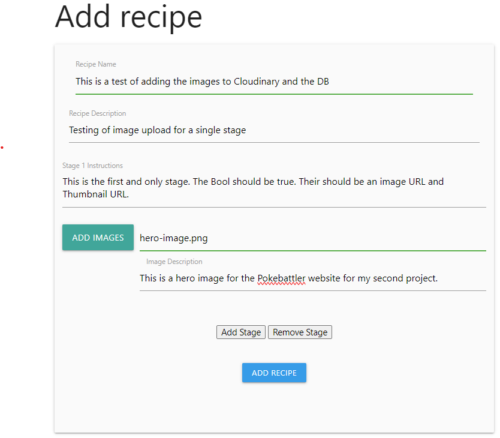
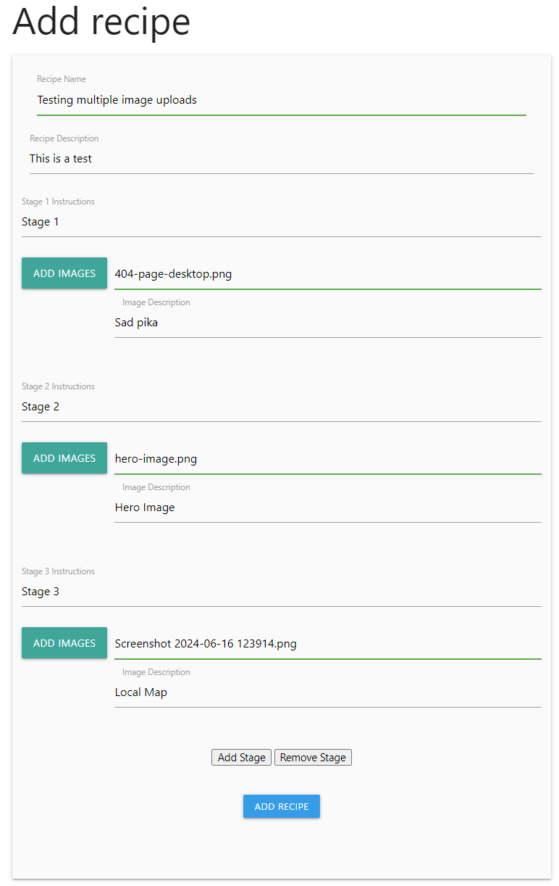
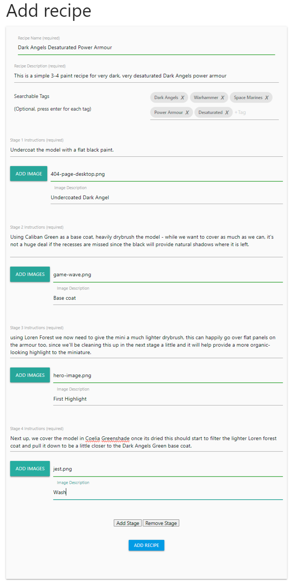

# **Colour Forge**

A paint library and painting recipe book for miniature painters. 

[The deployed website can be found here](https://colourforge.co.uk)

# Contents

[Site Concept](#site-concept)

  - [Site Owner Goals](#site-owner-goals)
  - [A Visitors Goals](#visitor-goals)

[User Stories](#user-stories)

  - [Account Registration and Authentication](#account-registration-and-authentication)
  - [Paint Collection Management](#paint-collection-management)
  - [Recipe Creation and Management](#recipe-creation-and-management)
  - [Viewing and Searching](#viewing-and-searching)    
  - [User Experience and Visuals](#user-experience-and-visuals)    
  - [Security and Error Handling](#security-and-error-handling)    
  - [Data Management](#data-management)    
  - [Administration](#administration)    
  - [Social Features](#social-features)   

[Scope](#scope) 

[Design](#design)

  - [Wireframes](#wireframes)
  - [Schema](#schema)
  - [UX](#ux)
  - [Colour Palette](#colour-palette)
  - [Typography](#typography)
  - [Images](#images)
  - [Icons](#icons)

[Bugs and Issues](#bugs-and-issues)
  - [Resolved Bugs](#resolved-bugs)
  - [Unresolved Bugs](#unresolved-bugs)

[Security and best Practices](#security-and-best-practices)  

[Technology](#technology)
  - [User testing](#user-testing)
  - [Frameworks and Programs](#frameworks-and-programs)

[Testing](#testing-and-validation)

  - [HTML Validation](#html-validation)
  - [CSS Validation](#css-validation)
  - [Accessibility](#accessibility)
  - [Performance](#performance)
  - [User Testing](#user-testing)
  - [User Story Testing](#user-story-testing)
  - [Javascript Testing](#javascript-testing)
  - [Python Testing](#python-testing)
  - [Device and Browser Testing](#device-and-browser-testing)
  - [Responsiveness](#responsiveness)
  - [Automated testing](#automated-testing)

 [Version Control and Deployment](#version-control-and-deployment)

  - [Repository Creation](#repository-creation)
  - [Cloning Locally](#cloning-locally)
  - [Deployment](#Deployment)

[Credits](#credits)
  - [Images](#images)

# Site Concept
Colour Forge is an online paint catalogue and recipe tracking tool for miniature painters, created to allow miniature painters a way of cataloguing the paints they own, allowing them to check what they may need while in hobby shops to help avoid purchasing the wrong paints for their ongoing projects, as well as creating recipes - effectively instructions for how to paint certain colours or miniatures, ensuring repeatability and consistency over multiple models.

This is a project that I've been contemplating for several years, which has caused a little feature creep to occur here and there as well as causing it to be a tad ambitious in scope for an MVP project, which resulted in having to scale back some planned functionality to allow me to have a working project to hand in. A common problem many hobbyists such as myself have is keeping track of their collections of paint, knowing what they're out of when they're near a hobby store as well as remembering specific methods for painting miniatures in a collection that they've not worked on for a while, meaning its very easy to end up with slight discrepancies between some miniatures appearance in a collection. The aim of this project is to help mitigate some of those issues by providing an easy to access online resource for hobbyists to use. As such, some of the site owner goals and user stories reflect this more expansive ambition for the project and as such via MoSCoW prioritisation have been allowed to be shifted in or out of the scope for MVP as features were brought online based on what was deemed to bring the most benefits, have a higher priority or take the most additional work, something which I know development teams have to consider when developing real world applications. I created and used a Kanban to help track specific parts of the project from conception, to styling and finally completion, which I used in conjunction with my MoSCoW board to help with planning and prioritisation. 

[My MoSCoW board can be found here](https://github.com/users/monkphin/projects/3/views/1)
[My Kanban board can be found here](https://github.com/users/monkphin/projects/1)

## Site Owner goals

- To store user data securely, particularly things like login credentials, using best practices like password hashes and other forms of encryption.
- Ensure that the app is accessible and responsive over all devices, providing a mobile friendly design. 
- Enable data management allowing users to add, edit and delete from their collections of paints and recipes. 
- For the user interface to be simple and easy to use, allowing users to create and store recipes or add to their paint collection. 
- To promote sharing and creativity by allowing users to document and share their painting methods with others. 

## Visitor Goals
- Easily organise and track my paint collection, ensuring I know what I have available and what I may need to replace. 
- Create and store paint recipes, so that I can replicate colour schemes and methods over the life of a painting project. 
- To have a clean, user friendly interface to allow me to manage my paints and recipes without confusion. 
- To be able to access my collection and recipes from any device so I can use the app while working on miniatures or while out shipping for paints. 
- To quickly search and filters paints or recipes to find specific entries based on things like colour, type of paint or project. 
- For my data to be securely stored so that I have no concerns about losing my recipes or any personal information that may be stored. 
- To be able to easily share recipes with friends. 

# User Stories
## Account registration and authentication
- 1. As a user, I want to be able to register for an account so that I may save my paint collection and recipes. 
- 2. As a user, I want to log in securely to access my data. 
- 3. As a user, I want to be able to reset my password if I forget it
- 4. As a user, I want to be able to change my account details

## Paint Collection Management
- 5. As a user, I would like to be able to add new paints to my collection by entering details of the paint. 
- 6. As a user, I want to be able to edit details of any paints in my collection, such as quantity, if I need to replace it and so on. 
- 7. As a user, I would like to be able to delete paints that I no longer have or use. 
- 8. As a user, I want to be able to search and filter my paint collection. 
- 9. As a user, I would like to be able to add paints to my library from an existing list. 

## Recipe creation and Management. 
- 10. As a user, I would like to be able to create new recipes using paints from my Library. 
- 11. As a user, I want to add detailed step by step instructions to my recipes. 
- 12. As a user, I would like to upload images to help see how each stage of the recipe looks. 
- 13. As a user, I want to be able to add tags or other identifiers to recipes to help me organise them. 
- 14. As a user, I would like to be able to edit my recipes as I improve them or need to change paints used. 
- 15. As a user, I would like to be able to delete recipes that are no longer of use to me. 

## Viewing and Searching
- 16. As a user, I want to be able to search my library and recipes using keywords. 
- 17. As a user, I want to be able to see all recipes that may use a particular paint from my library. 

## User Experience and Visuals
- 18. As a user, I want the application to be clean and easy to navigate. 
- 19. As a user, I would like the application to be fully responsive so that it can be easily used regardless of the device I access it from. 

## Security and error handling. 
- 20. As a user, I want my password to be stored securely to protect my account. 
- 21. As a user, I would like that only I am able to modify or edit my library or recipes. 
- 22. As a user, I want to receive visual feedback or confirmation when I edit or delete a paint or recipe. 
- 23. As a user, I would like to be alerted when I try and submit an incomplete form, with an indication of what data may be missing.

## Data Management
- 24. As a user, I would like to be able to import my paint collection for faster entry. 
- 25. As a user, I would like to be able to export my collection and recipes so that I know i have a back up. 

## Administration
- 26. As an admin, I want to be able to manage user accounts, including editing and deletion. 

## Social features
- 27. As a user I would like to be able to have a link for my recipes so that I can share them with other users. 

# Scope
Something that was highlighted from meetings with my mentor was that the initial concept I had may have been a little ambitious for the time frames given and the amount of work needed, so it was suggested that I scale back and add in features later as time is available. As such, it was decided that the MVP for the website would be around Paint Recipes, since this allowed multiple one-to-many tables to exist, as well as a many-to-many table for the Recipe Tags. It also created a core focus around a need that miniature painters have, which is documenting their process for painting minis so that they can easily remember how they may have approached painting a certain set of miniatures if they have taken a break from painting for a while, as well as share these recipes with others. Since the recipes were left visible to none logged in users, it was also suggested that all user recipes should be visible on the homepage, essentially creating more social features, which is something I was quite keen to focus on since it aligned with my own longer-term goals for the website.

This is a project I've been mulling over for several years, so it was very easy for it to suffer from scope creep as I started to design and develop functions and features. However, once I'd implemented CRUD functionality for paint recipes, I opted to focus on user and site administration, since while adding paint libraries is useful, I felt it was secondary to providing the site owner a way of assisting users who may have account or recipe issues, or to allow the owner to delete recipes or remove users who were using the service improperly, this also leans into the social aspect of the site as well as ensuring the site has some form of cover in place since it allows a site admin to ensure that the various recipes being shared are suitable for the site and not uploading content that may cause legal issues for the site owner. Naturally, this is still quite immature, simply focusing on modifying/deleting content. But the core functionality is there.

# Design

The early design needed to factor in the two core uses of the site, collating, cataloguing and editing a library of paints as well as creating, editing and sharing paint recipes. It also needs to support the ability to sign up for an account, modify the user's account, contact the site owner for support or other reasons and administer the website and its users for the site admin. Additional functionality would include some form of social sharing of recipes, either directly on the site, or indirectly via sharing links to other users or users who do not have an account yet, which should help to drive adoption as users share their recipes directly from the site.

It needs to support all of the above while still being somewhat simplistic and easy to use, as well as fully responsive with an interface that allows users to read through and emulate paint recipes, ideally with images to support each stage to show the desired results of the specific part of the instructions being worked on. Recipes should be presented in a simple, none distracting manner which allows the hobbyist to focus on the specific stage they're working on, while still letting them check the stage before and after the current one if needed.

## Wireframes:

Wireframes were created with Balsamiq software to provide rough mock-ups for layout.

Homepage
The home page currently shows either a login page or a specific landing page, where users can add paints or recipes to their account, as well as showing a carousel of their library and recipes depending on if they're logged in when accessing the page or not.

Mobile

Desktop

 

Side Menu

The side menu is specific to the mobile experience and will show either login/registration options for non-logged-in users, or more typical site navigation options for logged-in users.

Mobile

 

Registration Page

The registration page is accessible both from the home page and the sidebar when the user is not logged in. It allows a user to register for an account.

Mobile

Desktop

 

Profile Pages

The profile page will allow the user to manage their profile as needed, requesting password resets, changing their username or email address, granting them the ability to reset their library or recipes and delete their account entirely.

Mobile

Desktop

 

Paint Library and Recipe Pages

I had a couple of ideas for how to present the items for both the library and recipes lists - the most obvious one being a list of items for each. This could either be infinitely scrolling or use pagination to handle longer lists.

The alternative to the list to show the user their library or recipes was to use cards, allowing for a slightly cleaner and more mobile-friendly look, due to the cards presenting a larger interaction surface than a list would. Again much like the lists this could either infinitely scroll or allow for pagination for large library/recipe collection handling. Ultimately, this was the option I chose, since I felt it best presented the data in a more visually appealing and rich manner. 

Mobile

Desktop

 

Single Paint and Recipe pages. 

I had a couple of ideas for how to handle showing the individual paints for the library, one was to simply have each paint as its own page, this provides the maximum amount of room on smaller devices to show information. It may also be easier to handle in terms of building. The accordion at the bottom of the page will show some simple details about each recipe mentioned and will function as another path to get to the specific recipe in question. The wireframes also show what it should look like when deleting, editing and successfully editing the page. If I choose to use a 4 table DB, when entering a paint name it would be useful if this started to auto-complete based off the data in the stock list, when selected could autofill all the other fields, which the user could then edit and manipulate as needed before saving.

The other option, which I think is more visually pleasing, but potentially more limiting in terms of space would be to use some form of modal when selecting the paint. The wireframes also show what it should look like when deleting, editing and successfully editing the page.

Much like with the paint library, I thought it would be worthwhile to mock up a couple of options for how the recipe items should look when accessed. Again, having these rendered as single pages allows for the most amount of room to be used for the content on smaller screens. In this case, the accordion is being used to show each stage of the paint recipe and will contain simple instructions and images. The images should be able to be expanded via modals or light boxes. Again, the images show deletion alerts, the edit screen and an update confirmation.

I also tested what the recipe pages could look like containing the same data in a modal, which again may be more aesthetically pleasing but has other considerations which make it less ideal, including less space to work with, possible complexity of code, etc.

In both cases, I opted for single pages, rather than modals, this gave the content more room to breath on smaller screens and allowed the use of modal popups to show larger images for each recipe stage, as well as have a button to take the user directly to the full resolution version of the image in a new tab. 

Mobile

Desktop

 

Custom 404

The custom 404 functions as a way of handling users who may end up in places that they shouldn't when accessing the site. This features the same core layout that features throughout the rest of the site and allows the user to navigate back to the home page or use the menu to get to other locations.

In addition, I also added a custom 500, which was styled in much the same way. 

Mobile

Desktop

 

Feature Creep

Due to feature creep, I added in a few additional pages that were thought to be beyond scope, or not factored into the initial planning, such as the admin pages or the contact page. In cases where this occurred I was able to fall back on existing wireframes and choices made around them to quickly get them looking like they were a cohesive part of the website without adding too much additional overhead or work, or needing to really mock up anything via new wireframes for them. 

4 Table ERD

## Schema
Initially I had a few ideas for this, but didn't fully take into account how the data would need to be handled within the database to ensure it was easily modifiable and manipulatable, as well as supporting the one-to-many and many-to-many relationships that I was going to need to take advantage of for the data being used. 

These early attempts can be seen in the two below screenshots. 

Initial Concept ERDs

After talking my idea over with my mentor, it very quickly became apparent the two DB’s I’d mocked up were not going to be fit for purpose. As such, I redesigned the table to get something closely resembling what is in place currently, which can be found in the below screenshot. 

Final ERD

Due to the relative complexity of the initial project plan, I have scaled back a little to focus on just the paint recipes section, since this requires 6 tables to get working how I would like it to.
While working on the project, and adding in additional features such as administration rights, it was obvious that some of the tables would need some tweaks added over the original design, such as the ability for a user to be flagged as having administration privilege or having a public ID which was needed to allow for images to be deleted from Cloudinary, thumbnail_url, which was added when I realised Cloudinary could auto-gen thumbnails on upload, so could circumvent the need to render images to be smaller than their dimensions when using them for thumbnails, or the entity_type field to flag what type of entity the tag should be associated with, such as recipes or paints, which was added for future use - there were other fields and tables I could have also added here, surrounding things like self-serve password resets, which my research suggested would possibly benefit from having a separate table in place to assist with, or fields to flag if a recipe should be public or not, but these felt easier to add in later than the entity type field since this felt like it would take more effort to back populate if it was added in at a later date.

Below is the schema as it stands currently, along with an ERD diagram to demonstrate the tables and relationships. 

Updated ERD

user  
This is the table where all the user data will be stored, such as username, password, email etc.
 - id - an auto-incrementing field, which stores the table's primary key.
 - email - a text field, used for storing each user's email address to allow for login and password reset functionality.
 - username - a text field where the user could store their username which would be used to display personalised messaging as well as allow for login.
 - password - a text field for the user’s password.
 - is_admin - a Boolean which is used to track if a user should have access to the admin features or not. 

recipes 
This is where the user's recipes will be stored. It will have a foreign key for the user's table, to allow for a one-to-many relationship to the user's table so each user may create many recipes.
 - recipe_Id - an auto-incrementing field which stores the tables primary key.
 - user_id - the foreign key used for the one-to-many relationship to the user's table.
 - recipe_name - a text field for storing the name of each recipe, eg 'Space Marine Captain', 'Dark Eldar Reavers', ‘Supermarine Spitfire’ etc.
 - recipe_desc - a text field used to store a description of the recipe, where the user can describe what the recipe is for and any paints used in it.

recipe_stages 
This table is for each specific stage of the recipe. A recipe should consist of at least one stage and be able to extend as far as is needed to meet the user's requirements. This has a one-to-many relationship with the recipes table.
 - stage_id - an auto-incrementing field, which stores the table's primary key.
 - recipe_id - the foreign key to link to the recipes table for the one-to-many relationship since each recipe will have one or more stages.
 - stage_num - a numerical value the user can enter to delineate the order of stages. Eg stage 1, stage 2 etc.
 - instructions - text-based instructions for each stage of the recipe. Eg - 'Apply a base coat of Dark Angels Green'
 - is_final_stage - a boolean value which is programmatically set by the website so the last stage added automatically is flagged as being the final stage and any image assigned to this stage becomes the recipe thumbnail on the website. 

recipe_images 
This table is used to store images for each stage of the recipe, ideally, a placeholder image should be stored here if the user opts to not upload an image of their own. It has a one-to-many relationship to the recipe_stages table, allowing each stage to have multiple images if needed.
 - image_id - an auto-incrementing field, which stores the table's primary key.
 - stage_id - the foreign key used to link to the recipe stages table for the one-to-many relationship, since each stage could have multiple images.
 - image_url - the URL string of the uploaded image, automatically inserted when the user uploads an image.
 - thumbnail_url - the URL of the thumbnail generated when adding an image to Cloudinary.  
 - alt_text - a text string for the image alt text to ensure basic accessibility standards are met.
 - public_id - a text string, which was added later after I realised this would be an efficient way of handling image deletion to stop wasting space on Cloudinary

entity_tags    
This table isn't directly updatable by the user, instead it's used to allow for a many-to-many relationship between the recipes table and the recipe_tags table.
 - recipe_id - a foreign key, linking to the recipes table.
 - tag_id - a foreign key linking to the tags table.
 - entity_type - this isn't used in the MVP release, which features just the user's recipes - in the final version this will be used to identify the type of entity that the tag  relates to, eg 'paint', 'recipe', 'miniature' and so on, preventing recipe tags being seen and used for paints and vice versa. 

recipe_tags 
This table exists purely to store the tags that each user adds. Since it has a many-to-many relationship thanks to the recipe_tags table, each user can use any tag that is added in any recipe they may create, which should help limit potential data duplication as more users join the service.
 - tag_id - an auto-incrementing field, which stores the tables primary key.
 - tag_name - a text field where the tag name will be stored.

While I have larger plans around the ability to catalogue paints owned by a user and link them to their recipes, there was a high chance due to time constraints that this would not make into an MVP release, as such the above schema was designed with a degree of adaptability in mind, allowing me to add in additional tables to handle other data, either via many to many relationships or one to many relationships.  

# UX
When a user first visits the site, they will be presented with the homepage, the appearance of which will change depending on if the user is logged in or not. For a none logged in user, will see a carousel that shows some of the recipes that users of the site have created, which are fully accessible to non-members so they can peruse some of what the site has to offer. They’re invited from both the nav bar and a button on the home page to either log in or register. Once logged in the homepage view changes to display a paginated list of recipes contributed by all users of the website. This will show in either a 3x2, a 2x3 or a 1x6 array of cards depending on the size of the screen in use. Each recipe card displays a thumbnail, title and creator. Each card can show the recipe description using Materiliazes ‘Card Reveal’ function From here each recipe can be viewed and read freely, these can even be shared with none registered users of the website as a way of allowing users to not only share paint recipes others may find useful, but as a method of trying to attract new users by, effectively, advertising the site via its shared recipes. In addition to the list of recipes the homepage shows an ‘Add Recipe’ and currently, a non-functional ‘Add Paint’ card, these two cards allow the user to go directly to the ‘Add Recipe’ page to create a new paint recipe and advertise the planned paint library feature. 

For the nav bar, a logged-out user will only see the login, register and contact options - the contact form is publicly accessible to allow users to contact the admin in case of issues with their account since currently a self-serve password reset function has not been implemented. However, there are advantages to leaving this form public-facing even after this feature has been added, since it allows unregistered users to raise concerns and questions before joining. 

A logged-in user will see the ‘My Recipes’ section immediately after the home button, which is positioned to ensure users can get quick access to their recipe library, allowing them to log in, locate a recipe they have created and get to work relatively quickly. The My Recipes page lists -only- the user's own created recipes providing them with an uncluttered list of cards which are again paginated and will present no more than 6 per page in varying widths/heights depending on the device in use. This page also includes another card to allow the user to add a new recipe, which is always present at the top of the page, ensuring that the ability to create new recipes is never more than a click or two away from wherever the user is on the site. 

Next up we have the ‘Account’ page, which allows the user to edit and maintain their own account, this includes the ability to change their email address, and password and delete their account. In all cases there is a requirement for the user to enter their password, to firstly ensure that users can’t mistakenly fill in and action the specific part of the form without deliberately entering their password to do so, but also to prevent a third party from making changes if the user leaves the page up on their computer while away from their desk. 

Beyond this, we have the Logout, contact and search functions. Logout behaves as expected and provides a logged-in user a quick way to safely log out of the website when they’re done using it. Contact functions much like it does for none logged in users, presenting a simple contact form. The search button when clicked will present the user with a drop-down bar that contains a search field. This is currently configured purely to search for recipe tags, with the search results opening in a new page which uses the same familiar card layout. 

Finally, for administration accounts, we have an extra, hidden menu that uses drop-downs when on the desktop, or just lists both menu options when on smaller screens. This allows admins to administer either members' or the member's recipes, giving them the ability to quickly fix account issues or remove problematic content. Both these pages use the familiar card layout, though the member admins' content more closely matches that which is seen on the Account page, with each user's details being presented in its own card. 

When adding a recipe, the user is presented with a simple form, with a few ‘required’ fields such as the recipe name, description and stage instructions. The image and Image Description fields are both optional, with the Image Description field being used for image alt texts. At the bottom of this page are three buttons, two to add or remove stages, which effectively recreate or remove the ‘stage’ section of the form (though the remove button can only remove as far bas as stage 2, since removing stage 1 would prevent the user from being able to fill in the instructions field and prevent them from submitting the recipe.) removing a stage will clear its contents since these are not stored until the ‘Add Recipe’ button is pressed and the recipe is saved to the DB. 

It is also worth calling out the edit recipe page here, since while this is mostly the same as the add recipe page there is a subtle difference - since the recipe exists in the DB and the image is already on Cloudinary, this can be called to be rendered on the page. By default the image will replace the add image and image description button. However there is also a Delete Image button, which will remove the image and replace it with the add image and add description button, as well as a cancel button, allowing the user to change their mind and use the existing image still. 

While this has covered a lot of features there are still others that have not been mentioned, such as modals to show larger versions of the images in recipes, and defensive modals to give a user a chance to change their mind on the deletion of a recipe or their account. Admin-specific modals to remind them that they’re editing someone else's content which asks for a password confirmation before allowing them to proceed, emails to update the user of account level changes, as well as flashed alert messages to advise the user of the success or failure of their actions and possible reasons for those failures, such as forgetting to add their passwords etc. These are all important parts of the UX of the site since they provide feedback and reassurance to users in addition to additional layers of protection against making mistakes such as deleting something the user didn't mean to. 

# Colour Palette
The colour palette was a fairly late choice, with initial colours being based around some of the stock template colours from Materialize. These were adjusted to be darker to increase the contrast where needed between any text that is rendered on sections that have colour, but otherwise beyond ensuring that the colours weren't too distracting from the core of the content and ensuring good levels of contrast the core colouring was kept very simple, sticking to just a deep red for the top menu and footer, with darker versions of the colour for highlighted options in the menu bar and footer. The button colours were all picked to be fairly in line with the button use - blues and greens for buttons that provide either 'positive' or 'neutral' functionality, such as adding recipes, increasing/decreasing stages, back buttons, etc. With reds are used for more negative outcome buttons, such as deleting entries. Effectively this is leaning on existing understanding of how colour is used to represent things, green for go, red for stop etc.

# Typography
Much like the colour palette, the fonts were a fairly late choice in terms of development, since the main focus was getting the core CRUD functionality working, rather than making things look good to begin with. Three fonts were picked to give some slight visual difference between text, headings and the nav bar and all were provided by Google Fonts. These were all picked due to their clean, simple type face, ensuring no serif use to make sure they're legible over multiple sized devices for as many types of user as is possible, since the hobby community does feature many people who are members of the neurodiverse community. 

# Images
Local images are relatively minimal here, with much of the image content being provided by the users. However, the site logo and images used for the Add Paint and Add Recipe cards are the only 'static' images that the site uses and the only ones which are pulled from the host the site sits on. All other images in use are hosted on Cloudinary and are mostly provided by users, with three exceptions - the black and white and full-colour versions of the site logo and a single painted miniature image, all of which are used for the 'demo recipe' which is created when a user creates a new account. Credits for the images will be provided at the end of the readme.

The site Logo was kindly donated by a good friend who was aware of the project and is a call back to some character art that was used for Citadel paint sets in the 90s and early 00s, which many in the community often look fondly on. 

# Icons
Icons were provided by Font Awesome and were used for a few different features on the site, from social links in the footer to iconography to help demonstrate functionality on the collapsible or drawers on the recipe cards.

# Features

Tags, these were a challenge to get to work correctly due to not only the need for the many to many relationship to work, but also to have them be able to be re-used by users once they'd been entered so to have exiting tags presented as they were being typed. I tried a few alternative approaches to this, including using [Materialize Tags Input](https://henrychavez.github.io/materialize-tags/) as well as a few other tagging tools I found online, but was unable to get to work fully. Eventually I found [this Reddit Thread](https://www.reddit.com/r/flask/comments/25zjtb/af_can_someone_show_me_how_to_build_json_object/) along with this [Stackoverflow thread](https://stackoverflow.com/questions/62894961/problem-with-materialize-chips-autocomplete) and this [Github Issue](https://github.com/Dogfalo/materialize/issues/6401) which all helped me understand what was needed to get this working. 

# Bugs and Issues

Found an odd bug when using the chips feature from Materialize, where it was causing the stage counter to jump from 1 to 3 when adding a new stage. Removing the javascript needed for Chips to be initialized I found the behaviour worked as expected. The easiest fix here was to hard set the stageCount to 1, then increment/decrement it as part of the function to add/remove each stage as needed. This issue also made me realise that the ID tags being assigned were not unique as they're supposed to be, so I corrected this using Jinja to append the stage number to the ID tag for each new stage added by Javascript. 

I decided part way through developing the edit functionality to split out the varying functions needed to drive each page, in an effort to encourage more DRY like behaviour allowing for reuse of code. When trying to amalgamate both initial DB entry and editing an existing entry into a single function, this kept having issues, causing me to split these out into their own create and edit functions. This allows the code to be somewhat easier to maintain, since the various app routes and functions are smaller and simpler as well as allowing further DRY practice, since the various functions can be called as needed going forwards.

While developing the edit function, I realised that I was leaving images on Cloudinary that were no longer needed, since I hadn't built any logic to remove these. As such where stage deletion or image changes were handled, I added in functions to also delete the image from Cloudinary using the images public ID. 

I had an issue that was detected late on that allowed the default images used in the demo recipe to be deleted by any user when they delete the Demo Recipe, which is understandably not desirable, since this will impact all users who may join. As such, I added an additional check when deleting images to ensure that the public ID does not start with the word 'Placeholder'. Since I can manually set the PublicID and image names on images hosted on Cloudinary I was able to use this as a way of preventing this from being an issue. 

While the majority of the site has the submit buttons disabled onclick, to prevent the potential for users to spam adding recipes etc, I cannot get this to work in conjunction with Google ReCaptcha on the email form, since it seems that ReCaptcha takes control of the button when its clicked, which prevents my from disabling this. 
Further investigation will be needed how to resolve this, however since ReCaptcha was more of a stretch goal for the project, since I'm pushing beyond what should be an MVP here, I feel reasonably comfortable letting this go for the time being, since all that it will mean is that users may be able to send the same email to the inbox multiple times, which has no real impact on the site or its functionality and is more a personal annoyance. 

Found an issue when creating the edit recipe page, where when an image was using placeholders, so had no entry in the DB, since I was just populating these via the HTML it would generate the following Werkzeug error: UndefinedError
jinja2.exceptions.UndefinedError: sqlalchemy.orm.collections.InstrumentedList object has no element 0
While falling back to rendering a placeholder file locally is fine, I couldn't quite work out how to skip over none existent DB entries when loading the edit page for recipes that had no images. As such, I adjusted the image handling logic in the routes.py file so that it would insert a URL string into the images table when the user didn't submit an image, allowing this to be loaded and rendered from the Jinja insertions on the edit page. While this works, I will be leaving the HTML fall backs in place as a safety net, though these shouldn't ever be needed, since unless the connection to the DB goes down then the site should always see the entry and if the DB connection fails, the recipes wont be loading anyway. 

Found an issue late in development where when updating a single stage of a multistage recipe, the stages would reorder. This seems very hit and miss where it doesn't always seem to occur on recipe editing. 
open_punch_bath_8981=> select * from recipe_stages where recipe_id = 53;

This was the recipe before editing. 
 stage_id | recipe_id | stage_num | instructions | is_final_stage 
----------+-----------+-----------+--------------+----------------
      135 |        53 |         1 | Testing 1    | f
      136 |        53 |         2 | Testing 2    | f
      137 |        53 |         3 | Testing 3    | t
(3 rows)

This was it after
open_punch_bath_8981=> select * from recipe_stages where recipe_id = 53;
 stage_id | recipe_id | stage_num |           instructions           | is_final_stage 
----------+-----------+-----------+----------------------------------+----------------
      136 |        53 |         2 | Testing 2                        | f
      135 |        53 |         1 | Testing 1\r                     +| f
          |           |           | \r                              +| 
          |           |           | this should move to stage 2 or 3 | 
      137 |        53 |         3 | Testing 3                        | t
(3 rows)

A quick fix to this was to force a sort on the for loop on any pages that render the recipe stages to ensure that the user sees them in the correct order, irrespective of what order the recipe is in the DB. While this isn't a fix of the underlying issue, it does provide a quick, short term user facing resolution to the issue to allow me time to properly investigate and resolve the underlying issue. Even if/when I resolve the under lying issue this can also happily remain in the HTML for the foreseeable future, since it's a useful fallback in-case of other issues which may cause reordering of stages that I may miss or may crop up as I develop the site further, or as I continue to refine and refactor the code. 

Jinja for loop before the fix       
Jinja for loop after the fix        

# Security and best Practices

# Technology

## Frameworks and Programs

- [ERD DB Designer](https://erd.dbdesigner.net/)

  - Used to help with ERD diagrams and understanding the DB relationships

- [Balsamiq](https://balsamiq.com/)

  - Wire-framing program.

- [VSCode](https://code.visualstudio.com/)

  - IDE of choice.  

- [Git](https://github.com/)

  - Used for version control, storage and deployment.  

- [Djecrety](https://djecrety.ir/)

 - Used to generate secret Key

 - [Cloudinary](https://cloudinary.com/users/login)

 - Used to host image files

# Testing and Validation

## Use based functionality testing
While working on building basic functionality. It occurred to me that I would ideally need to test each specific function as I brought it online. As such, I commented out the majority of the models.py file and reduced it to just the recipes table with no relationships. I then created a new file called reset_db.py whose function was effectively purely to tear down and rebuild the db to save me having to do this manually each time I needed to online a new feature for testing. This way, I could keep my data clean and fresh each time a new feature was added. This idea came about because I dove in and created the entire DB schema with all relationships in place which when trying to test just adding a recipe name and description caused errors since I had nothing in place to ensure the foreign keys were being updated and that the data was fully linked and working, which caused Werkzueg errors to occur constantly. I also added some limited print output the function to ensure the data was being correctly captured before sending to the DB. 

Button debounce
While working on getting edit functionality fully online I decided to publish the app to Heroku to allow me to get some user testing as things were moving forwards. This very quickly highlighted an issue where a user could submit the same recipe multiple times which I' hadn't factored for. A simple button disable function was implmented in the Javascript to prevent this from occurring. Initially this is only on the add_recipe page, but ideally it needs to be implemented on all pages that have a form/button that allows a user to modify the database. Several examples for how to do this via Jquery were found, with [this stack overflow](https://stackoverflow.com/questions/97962/debounce-clicks-when-submitting-a-web-form) article being particularly useful 

### add recipe

basic functionality to write to the recipes table

Output of writing to the recipes table 

Recipe Name: This is a test of the add recipe function 
Recipe Description: Testing the ability to add recipes. Nothing to see here. Once this works I will start to build the recipes page to show the stored data. 
127.0.0.1 - - [29/Sep/2024 16:46:15] "POST /add_recipe HTTP/1.1" 302 - 
127.0.0.1 - - [29/Sep/2024 16:46:15] "GET /recipes HTTP/1.1" 200 - 
127.0.0.1 - - [29/Sep/2024 16:46:15] "GET /static/css/style.css HTTP/1.1" 304 - 
127.0.0.1 - - [29/Sep/2024 16:46:15] "GET /static/images/logo.png HTTP/1.1" 304 - 
127.0.0.1 - - [29/Sep/2024 16:46:15] "GET /static/js/script.js HTTP/1.1" 304 - 

Recipes table contents 
open_punch_bath_8981=> \dt 
           List of relations 
 Schema |  Name   | Type  |    Owner
--------+---------+-------+-------------
 public | recipes | table | urbqgoc5q8y
(1 row) 
 
open_punch_bath_8981=> select * from recipes; 
 recipe_id |                recipe_name                |                                                                recipe_desc
-----------+-------------------------------------------+-------------------------------------------------------------------------------------------------------------------------------------------
         1 | This is a test of the add recipe function | Testing the ability to add recipes. Nothing to see here. Once this works I will start to build the recipes page to show the stored data.
(1 row)

Output of writing to the recipe and recipe_stages tables

Recipe Name: This is a test of the recipe stages 
Recipe Description: Testing to see if a single stage can be added OK 
2 
Instructions List: ['Just a single stage test. '] 
Is Final Stage?: None 
127.0.0.1 - - [29/Sep/2024 21:22:27] "POST /add_recipe HTTP/1.1" 302 - 
127.0.0.1 - - [29/Sep/2024 21:22:27] "GET /recipes HTTP/1.1" 200 - 
127.0.0.1 - - [29/Sep/2024 21:22:28] "GET /static/css/style.css HTTP/1.1" 304 - 
127.0.0.1 - - [29/Sep/2024 21:22:28] "GET /static/images/logo.png HTTP/1.1" 304 - 
127.0.0.1 - - [29/Sep/2024 21:22:28] "GET /static/js/script.js HTTP/1.1" 304 - 

open_punch_bath_8981=> \dt 
              List of relations
 Schema |     Name      | Type  |    Owner
--------+---------------+-------+-------------
 public | recipe_stages | table | urbqgoc5q8y
 public | recipes       | table | urbqgoc5q8y
(2 rows) 
 
open_punch_bath_8981=> select * from recipes; 
 recipe_id |             recipe_name             |                   recipe_desc
-----------+-------------------------------------+--------------------------------------------------
         1 | This is a test of the recipe stages | Testing to see if a single stage can be added OK
(1 row)

open_punch_bath_8981=> select * from recipe_stages;
 stage_id | recipe_id | stage_num |        instructions        | is_final_stage 
----------+-----------+-----------+----------------------------+----------------
        1 |         1 |         1 | Just a single stage test.  | f
(1 row)

basic functionality to write to the recipes table and add multiple stages to the recipes_stages table

 
Recipe Name: Testing adding 2 stages 
Recipe Description: This is a test of 2 stages 
3 
Instructions List: ['This is the first stage.', 'This is the second stage. '] 
Is Final Stage?: None 
127.0.0.1 - - [29/Sep/2024 21:25:01] "POST /add_recipe HTTP/1.1" 302 - 
127.0.0.1 - - [29/Sep/2024 21:25:01] "GET /recipes HTTP/1.1" 200 - 
127.0.0.1 - - [29/Sep/2024 21:25:02] "GET /static/images/logo.png HTTP/1.1" 304 - 
127.0.0.1 - - [29/Sep/2024 21:25:02] "GET /static/js/script.js HTTP/1.1" 304 - 
127.0.0.1 - - [29/Sep/2024 21:25:02] "GET /static/css/style.css HTTP/1.1" 304 - 
 
open_punch_bath_8981=> select * from recipes; 
 recipe_id |       recipe_name       |        recipe_desc
-----------+-------------------------+----------------------------
         1 | Testing adding 2 stages | This is a test of 2 stages
(1 row) 
 
open_punch_bath_8981=> select * from recipe_stages; 
 stage_id | recipe_id | stage_num |        instructions        | is_final_stage 
----------+-----------+-----------+----------------------------+----------------
        1 |         1 |         1 | This is the first stage.   | f
        2 |         1 |         2 | This is the second stage.  | f
(2 rows)

Output of writing to the recipe and recipe_stages tables and testing the Boolean

Recipe Name: Testing three stages with a final stage 
Recipe Description: This is a test of all functions added so far, recipe name, recipe description, multiple recipe stages and finally if the final stage bool is honoured.  
4 
Instructions List: ['This is stage 1 of the third test', 'This is stage 2 of the third test', 'This is stage 3 of the third test'] 
Is Final Stage?: on 
127.0.0.1 - - [29/Sep/2024 21:28:22] "POST /add_recipe HTTP/1.1" 302 - 
127.0.0.1 - - [29/Sep/2024 21:28:22] "GET /recipes HTTP/1.1" 200 - 
127.0.0.1 - - [29/Sep/2024 21:28:22] "GET /static/css/style.css HTTP/1.1" 304 - 
127.0.0.1 - - [29/Sep/2024 21:28:22] "GET /static/images/logo.png HTTP/1.1" 304 - 
127.0.0.1 - - [29/Sep/2024 21:28:22] "GET /static/js/script.js HTTP/1.1" 304 - 
 
open_punch_bath_8981=> select * from recipes; 
 recipe_id |               recipe_name               |                                                                       recipe_desc
-----------+-----------------------------------------+---------------------------------------------------------------------------------------------------------------------------------------------------------
         1 | Testing three stages with a final stage | This is a test of all functions added so far, recipe name, recipe description, multiple recipe stages and finally if the final stage bool is honoured.
(1 row) 
 
open_punch_bath_8981=> select * from recipe_stages; 
 stage_id | recipe_id | stage_num |           instructions            | is_final_stage 
----------+-----------+-----------+-----------------------------------+----------------
        1 |         1 |         1 | This is stage 1 of the third test | t
        2 |         1 |         2 | This is stage 2 of the third test | t
        3 |         1 |         3 | This is stage 3 of the third test | t

It seemed this assigned true to all stages, rather than just the last. This caused me to rethink how this should be handled, either giving the user an option per stage, which seems like too clunky a solution. Or to automatically assume the last stage added is the last stage of the instructions, which would make more sense since this is where we would normally expect the image used in the card for the recipe to be selected from. 

Output of writing to the recipe and recipe_stages tables and testing the new Boolean logic

 
Recipe Name: Retest of multiple stages, with the new logic for the final stage added 
Recipe Description: This is hopefully a final test of the add recipe function, featuring the ability to add multiple stages and for the last stage to automatically have its bool set as 'true' to denote it as the last stage, meaning its attached image will be used for the recipes image 
5 
Instructions List: ['This stage 1 of the test of the adjusted Boolean handling', 'This stage 2 of the test of the adjusted Boolean handling', 'This stage 3 of the test of the adjusted Boolean handling', 'This stage 4 of the test of the adjusted Boolean handling'] 
Is Final Stage?: None 
127.0.0.1 - - [29/Sep/2024 21:43:16] "POST /add_recipe HTTP/1.1" 302 - 
127.0.0.1 - - [29/Sep/2024 21:43:16] "GET /recipes HTTP/1.1" 200 - 
127.0.0.1 - - [29/Sep/2024 21:43:17] "GET /static/js/script.js HTTP/1.1" 304 - 
127.0.0.1 - - [29/Sep/2024 21:43:17] "GET /static/css/style.css HTTP/1.1" 304 - 
127.0.0.1 - - [29/Sep/2024 21:43:17] "GET /static/images/logo.png HTTP/1.1" 304 - 
 
open_punch_bath_8981=> select * from recipes; 
 recipe_id |                               recipe_name                               |                                                                                                                                recipe_desc
-----------+-------------------------------------------------------------------------+---------------------------------------------------------------------------------------------------------------------------------------------------------------------------------------------------------------------------------------------------------------------------
         1 | Testing three stages with a final stage                                 | This is a test of all functions added so far, recipe name, recipe description, multiple recipe stages and finally if the final stage bool is honoured.
         2 | Retest of multiple stages, with the new logic for the final stage added | This is hopefully a final test of the add recipe function, featuring the ability to add multiple stages and for the last stage to automatically have its bool set as 'true' to denote it as the last stage, meaning its attached image will be used for the recipes image
(2 rows) 
 
open_punch_bath_8981=> select * from recipe_stages; 
 stage_id | recipe_id | stage_num |                       instructions                        | is_final_stage 
----------+-----------+-----------+-----------------------------------------------------------+----------------
        1 |         1 |         1 | This is stage 1 of the third test                         | t
        2 |         1 |         2 | This is stage 2 of the third test                         | t
        3 |         1 |         3 | This is stage 3 of the third test                         | t
        4 |         2 |         1 | This stage 1 of the test of the adjusted Boolean handling | f
        5 |         2 |         2 | This stage 2 of the test of the adjusted Boolean handling | f
        6 |         2 |         3 | This stage 3 of the test of the adjusted Boolean handling | f
        7 |         2 |         4 | This stage 4 of the test of the adjusted Boolean handling | f

Output of writing to the recipe and recipe_stages tables and testing the fix Boolean logic

 
Recipe Name: Test of adjusted logic for Bool handling 
Recipe Description: THis is hopefully a final test for the adjusted Boolean logic 
3 
Instructions List: ['Stage 1 of the adjusted logic test', 'Stage 2 of the adjusted logic test'] 
Is Final Stage?: None 
127.0.0.1 - - [29/Sep/2024 21:55:34] "POST /add_recipe HTTP/1.1" 302 - 
127.0.0.1 - - [29/Sep/2024 21:55:34] "GET /recipes HTTP/1.1" 200 - 
127.0.0.1 - - [29/Sep/2024 21:55:34] "GET /static/css/style.css HTTP/1.1" 304 - 
127.0.0.1 - - [29/Sep/2024 21:55:34] "GET /static/images/logo.png HTTP/1.1" 304 - 
127.0.0.1 - - [29/Sep/2024 21:55:34] "GET /static/js/script.js HTTP/1.1" 304 - 
127.0.0.1 - - [29/Sep/2024 21:55:39] "GET /static/css/style.css HTTP/1.1" 304 - 
 
open_punch_bath_8981=> select * from recipes; 
 recipe_id |                               recipe_name                               |                                                                                                                                recipe_desc
-----------+-------------------------------------------------------------------------+---------------------------------------------------------------------------------------------------------------------------------------------------------------------------------------------------------------------------------------------------------------------------
         1 | Testing three stages with a final stage                                 | This is a test of all functions added so far, recipe name, recipe description, multiple recipe stages and finally if the final stage bool is honoured.
         2 | Retest of multiple stages, with the new logic for the final stage added | This is hopefully a final test of the add recipe function, featuring the ability to add multiple stages and for the last stage to automatically have its bool set as 'true' to denote it as the last stage, meaning its attached image will be used for the recipes image
         3 | Testing adjusted logic for last stage check                             | Adjusted logic check for final stage logic
         4 | Test of adjusted logic for Bool handling                                | THis is hopefully a final test for the adjusted Boolean logic
(4 rows) 
 
open_punch_bath_8981=> select * from recipe_stages; 
 stage_id | recipe_id | stage_num |                       instructions                        | is_final_stage 
----------+-----------+-----------+-----------------------------------------------------------+----------------
        1 |         1 |         1 | This is stage 1 of the third test                         | t
        2 |         1 |         2 | This is stage 2 of the third test                         | t
        3 |         1 |         3 | This is stage 3 of the third test                         | t
        4 |         2 |         1 | This stage 1 of the test of the adjusted Boolean handling | f
        5 |         2 |         2 | This stage 2 of the test of the adjusted Boolean handling | f
        6 |         2 |         3 | This stage 3 of the test of the adjusted Boolean handling | f
        7 |         2 |         4 | This stage 4 of the test of the adjusted Boolean handling | f
        8 |         4 |         1 | Stage 1 of the adjusted logic test                        | f
        9 |         4 |         2 | Stage 2 of the adjusted logic test                        | t
(9 rows)

Output of writing to the recipe, recipe_stages tables, uploading to Cloudinary and finally writing the results of the upload to the recipe_images table

 
Recipe Name: This is a test of adding the images to Cloudinary and the DB 
Recipe Description: Testing of image upload for a single stage 
1 
Instructions List: ['This is the first and only stage. The Bool should be true. Their should be an image URL and Thumbnail URL. '] 
Is Final Stage?: None 
Image names: [<FileStorage: 'hero-image.png' ('image/png')>] 
127.0.0.1 - - [30/Sep/2024 18:04:08] "POST /add_recipe HTTP/1.1" 302 - 
127.0.0.1 - - [30/Sep/2024 18:04:08] "GET /recipes HTTP/1.1" 200 - 
127.0.0.1 - - [30/Sep/2024 18:04:08] "GET /static/css/style.css HTTP/1.1" 304 - 
127.0.0.1 - - [30/Sep/2024 18:04:08] "GET /static/images/logo.png HTTP/1.1" 304 - 
127.0.0.1 - - [30/Sep/2024 18:04:08] "GET /static/js/script.js HTTP/1.1" 304 - 
 
open_punch_bath_8981=> SELECT * FROM recipes; 
 recipe_id |                         recipe_name                          |                recipe_desc
-----------+--------------------------------------------------------------+--------------------------------------------
         1 | This is a test of adding the images to Cloudinary and the DB | Testing of image upload for a single stage
(1 row)

open_punch_bath_8981=> SELECT * FROM recipe_stages; 
 stage_id | recipe_id | stage_num |                                                instructions                                                 | is_final_stage
----------+-----------+-----------+-------------------------------------------------------------------------------------------------------------+----------------
        1 |         1 |         1 | This is the first and only stage. The Bool should be true. Their should be an image URL and Thumbnail URL.  | t
(1 row)

open_punch_bath_8981=> SELECT * FROM recipe_images; 
 image_id | stage_id |                                       image_url                                        |                                        thumbnail_url                                         |                                 alt_text
----------+----------+----------------------------------------------------------------------------------------+----------------------------------------------------------------------------------------------+--------------------------------------------------------------------------
        1 |        1 | https://res.cloudinary.com/dlmbpbtfx/image/upload/v1727715847/eupydc07vwmej3en6xbs.png | http://res.cloudinary.com/dlmbpbtfx/image/upload/c_fill,h_100,w_100/eupydc07vwmej3en6xbs.jpg | This is a hero image for the Pokebattler website for my second project.
(1 row)

Output of writing to the recipe, recipe_stages tables, uploading to Cloudinary and finally writing the results of the upload to the recipe_images table

 
Recipe Name: This is a test of adding multiple images 
Recipe Description: Will try for three images this time over 4 stages 
1 
Instructions List: ['This is the first stages image', 'This is the second stages image', 'The third stage will have no alt_text added', 'This will have no image attached '] 
Is Final Stage?: None 
Image names: [<FileStorage: '404-page-desktop.png' ('image/png')>] 
127.0.0.1 - - [30/Sep/2024 18:12:03] "POST /add_recipe HTTP/1.1" 302 - 
127.0.0.1 - - [30/Sep/2024 18:12:03] "GET /recipes HTTP/1.1" 200 - 
127.0.0.1 - - [30/Sep/2024 18:12:03] "GET /static/css/style.css HTTP/1.1" 304 - 
127.0.0.1 - - [30/Sep/2024 18:12:03] "GET /static/images/logo.png HTTP/1.1" 304 - 
127.0.0.1 - - [30/Sep/2024 18:12:03] "GET /static/js/script.js HTTP/1.1" 304 - 

127.0.0.1 - - [30/Sep/2024 18:04:08] "GET /static/js/script.js HTTP/1.1" 304 - 
 
open_punch_bath_8981=> SELECT * FROM recipes; 
 recipe_id |                         recipe_name                          |                    recipe_desc
-----------+--------------------------------------------------------------+---------------------------------------------------
         1 | This is a test of adding the images to Cloudinary and the DB | Testing of image upload for a single stage
         2 | This is a test of adding multiple images                     | Will try for three images this time over 4 stages
(2 rows)

open_punch_bath_8981=> SELECT * FROM recipe_stages; 
 stage_id | recipe_id | stage_num |                                                instructions                                                 | is_final_stage 
----------+-----------+-----------+-------------------------------------------------------------------------------------------------------------+----------------
        1 |         1 |         1 | This is the first and only stage. The Bool should be true. Their should be an image URL and Thumbnail URL.  | t
        2 |         2 |         1 | This is the first stages image                                                                              | f
(2 rows)

open_punch_bath_8981=> SELECT * FROM recipe_images; 
 image_id | stage_id |                                       image_url                                        |                                        thumbnail_url                                         |                                 alt_text
----------+----------+----------------------------------------------------------------------------------------+----------------------------------------------------------------------------------------------+--------------------------------------------------------------------------
        1 |        1 | https://res.cloudinary.com/dlmbpbtfx/image/upload/v1727715847/eupydc07vwmej3en6xbs.png | http://res.cloudinary.com/dlmbpbtfx/image/upload/c_fill,h_100,w_100/eupydc07vwmej3en6xbs.jpg | This is a hero image for the Pokebattler website for my second project.
        2 |        2 | https://res.cloudinary.com/dlmbpbtfx/image/upload/v1727716322/tnp1ssx1ac3gjs8blb0g.png | http://res.cloudinary.com/dlmbpbtfx/image/upload/c_fill,h_100,w_100/tnp1ssx1ac3gjs8blb0g.jpg | Sad Pikachu!
(2 rows)
(1 row)

The above only seemed to add a single image of the several that were input. On inspection, I'd missed creating the images and alt text entries as arrays. 

Output of writing to the recipe, recipe_stages tables, uploading to Cloudinary and finally writing the results of the upload to the recipe_images table

 
Recipe Name: Testing multiple image uploads 
Recipe Description: This is a test 
3 
Instructions List: ['Stage 1', 'Stage 2', 'Stage 3'] 
Is Final Stage?: None 
Image names: ['404-page-desktop.png', 'hero-image.png', 'Screenshot 2024-06-16 123914.png'] 
alt text: ['Sad pika', 'Hero Image', 'Local Map'] 
127.0.0.1 - - [30/Sep/2024 22:17:19] "POST /add_recipe HTTP/1.1" 302 - 
127.0.0.1 - - [30/Sep/2024 22:17:19] "GET /recipes HTTP/1.1" 200 - 
127.0.0.1 - - [30/Sep/2024 22:17:19] "GET /static/css/style.css HTTP/1.1" 304 - 
127.0.0.1 - - [30/Sep/2024 22:17:19] "GET /static/images/logo.png HTTP/1.1" 304 - 
127.0.0.1 - - [30/Sep/2024 22:17:19] "GET /static/js/script.js HTTP/1.1" 304 - 
 
open_punch_bath_8981=> SELECT * FROM recipes; 
 recipe_id |          recipe_name           |  recipe_desc   
-----------+--------------------------------+----------------
         1 | Testing multiple image uploads | This is a test
(1 row)

open_punch_bath_8981=> SELECT * FROM recipe_stages; 
 stage_id | recipe_id | stage_num | instructions | is_final_stage 
----------+-----------+-----------+--------------+----------------
        1 |         1 |         1 | Stage 1      | f
        2 |         1 |         2 | Stage 2      | f
        3 |         1 |         3 | Stage 3      | t
(3 rows)

open_punch_bath_8981=> SELECT * FROM recipe_images; 
 image_id | stage_id |                                       image_url                                        |                                        thumbnail_url                                         |  alt_text  
----------+----------+----------------------------------------------------------------------------------------+----------------------------------------------------------------------------------------------+------------
        1 |        1 | https://res.cloudinary.com/dlmbpbtfx/image/upload/v1727731037/zcs4iirp7kqhspzje4lv.png | http://res.cloudinary.com/dlmbpbtfx/image/upload/c_fill,h_100,w_100/zcs4iirp7kqhspzje4lv.jpg | Sad pika
        2 |        2 | https://res.cloudinary.com/dlmbpbtfx/image/upload/v1727731037/ixa63ye6aszg97ls8vvu.png | http://res.cloudinary.com/dlmbpbtfx/image/upload/c_fill,h_100,w_100/ixa63ye6aszg97ls8vvu.jpg | Hero Image
        3 |        3 | https://res.cloudinary.com/dlmbpbtfx/image/upload/v1727731038/ocke1j24jnwolatvzmb3.png | http://res.cloudinary.com/dlmbpbtfx/image/upload/c_fill,h_100,w_100/ocke1j24jnwolatvzmb3.jpg | Local Map
(3 rows)

Output of testing unexpected behaviours, such as not filling in all fields, forgetting to add alt-text (image description), forgetting to add an image, etc.

 
Recipe Name: Test of not adding data to all fields for multiple stages 
Recipe Description: Some stages will have all fields filled. Some will not. 
5 
Instructions List: ['Stage 1 - this is the control and will have data in all fields ', 'Stage 2 - this will only have the instructions ', 'Stage 3 - This will just be an image', "Stage 4 - this is a possible, but unlikely scenario where an image description is added for an image alt. Once i've wired up the default placeholder image this should be overwritten so I may need logic for this. ", 'Stage 5 - this needed to be filled in to submit, as expected'] 
Is Final Stage?: None 
Image names: ['Screenshot 2024-06-08 021116.png', '', 'Screenshot 2024-09-12 223744.png', '', 'Screenshot 2024-07-25 202904.png'] 
alt text: ['The Thing', '', '', 'I forgot to add an image', "Phone Mock-up - In this instance I'm testing adding images and no Instructions"] 
127.0.0.1 - - [30/Sep/2024 22:28:38] "POST /add_recipe HTTP/1.1" 302 - 
127.0.0.1 - - [30/Sep/2024 22:28:38] "GET /recipes HTTP/1.1" 200 - 
127.0.0.1 - - [30/Sep/2024 22:28:39] "GET /static/css/style.css HTTP/1.1" 304 - 
127.0.0.1 - - [30/Sep/2024 22:28:39] "GET /static/images/logo.png HTTP/1.1" 304 - 
127.0.0.1 - - [30/Sep/2024 22:28:39] "GET /static/js/script.js HTTP/1.1" 304 - 
 
open_punch_bath_8981=> SELECT * FROM recipes; 
 recipe_id |                        recipe_name                        |                       recipe_desc
-----------+-----------------------------------------------------------+----------------------------------------------------------
         1 | Testing multiple image uploads                            | This is a test
         2 | Test of not adding data to all fields for multiple stages | Some stages will have all fields filled. Some will not.
(2 rows)

open_punch_bath_8981=> SELECT * FROM recipe_stages; 
 stage_id | recipe_id | stage_num |                                                                                                     instructions                                                                                                     | is_final_stage 
----------+-----------+-----------+----------------------------------------------------------------------------------------------------------------------------------------------------------------------------------------------------------------------+----------------
        1 |         1 |         1 | Stage 1                                                                                                                                                                                                              | f
        2 |         1 |         2 | Stage 2                                                                                                                                                                                                              | f
        3 |         1 |         3 | Stage 3                                                                                                                                                                                                              | t
        4 |         2 |         1 | Stage 1 - this is the control and will have data in all fields                                                                                                                                                       | f
        5 |         2 |         2 | Stage 2 - this will only have the instructions                                                                                                                                                                       | f
        6 |         2 |         3 | Stage 3 - This will just be an image                                                                                                                                                                                 | f
        7 |         2 |         4 | Stage 4 - this is a possible, but unlikely scenario where an image description is added for an image alt. Once i've wired up the default placeholder image this should be overwritten so I may need logic for this.  | f
        8 |         2 |         5 | Stage 5 - this needed to be filled in to submit, as expected                                                                                                                                                         | t
(8 rows)

open_punch_bath_8981=> SELECT * FROM recipe_images; 
 image_id | stage_id |                                       image_url                                        |                                        thumbnail_url                                         |                                   alt_text
----------+----------+----------------------------------------------------------------------------------------+----------------------------------------------------------------------------------------------+-------------------------------------------------------------------------------
        1 |        1 | https://res.cloudinary.com/dlmbpbtfx/image/upload/v1727731037/zcs4iirp7kqhspzje4lv.png | http://res.cloudinary.com/dlmbpbtfx/image/upload/c_fill,h_100,w_100/zcs4iirp7kqhspzje4lv.jpg | Sad pika
        2 |        2 | https://res.cloudinary.com/dlmbpbtfx/image/upload/v1727731037/ixa63ye6aszg97ls8vvu.png | http://res.cloudinary.com/dlmbpbtfx/image/upload/c_fill,h_100,w_100/ixa63ye6aszg97ls8vvu.jpg | Hero Image
        3 |        3 | https://res.cloudinary.com/dlmbpbtfx/image/upload/v1727731038/ocke1j24jnwolatvzmb3.png | http://res.cloudinary.com/dlmbpbtfx/image/upload/c_fill,h_100,w_100/ocke1j24jnwolatvzmb3.jpg | Local Map
        4 |        4 | https://res.cloudinary.com/dlmbpbtfx/image/upload/v1727731716/jwrsx0hlqixuxl2k1fdc.png | http://res.cloudinary.com/dlmbpbtfx/image/upload/c_fill,h_100,w_100/jwrsx0hlqixuxl2k1fdc.jpg | The Thing
        5 |        6 | https://res.cloudinary.com/dlmbpbtfx/image/upload/v1727731717/ytwtbmoc6wmrxenzk5fj.png | http://res.cloudinary.com/dlmbpbtfx/image/upload/c_fill,h_100,w_100/ytwtbmoc6wmrxenzk5fj.jpg |
        6 |        8 | https://res.cloudinary.com/dlmbpbtfx/image/upload/v1727731718/xeynhlcgz4jbzuysjg34.png | http://res.cloudinary.com/dlmbpbtfx/image/upload/c_fill,h_100,w_100/xeynhlcgz4jbzuysjg34.jpg | Phone Mockup - In this instance I'm testing adding images and no Instructions
(6 rows)

The above test, while initially using 6 stages for testing, also let me test what would happen if I removed a stage using the remove button before submitting, since the 5th and 6th stages were both initially intended to have the instructions empty, with the sixth stage having just the images alt-text added. Since both stages were unable to be submitted as empty as per design this meant that stage 6 was no longer needed, allowing me to prove the removal of a stage stops it being submitted. 

Testing writing to all tables needed for adding a recipe, recipes, recipe_stages, recipe_images, recipe_tags and entity_tags  

 
Recipe Name: Dark Angels Desaturated Power Armour 
Recipe Description: This is a simple 3-4 paint recipe for very dark, very desaturated Dark Angels power armour 
1 
Instructions List: ['Undercoat the model with a flat black paint. ', "Using Caliban Green as a base coat, heavily drybrush the model - while we want to cover as much as we can, it's not a huge deal if the recesses are missed since the black will provide natural shadows where it is left. ", "using Loren Forest we now need to give the mini a much lighter drybrush, this can happily go over flat panels on the armour too, sinInstructions List: ['Undercoat the model with a flat black paint. ', "Using Caliban Green as a base coat, heavily drybrush the model - while we want to cover as much as we can, it's not a huge deal if the recesses are missed since the black will provide natural shadows where it is left. ", "using Loren Forest we now need to give the mini a much lighter drybrush, this can happily go over flat panels on the armour too, since we'll be cleaning this up in the next stage a little and it will help provide a more organic-looking highlight to the miniature. ", 'Next up, we cover the model in Coelia Greenshade once its dried this should start to filter the lighter Loren forest coat and pull it down to be a little closer to the Dark Angels Green base coat. '] 
Is Final Stage?: None 
Image names: ['404-page-desktop.png', 'game-wave.png', 'hero-image.png', 'jest.png'] 
alt text: ['Undercoated Dark Angel', 'Base coat', 'First Highlight', 'Wash'] 
Full form content ImmutableMultiDict([('recipe_name', 'Dark Angels Desaturated Power Armour'), ('recipe_desc', 'This is a simple 3-4 paint recipe for very dark, very desaturated Dark Angels power armour'), ('tags', 'Dark Angels,Warhammer,Space Marines,Power Armour,Desaturated'), ('instructions[]', 'Undercoat the model with a flat black paint. '), ('instructions[]', "Using Caliban Green as a base coat, heavily drybrush the model - while we want to cover as much as we can, it's not a huge deal if the recesses are missed since the black will provide natural shadows where it is left. "), ('instructions[]', "using Loren Forest we now need to give the mini a much lighter drybrush, this can happily go over flat panels on the armour too, since we'll be cleaning this up in the next stage a little and it will help provide a more organic-looking highlight to the miniature. "), ('instructions[]', 'Next up, we cover the model in Coelia Greenshade once its dried this should start to filter the lighter Loren forest coat and pull it down to be a little closer to the Dark Angels Green base coat. '), ('image_desc[]', 'Undercoated Dark Angel'), ('image_desc[]', 'Base coat'), ('image_desc[]', 'First Highlight'), ('image_desc[]', 'Wash')]) 
 
open_punch_bath_8981=> \dt 
              List of relations
 Schema |     Name      | Type  |    Owner    
--------+---------------+-------+-------------
 public | entity_tags   | table | urbqgoc5q8y
 public | recipe_images | table | urbqgoc5q8y
 public | recipe_stages | table | urbqgoc5q8y
 public | recipe_tags   | table | urbqgoc5q8y
 public | recipes       | table | urbqgoc5q8y
(5 rows)

open_punch_bath_8981=> select * from recipes; 
 recipe_id |             recipe_name              |                                        recipe_desc
-----------+--------------------------------------+--------------------------------------------------------------------------------------------
         1 | Dark Angels Desaturated Power Armour | This is a simple 3-4 paint recipe for very dark, very desaturated Dark Angels power armour
(1 row)

open_punch_bath_8981=> select * from recipe_stages; 
 stage_id | recipe_id | stage_num |                                                                                                                               instructions                                                                                                                               | is_final_stage 
----------+-----------+-----------+--------------------------------------------------------------------------------------------------------------------------------------------------------------------------------------------------------------------------------------------------------------------------+----------------
        1 |         1 |         1 | Undercoat the model with a flat black paint.                                                                                                                                                                                                                             | f
        2 |         1 |         2 | Using Caliban Green as a base coat, heavily drybrush the model - while we want to cover as much as we can, it's not a huge deal if the recesses are missed since the black will provide natural shadows where it is left.                                                | f
        3 |         1 |         3 | using Loren Forest we now need to give the mini a much lighter drybrush, this can happily go over flat panels on the armour too, since we'll be cleaning this up in the next stage a little and it will help provide a more organic-looking highlight to the miniature.  | f
        4 |         1 |         4 | Next up, we cover the model in Coelia Greenshade once its dried this should start to filter the lighter Loren forest coat and pull it down to be a little closer to the Dark Angels Green base coat.                                                                     | t
(4 rows)

open_punch_bath_8981=> select * from recipe_images; 
 image_id | stage_id |                                       image_url                                        |                                        thumbnail_url                                         |        alt_text        
----------+----------+----------------------------------------------------------------------------------------+----------------------------------------------------------------------------------------------+------------------------
        1 |        1 | https://res.cloudinary.com/dlmbpbtfx/image/upload/v1727987873/q5i2ftplla6udtqxdlob.png | http://res.cloudinary.com/dlmbpbtfx/image/upload/c_fill,h_100,w_100/q5i2ftplla6udtqxdlob.jpg | Undercoated Dark Angel
        2 |        2 | https://res.cloudinary.com/dlmbpbtfx/image/upload/v1727987876/afcihcowy0sjo7jvtzx1.png | http://res.cloudinary.com/dlmbpbtfx/image/upload/c_fill,h_100,w_100/afcihcowy0sjo7jvtzx1.jpg | Base coat
        3 |        3 | https://res.cloudinary.com/dlmbpbtfx/image/upload/v1727987877/bc4onemhmikj4otzngk2.png | http://res.cloudinary.com/dlmbpbtfx/image/upload/c_fill,h_100,w_100/bc4onemhmikj4otzngk2.jpg | First Highlight
        4 |        4 | https://res.cloudinary.com/dlmbpbtfx/image/upload/v1727987878/g5ccnr4thoblvveatmpq.png | http://res.cloudinary.com/dlmbpbtfx/image/upload/c_fill,h_100,w_100/g5ccnr4thoblvveatmpq.jpg | Wash
(4 rows)

open_punch_bath_8981=> select * from recipe_tags; 
 tag_id |   tag_name    
--------+---------------
      1 | Dark Angels
      2 | Warhammer
      3 | Space Marines
      4 | Power Armour
      5 | Desaturated
(5 rows)

open_punch_bath_8981=> select * from entity_tags; 
 recipe_id | tag_id | entity_type 
-----------+--------+-------------
         1 |      1 | recipe
         1 |      2 | recipe
         1 |      3 | recipe
         1 |      4 | recipe
         1 |      5 | recipe
(5 rows)

# Version control and Deployment

# Credits

Placeholder image for recipes from https://minifreakstudios.com/painting/commissioned-painting-for-warhammer-minis/

