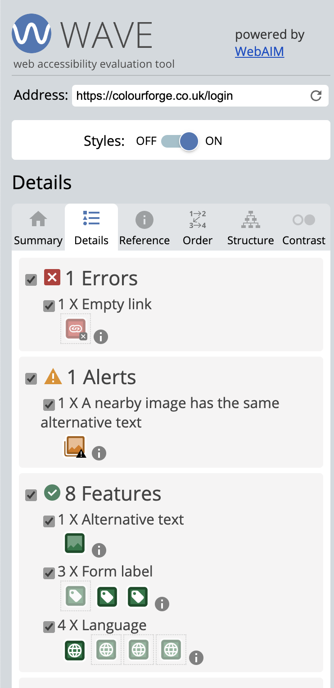

# **Colour Forge**

[Testing and Validation](#testing-and-validation)

 - [Usage Based Functionality Testing](#use-based-functionality-testing)
 - [HTML Validation](#html-validation)
 - [CSS Validation](#css-validation)
 - [Accessibility](#accessibility)
 - [Performance](#performance)
 - [User Testing](#user-testing)
 - [User Story Testing](#user-story-testing)
 - [Javascript Testing](#javascript-testing)
 - [Python Testing](#python-testing)
 - [Device and Browser Testing](#device-and-browser-testing)
 - [Responsiveness](#responsiveness)
 - [Automated testing](#automated-testing)

# Testing and Validation

## Use based functionality testing
While working on building basic functionality. It occurred to me that I would ideally need to test each specific function as I brought it online. As such, I commented out the majority of the models.py file and reduced it to just the recipes table with no relationships. I then created a new file called reset_db.py whose function was effectively purely to tear down and rebuild the db to save me having to do this manually each time I needed to online a new feature for testing. This way, I could keep my data clean and fresh each time a new feature was added. This idea came about because I dove in and created the entire DB schema with all relationships in place which when trying to test just adding a recipe name and description caused errors since I had nothing in place to ensure the foreign keys were being updated and that the data was fully linked and working, which caused Werkzueg errors to occur constantly. I also added some limited print output the function to ensure the data was being correctly captured before sending to the DB. 

This method of testing was abandoned after I started to get more to grips with accessing and writing data to the database, instead relying more on directly checking to see if data had updated on the website. Sadly, I neglected to record much, if any data at this stage, since I was more focused on getting functionality online. 

### add recipe

basic functionality to write to the recipes table

Output of writing to the recipes table 

Recipe Name: This is a test of the add recipe function 
Recipe Description: Testing the ability to add recipes. Nothing to see here. Once this works I will start to build the recipes page to show the stored data. 

127.0.0.1 - - [29/Sep/2024 16:46:15] "POST /add_recipe HTTP/1.1" 302 - 
127.0.0.1 - - [29/Sep/2024 16:46:15] "GET /recipes HTTP/1.1" 200 - 
127.0.0.1 - - [29/Sep/2024 16:46:15] "GET /static/css/style.css HTTP/1.1" 304 - 
127.0.0.1 - - [29/Sep/2024 16:46:15] "GET /static/images/logo.png HTTP/1.1" 304 - 
127.0.0.1 - - [29/Sep/2024 16:46:15] "GET /static/js/script.js HTTP/1.1" 304 - 

Recipes table contents 
open_punch_bath_8981=> \dt 
           List of relations 
| Schema |  Name   | Type  |    Owner    |
|------- | ------- | ----- | ------------|
| public | recipes | table | urbqgoc5q8y |
(1 row)

open_punch_bath_8981=> select * from recipes; 

| recipe_id |                recipe_name                 |                                                                recipe_desc                                                               |
| --------- | ------------------------------------------ | ---------------------------------------------------------------------------------------------------------------------------------------- |
|    1      | This is a test of the add recipe function  | Testing the ability to add recipes. Nothing to see here. Once this works I will start to build the recipes page to show the stored data. |
(1 row)

Output of writing to the recipe and recipe_stages tables

Recipe Name: This is a test of the recipe stages 
Recipe Description: Testing to see if a single stage can be added OK 
2 
Instructions List: ['Just a single stage test. '] 
Is Final Stage?: None 
127.0.0.1 - - [29/Sep/2024 21:22:27] "POST /add_recipe HTTP/1.1" 302 - 
127.0.0.1 - - [29/Sep/2024 21:22:27] "GET /recipes HTTP/1.1" 200 - 
127.0.0.1 - - [29/Sep/2024 21:22:28] "GET /static/css/style.css HTTP/1.1" 304 - 
127.0.0.1 - - [29/Sep/2024 21:22:28] "GET /static/images/logo.png HTTP/1.1" 304 - 
127.0.0.1 - - [29/Sep/2024 21:22:28] "GET /static/js/script.js HTTP/1.1" 304 - 

open_punch_bath_8981=> \dt 
           List of relations 
| Schema |     Name      | Type  |    Owner     |
| ------ | ------------- | ----- | ------------ |
| public | recipe_stages | table | urbqgoc5q8y  |
| public | recipes       | table | urbqgoc5q8y  |
(2 rows)

open_punch_bath_8981=> select * from recipes; 

| recipe_id |             recipe_name             |                   recipe_desc                     |
| --------  |------------------------------------ | ------------------------------------------------- |
|     1     | This is a test of the recipe stages | Testing to see if a single stage can be added OK  |
(1 row)

open_punch_bath_8981=> select * from recipe_stages; 

| stage_id | recipe_id | stage_num |        instructions        | is_final_stage   |
| -------- | --------- | --------- | -------------------------- | ---------------- |
|    1     |         1 |         1 | Just a single stage test.  | f                | 
(1 row)

basic functionality to write to the recipes table and add multiple stages to the recipes_stages table

Recipe Name: Testing adding 2 stages 
Recipe Description: This is a test of 2 stages 
3 
Instructions List: ['This is the first stage.', 'This is the second stage. '] 
Is Final Stage?: None 
127.0.0.1 - - [29/Sep/2024 21:25:01] "POST /add_recipe HTTP/1.1" 302 - 
127.0.0.1 - - [29/Sep/2024 21:25:01] "GET /recipes HTTP/1.1" 200 - 
127.0.0.1 - - [29/Sep/2024 21:25:02] "GET /static/images/logo.png HTTP/1.1" 304 - 
127.0.0.1 - - [29/Sep/2024 21:25:02] "GET /static/js/script.js HTTP/1.1" 304 - 
127.0.0.1 - - [29/Sep/2024 21:25:02] "GET /static/css/style.css HTTP/1.1" 304 - 
 
open_punch_bath_8981=> select * from recipes; 

| recipe_id |       recipe_name       |        recipe_desc         |
| --------- | ----------------------- | -------------------------- |
|      1    | Testing adding 2 stages | This is a test of 2 stages |
(1 row)

open_punch_bath_8981=> select * from recipe_stages; 
| stage_id | recipe_id | stage_num |        instructions        | is_final_stage  |
| -------- | --------- | --------- | -------------------------- | --------------- |
|     1    |      1    |      1    | This is the first stage.   | f               |
|     2    |      1    |      2    | This is the second stage.  | f               |
(2 rows)

Output of writing to the recipe and recipe_stages tables and testing the Boolean

Recipe Name: Testing three stages with a final stage 
Recipe Description: This is a test of all functions added so far, recipe name, recipe description, multiple recipe stages and finally if the final stage bool is honoured.  
4 
Instructions List: ['This is stage 1 of the third test', 'This is stage 2 of the third test', 'This is stage 3 of the third test'] 
Is Final Stage?: on 
127.0.0.1 - - [29/Sep/2024 21:28:22] "POST /add_recipe HTTP/1.1" 302 - 
127.0.0.1 - - [29/Sep/2024 21:28:22] "GET /recipes HTTP/1.1" 200 - 
127.0.0.1 - - [29/Sep/2024 21:28:22] "GET /static/css/style.css HTTP/1.1" 304 - 
127.0.0.1 - - [29/Sep/2024 21:28:22] "GET /static/images/logo.png HTTP/1.1" 304 - 
127.0.0.1 - - [29/Sep/2024 21:28:22] "GET /static/js/script.js HTTP/1.1" 304 - 
 
open_punch_bath_8981=> select * from recipes; 

| recipe_id |               recipe_name               |                                                                       recipe_desc                                                                      |
| --------- | --------------------------------------- | ------------------------------------------------------------------------------------------------------------------------------------------------------ |
|     1     | Testing three stages with a final stage | This is a test of all functions added so far, recipe name, recipe description, multiple recipe stages and finally if the final stage bool is honoured. |

(1 row) 
 
open_punch_bath_8981=> select * from recipe_stages; 
| stage_id | recipe_id | stage_num |           instructions            | is_final_stage |
| -------- | --------- | --------- | --------------------------------- | -------------- |
|     1    |      1    |      1    | This is stage 1 of the third test | t              |
|     2    |      1    |      2    | This is stage 2 of the third test | t              | 
|     3    |      1    |      3    | This is stage 3 of the third test | t              | 

It seemed this assigned true to all stages, rather than just the last. This caused me to rethink how this should be handled, either giving the user an option per stage, which seems like too clunky a solution. Or to automatically assume the last stage added is the last stage of the instructions, which would make more sense since this is where we would normally expect the image used in the card for the recipe to be selected from. 

Output of writing to the recipe and recipe_stages tables and testing the new Boolean logic

 
Recipe Name: Retest of multiple stages, with the new logic for the final stage added 
Recipe Description: This is hopefully a final test of the add recipe function, featuring the ability to add multiple stages and for the last stage to automatically have its bool set as 'true' to denote it as the last stage, meaning its attached image will be used for the recipes image 
5 
Instructions List: ['This stage 1 of the test of the adjusted Boolean handling', 'This stage 2 of the test of the adjusted Boolean handling', 'This stage 3 of the test of the adjusted Boolean handling', 'This stage 4 of the test of the adjusted Boolean handling'] 
Is Final Stage?: None 
127.0.0.1 - - [29/Sep/2024 21:43:16] "POST /add_recipe HTTP/1.1" 302 - 
127.0.0.1 - - [29/Sep/2024 21:43:16] "GET /recipes HTTP/1.1" 200 - 
127.0.0.1 - - [29/Sep/2024 21:43:17] "GET /static/js/script.js HTTP/1.1" 304 - 
127.0.0.1 - - [29/Sep/2024 21:43:17] "GET /static/css/style.css HTTP/1.1" 304 - 
127.0.0.1 - - [29/Sep/2024 21:43:17] "GET /static/images/logo.png HTTP/1.1" 304 - 
 
open_punch_bath_8981=> select * from recipes; 

| recipe_id |                               recipe_name                               |                                                                                                                                recipe_desc                                                                                                                                |
| --------- | ----------------------------------------------------------------------- | ------------------------------------------------------------------------------------------------------------------------------------------------------------------------------------------------------------------------------------------------------------------------- | 
|     1     | Testing three stages with a final stage                                 | This is a test of all functions added so far, recipe name, recipe description, multiple recipe stages and finally if the final stage bool is honoured.                                                                                                                    |
|     2     | Retest of multiple stages, with the new logic for the final stage added | This is hopefully a final test of the add recipe function, featuring the ability to add multiple stages and for the last stage to automatically have its bool set as 'true' to denote it as the last stage, meaning its attached image will be used for the recipes image |
(2 rows)

| stage_id | recipe_id | stage_num | instructions                                     | is_final_stage |
|----------|-----------|-----------|--------------------------------------------------|----------------|
| 1        | 1         | 1         | This is stage 1 of the third test                | t              |
| 2        | 1         | 3         | This is stage 2 of the third test                | t              |
| 3        | 1         | 3         | This is stage 3 of the third test                | t              |
| 4        | 2         | 1         | This is stage 1 of the adjusted Boolean handling | f              |
| 5        | 2         | 2         | This is stage 2 of the adjusted Boolean handling | f              |
| 6        | 2         | 3         | This is stage 3 of the adjusted Boolean handling | f              |
| 7        | 2         | 4         | This is stage 4 of the adjusted Boolean handling | f              |

Output of writing to the recipe and recipe_stages tables and testing the fix Boolean logic

 
Recipe Name: Test of adjusted logic for Bool handling 
Recipe Description: THis is hopefully a final test for the adjusted Boolean logic 
3 
Instructions List: ['Stage 1 of the adjusted logic test', 'Stage 2 of the adjusted logic test'] 
Is Final Stage?: None 
127.0.0.1 - - [29/Sep/2024 21:55:34] "POST /add_recipe HTTP/1.1" 302 - 
127.0.0.1 - - [29/Sep/2024 21:55:34] "GET /recipes HTTP/1.1" 200 - 
127.0.0.1 - - [29/Sep/2024 21:55:34] "GET /static/css/style.css HTTP/1.1" 304 - 
127.0.0.1 - - [29/Sep/2024 21:55:34] "GET /static/images/logo.png HTTP/1.1" 304 - 
127.0.0.1 - - [29/Sep/2024 21:55:34] "GET /static/js/script.js HTTP/1.1" 304 - 
127.0.0.1 - - [29/Sep/2024 21:55:39] "GET /static/css/style.css HTTP/1.1" 304 - 
 
open_punch_bath_8981=> select * from recipes; 

| recipe_id |                               recipe_name                               |                                                                                                                                recipe_desc                                                                                                                                 |
| --------  | ----------------------------------------------------------------------- | -------------------------------------------------------------------------------------------------------------------------------------------------------------------------------------------------------------------------------------------------------------------------- |
|     1     | Testing three stages with a final stage                                 | This is a test of all functions added so far, recipe name, recipe description, multiple recipe stages and finally if the final stage bool is honoured.                                                                                                                     |
|     2     | Retest of multiple stages, with the new logic for the final stage added | This is hopefully a final test of the add recipe function, featuring the ability to add multiple stages and for the last stage to automatically have its bool set as 'true' to denote it as the last stage, meaning its attached image will be used for the recipes image  |
|     3     | Testing adjusted logic for last stage check                             | Adjusted logic check for final stage logic                                                                                                                                                                                                                                 |
|     4     | Test of adjusted logic for Bool handling                                | THis is hopefully a final test for the adjusted Boolean logic                                                                                                                                                                                                              |
(4 rows) 

open_punch_bath_8981=> select * from recipe_stages; 

| stage_id | recipe_id | stage_num |                       instructions                        | is_final_stage |
| -------- | --------- | --------- | --------------------------------------------------------- | -------------- |
|    1     |    1      |    1      | This is stage 1 of the third test                         | t              |
|    2     |    1      |    2      | This is stage 2 of the third test                         | t              |
|    3     |    1      |    3      | This is stage 3 of the third test                         | t              |
|    4     |    2      |    1      | This stage 1 of the test of the adjusted Boolean handling | f              |
|    5     |    2      |    2      | This stage 2 of the test of the adjusted Boolean handling | f              |
|    6     |    2      |    3      | This stage 3 of the test of the adjusted Boolean handling | f              |
|    7     |    2      |    4      | This stage 4 of the test of the adjusted Boolean handling | f              |
|    8     |    4      |    1      | Stage 1 of the adjusted logic test                        | f              |
|    9     |    4      |    2      | Stage 2 of the adjusted logic test                        | t              |
(9 rows)

Output of writing to the recipe, recipe_stages tables, uploading to Cloudinary and finally writing the results of the upload to the recipe_images table

 
Recipe Name: This is a test of adding the images to Cloudinary and the DB 
Recipe Description: Testing of image upload for a single stage 
1 
Instructions List: ['This is the first and only stage. The Bool should be true. Their should be an image URL and Thumbnail URL. '] 
Is Final Stage?: None 
Image names: [<FileStorage: 'hero-image.png' ('image/png')>] 
127.0.0.1 - - [30/Sep/2024 18:04:08] "POST /add_recipe HTTP/1.1" 302 - 
127.0.0.1 - - [30/Sep/2024 18:04:08] "GET /recipes HTTP/1.1" 200 - 
127.0.0.1 - - [30/Sep/2024 18:04:08] "GET /static/css/style.css HTTP/1.1" 304 - 
127.0.0.1 - - [30/Sep/2024 18:04:08] "GET /static/images/logo.png HTTP/1.1" 304 - 
127.0.0.1 - - [30/Sep/2024 18:04:08] "GET /static/js/script.js HTTP/1.1" 304 - 
 
open_punch_bath_8981=> SELECT * FROM recipes; 

| recipe_id |                         recipe_name                          |                recipe_desc                 |
| --------- | ------------------------------------------------------------ | ------------------------------------------ |
|     1     | This is a test of adding the images to Cloudinary and the DB | Testing of image upload for a single stage |
(1 row)

open_punch_bath_8981=> SELECT * FROM recipe_stages; 
| stage_id | recipe_id | stage_num |                                                instructions                                                 | is_final_stage |
| -------- | --------- | --------- | ----------------------------------------------------------------------------------------------------------- | -------------- |
|     1    |     1     |     1     | This is the first and only stage. The Bool should be true. Their should be an image URL and Thumbnail URL.  | t              |
(1 row)

open_punch_bath_8981=> SELECT * FROM recipe_images; 
| image_id | stage_id |                                       image_url                                        |                                        thumbnail_url                                         |                                 alt_text                                |
| -------- | -------- | -------------------------------------------------------------------------------------- | -------------------------------------------------------------------------------------------- | ----------------------------------------------------------------------- |
|     1    |     1    | https://res.cloudinary.com/dlmbpbtfx/image/upload/v1727715847/eupydc07vwmej3en6xbs.png | http://res.cloudinary.com/dlmbpbtfx/image/upload/c_fill,h_100,w_100/eupydc07vwmej3en6xbs.jpg | This is a hero image for the Pokebattler website for my second project. |
(1 row)

Output of writing to the recipe, recipe_stages tables, uploading to Cloudinary and finally writing the results of the upload to the recipe_images table

 
Recipe Name: This is a test of adding multiple images 
Recipe Description: Will try for three images this time over 4 stages 
1 
Instructions List: ['This is the first stages image', 'This is the second stages image', 'The third stage will have no alt_text added', 'This will have no image attached '] 
Is Final Stage?: None 
Image names: [<FileStorage: '404-page-desktop.png' ('image/png')>] 
127.0.0.1 - - [30/Sep/2024 18:12:03] "POST /add_recipe HTTP/1.1" 302 - 
127.0.0.1 - - [30/Sep/2024 18:12:03] "GET /recipes HTTP/1.1" 200 - 
127.0.0.1 - - [30/Sep/2024 18:12:03] "GET /static/css/style.css HTTP/1.1" 304 - 
127.0.0.1 - - [30/Sep/2024 18:12:03] "GET /static/images/logo.png HTTP/1.1" 304 - 
127.0.0.1 - - [30/Sep/2024 18:12:03] "GET /static/js/script.js HTTP/1.1" 304 - 

127.0.0.1 - - [30/Sep/2024 18:04:08] "GET /static/js/script.js HTTP/1.1" 304 - 
 
open_punch_bath_8981=> SELECT * FROM recipes; 

| recipe_id |                         recipe_name                          |                    recipe_desc                    |
| --------- | ------------------------------------------------------------ | ------------------------------------------------- |
|      1    | This is a test of adding the images to Cloudinary and the DB | Testing of image upload for a single stage        |
|      2    | This is a test of adding multiple images                     | Will try for three images this time over 4 stages |
(2 rows)

open_punch_bath_8981=> SELECT * FROM recipe_stages; 
| stage_id | recipe_id | stage_num |                                                instructions                                                 | is_final_stage  |
| -------- | --------- | --------- | ----------------------------------------------------------------------------------------------------------- | --------------- |
|    1     |     1     |     1     | This is the first and only stage. The Bool should be true. Their should be an image URL and Thumbnail URL.  | t               |
|    2     |     2     |     1     | This is the first stages image                                                                              | f               |
(2 rows)

open_punch_bath_8981=> SELECT * FROM recipe_images; 
| image_id | stage_id |                                       image_url                                        |                                        thumbnail_url                                         |                                 alt_text                                 | 
| -------- | -------- | -------------------------------------------------------------------------------------- | -------------------------------------------------------------------------------------------- | ------------------------------------------------------------------------ | 
|     1    |     1    | https://res.cloudinary.com/dlmbpbtfx/image/upload/v1727715847/eupydc07vwmej3en6xbs.png | http://res.cloudinary.com/dlmbpbtfx/image/upload/c_fill,h_100,w_100/eupydc07vwmej3en6xbs.jpg | This is a hero image for the Pokebattler website for my second project.  | 
|     2    |     2    | https://res.cloudinary.com/dlmbpbtfx/image/upload/v1727716322/tnp1ssx1ac3gjs8blb0g.png | http://res.cloudinary.com/dlmbpbtfx/image/upload/c_fill,h_100,w_100/tnp1ssx1ac3gjs8blb0g.jpg | Sad Pikachu!                                                             | 
(2 rows)

The above only seemed to add a single image of the several that were input. On inspection, I'd missed creating the images and alt text entries as arrays. 

Output of writing to the recipe, recipe_stages tables, uploading to Cloudinary and finally writing the results of the upload to the recipe_images table

 
Recipe Name: Testing multiple image uploads 
Recipe Description: This is a test 
3 
Instructions List: ['Stage 1', 'Stage 2', 'Stage 3'] 
Is Final Stage?: None 
Image names: ['404-page-desktop.png', 'hero-image.png', 'Screenshot 2024-06-16 123914.png'] 
alt text: ['Sad pika', 'Hero Image', 'Local Map'] 
127.0.0.1 - - [30/Sep/2024 22:17:19] "POST /add_recipe HTTP/1.1" 302 - 
127.0.0.1 - - [30/Sep/2024 22:17:19] "GET /recipes HTTP/1.1" 200 - 
127.0.0.1 - - [30/Sep/2024 22:17:19] "GET /static/css/style.css HTTP/1.1" 304 - 
127.0.0.1 - - [30/Sep/2024 22:17:19] "GET /static/images/logo.png HTTP/1.1" 304 - 
127.0.0.1 - - [30/Sep/2024 22:17:19] "GET /static/js/script.js HTTP/1.1" 304 - 
 
open_punch_bath_8981=> SELECT * FROM recipes; 

| recipe_id |          recipe_name           |  recipe_desc   | 
| --------- | ------------------------------ | -------------- |
|     1     | Testing multiple image uploads | This is a test |
(1 row)

open_punch_bath_8981=> SELECT * FROM recipe_stages; 
| stage_id | recipe_id | stage_num | instructions | is_final_stage |
| -------- | --------- | --------- | ------------ | -------------- |
|     1    |     1     |     1     | Stage 1      | f              |
|     2    |     1     |     2     | Stage 2      | f              |
|     3    |     1     |     3     | Stage 3      | t              |
(3 rows)

open_punch_bath_8981=> SELECT * FROM recipe_images; 
| image_id | stage_id |                                       image_url                                        |                                        thumbnail_url                                         |  alt_text   |
| -------- | -------- | -------------------------------------------------------------------------------------- | -------------------------------------------------------------------------------------------- | ----------- |
|    1     |     1    | https://res.cloudinary.com/dlmbpbtfx/image/upload/v1727731037/zcs4iirp7kqhspzje4lv.png | http://res.cloudinary.com/dlmbpbtfx/image/upload/c_fill,h_100,w_100/zcs4iirp7kqhspzje4lv.jpg | Sad pika    |
|    2     |     2    | https://res.cloudinary.com/dlmbpbtfx/image/upload/v1727731037/ixa63ye6aszg97ls8vvu.png | http://res.cloudinary.com/dlmbpbtfx/image/upload/c_fill,h_100,w_100/ixa63ye6aszg97ls8vvu.jpg | Hero Image  | 
|    3     |     3    | https://res.cloudinary.com/dlmbpbtfx/image/upload/v1727731038/ocke1j24jnwolatvzmb3.png | http://res.cloudinary.com/dlmbpbtfx/image/upload/c_fill,h_100,w_100/ocke1j24jnwolatvzmb3.jpg | Local Map   |
(3 rows)

Output of testing unexpected behaviours, such as not filling in all fields, forgetting to add alt-text (image description), forgetting to add an image, etc.

 
Recipe Name: Test of not adding data to all fields for multiple stages 
Recipe Description: Some stages will have all fields filled. Some will not. 
5 
Instructions List: ['Stage 1 - this is the control and will have data in all fields ', 'Stage 2 - this will only have the instructions ', 'Stage 3 - This will just be an image', "Stage 4 - this is a possible, but unlikely scenario where an image description is added for an image alt. Once i've wired up the default placeholder image this should be overwritten so I may need logic for this. ", 'Stage 5 - this needed to be filled in to submit, as expected'] 
Is Final Stage?: None 
Image names: ['Screenshot 2024-06-08 021116.png', '', 'Screenshot 2024-09-12 223744.png', '', 'Screenshot 2024-07-25 202904.png'] 
alt text: ['The Thing', '', '', 'I forgot to add an image', "Phone Mock-up - In this instance I'm testing adding images and no Instructions"] 
127.0.0.1 - - [30/Sep/2024 22:28:38] "POST /add_recipe HTTP/1.1" 302 - 
127.0.0.1 - - [30/Sep/2024 22:28:38] "GET /recipes HTTP/1.1" 200 - 
127.0.0.1 - - [30/Sep/2024 22:28:39] "GET /static/css/style.css HTTP/1.1" 304 - 
127.0.0.1 - - [30/Sep/2024 22:28:39] "GET /static/images/logo.png HTTP/1.1" 304 - 
127.0.0.1 - - [30/Sep/2024 22:28:39] "GET /static/js/script.js HTTP/1.1" 304 - 
 
open_punch_bath_8981=> SELECT * FROM recipes; 

| recipe_id |                        recipe_name                        |                       recipe_desc                        | 
| --------- | --------------------------------------------------------- | -------------------------------------------------------- |
|      1    | Testing multiple image uploads                            | This is a test                                           |
|      2    | Test of not adding data to all fields for multiple stages | Some stages will have all fields filled. Some will not.  |
(2 rows)

open_punch_bath_8981=> SELECT * FROM recipe_stages; 
| stage_id | recipe_id | stage_num |                                                                                                     instructions                                                                                                     | is_final_stage | 
| -------- | --------- | ----------| -------------------------------------------------------------------------------------------------------------------------------------------------------------------------------------------------------------------  | -------------- |
|     1    |     1     |     1     | Stage 1                                                                                                                                                                                                              | f              |
|     2    |     1     |     2     | Stage 2                                                                                                                                                                                                              | f              |
|     3    |     1     |     3     | Stage 3                                                                                                                                                                                                              | t              |
|     4    |     2     |     1     | Stage 1 - this is the control and will have data in all fields                                                                                                                                                       | f              |
|     5    |     2     |     2     | Stage 2 - this will only have the instructions                                                                                                                                                                       | f              |
|     6    |     2     |     3     | Stage 3 - This will just be an image                                                                                                                                                                                 | f              |
|     7    |     2     |     4     | Stage 4 - this is a possible, but unlikely scenario where an image description is added for an image alt. Once i've wired up the default placeholder image this should be overwritten so I may need logic for this.  | f              |
|     8    |     2     |     5     | Stage 5 - this needed to be filled in to submit, as expected                                                                                                                                                         | t              |
(8 rows)

open_punch_bath_8981=> SELECT * FROM recipe_images; 
| image_id | stage_id |                                       image_url                                        |                                        thumbnail_url                                         |                                   alt_text                                    |
| -------- | -------- | -------------------------------------------------------------------------------------- | -------------------------------------------------------------------------------------------- | ----------------------------------------------------------------------------- |
|    1     |     1    | https://res.cloudinary.com/dlmbpbtfx/image/upload/v1727731037/zcs4iirp7kqhspzje4lv.png | http://res.cloudinary.com/dlmbpbtfx/image/upload/c_fill,h_100,w_100/zcs4iirp7kqhspzje4lv.jpg | Sad pika                                                                      |
|    2     |     2    | https://res.cloudinary.com/dlmbpbtfx/image/upload/v1727731037/ixa63ye6aszg97ls8vvu.png | http://res.cloudinary.com/dlmbpbtfx/image/upload/c_fill,h_100,w_100/ixa63ye6aszg97ls8vvu.jpg | Hero Image                                                                    |
|    3     |     3    | https://res.cloudinary.com/dlmbpbtfx/image/upload/v1727731038/ocke1j24jnwolatvzmb3.png | http://res.cloudinary.com/dlmbpbtfx/image/upload/c_fill,h_100,w_100/ocke1j24jnwolatvzmb3.jpg | Local Map                                                                     |
|    4     |     4    | https://res.cloudinary.com/dlmbpbtfx/image/upload/v1727731716/jwrsx0hlqixuxl2k1fdc.png | http://res.cloudinary.com/dlmbpbtfx/image/upload/c_fill,h_100,w_100/jwrsx0hlqixuxl2k1fdc.jpg | The Thing                                                                     |
|    5     |     6    | https://res.cloudinary.com/dlmbpbtfx/image/upload/v1727731717/ytwtbmoc6wmrxenzk5fj.png | http://res.cloudinary.com/dlmbpbtfx/image/upload/c_fill,h_100,w_100/ytwtbmoc6wmrxenzk5fj.jpg |                                                                               |
|    6     |     8    | https://res.cloudinary.com/dlmbpbtfx/image/upload/v1727731718/xeynhlcgz4jbzuysjg34.png | http://res.cloudinary.com/dlmbpbtfx/image/upload/c_fill,h_100,w_100/xeynhlcgz4jbzuysjg34.jpg | Phone Mockup - In this instance I'm testing adding images and no Instructions |
(6 rows)

The above test, while initially using 6 stages for testing, also let me test what would happen if I removed a stage using the remove button before submitting, since the 5th and 6th stages were both initially intended to have the instructions empty, with the sixth stage having just the images alt-text added. Since both stages were unable to be submitted as empty as per design this meant that stage 6 was no longer needed, allowing me to prove the removal of a stage stops it being submitted. 

Testing writing to all tables needed for adding a recipe, recipes, recipe_stages, recipe_images, recipe_tags and entity_tags  

 
Recipe Name: Dark Angels Desaturated Power Armour 
Recipe Description: This is a simple 3-4 paint recipe for very dark, very desaturated Dark Angels power armour 
1 
Instructions List: ['Undercoat the model with a flat black paint. ', "Using Caliban Green as a base coat, heavily drybrush the model - while we want to cover as much as we can, it's not a huge deal if the recesses are missed since the black will provide natural shadows where it is left. ", "using Loren Forest we now need to give the mini a much lighter drybrush, this can happily go over flat panels on the armour too, sinInstructions List: ['Undercoat the model with a flat black paint. ', "Using Caliban Green as a base coat, heavily drybrush the model - while we want to cover as much as we can, it's not a huge deal if the recesses are missed since the black will provide natural shadows where it is left. ", "using Loren Forest we now need to give the mini a much lighter drybrush, this can happily go over flat panels on the armour too, since we'll be cleaning this up in the next stage a little and it will help provide a more organic-looking highlight to the miniature. ", 'Next up, we cover the model in Coelia Greenshade once its dried this should start to filter the lighter Loren forest coat and pull it down to be a little closer to the Dark Angels Green base coat. '] 
Is Final Stage?: None 
Image names: ['404-page-desktop.png', 'game-wave.png', 'hero-image.png', 'jest.png'] 
alt text: ['Undercoated Dark Angel', 'Base coat', 'First Highlight', 'Wash'] 
Full form content ImmutableMultiDict([('recipe_name', 'Dark Angels Desaturated Power Armour'), ('recipe_desc', 'This is a simple 3-4 paint recipe for very dark, very desaturated Dark Angels power armour'), ('tags', 'Dark Angels,Warhammer,Space Marines,Power Armour,Desaturated'), ('instructions[]', 'Undercoat the model with a flat black paint. '), ('instructions[]', "Using Caliban Green as a base coat, heavily drybrush the model - while we want to cover as much as we can, it's not a huge deal if the recesses are missed since the black will provide natural shadows where it is left. "), ('instructions[]', "using Loren Forest we now need to give the mini a much lighter drybrush, this can happily go over flat panels on the armour too, since we'll be cleaning this up in the next stage a little and it will help provide a more organic-looking highlight to the miniature. "), ('instructions[]', 'Next up, we cover the model in Coelia Greenshade once its dried this should start to filter the lighter Loren forest coat and pull it down to be a little closer to the Dark Angels Green base coat. '), ('image_desc[]', 'Undercoated Dark Angel'), ('image_desc[]', 'Base coat'), ('image_desc[]', 'First Highlight'), ('image_desc[]', 'Wash')]) 
 
open_punch_bath_8981=> \dt 

           List of relations 

| Schema |     Name      | Type  |    Owner    | 
| ------ |-------------  | ----- | ----------- |
| public | entity_tags   | table | urbqgoc5q8y |
| public | recipe_images | table | urbqgoc5q8y |
| public | recipe_stages | table | urbqgoc5q8y | 
| public | recipe_tags   | table | urbqgoc5q8y |
| public | recipes       | table | urbqgoc5q8y |
(5 rows)

open_punch_bath_8981=> select * from recipes; 
| recipe_id |             recipe_name              |                                        recipe_desc                                         |
| --------- | ------------------------------------ | ------------------------------------------------------------------------------------------ |
|      1    | Dark Angels Desaturated Power Armour | This is a simple 3-4 paint recipe for very dark, very desaturated Dark Angels power armour | 
(1 row)

open_punch_bath_8981=> select * from recipe_stages; 
| stage_id | recipe_id | stage_num |                                                                                                                               instructions                                                                                                                               | is_final_stage  |
| -------- | --------- | --------- | ------------------------------------------------------------------------------------------------------------------------------------------------------------------------------------------------------------------------------------------------------------------------ | --------------- |
|     1    |     1     |     1     | Undercoat the model with a flat black paint.                                                                                                                                                                                                                             | f               |
|     2    |     1     |     2     | Using Caliban Green as a base coat, heavily drybrush the model - while we want to cover as much as we can, it's not a huge deal if the recesses are missed since the black will provide natural shadows where it is left.                                                | f               |
|     3    |     1     |     3     | using Loren Forest we now need to give the mini a much lighter drybrush, this can happily go over flat panels on the armour too, since we'll be cleaning this up in the next stage a little and it will help provide a more organic-looking highlight to the miniature.  | f               |
|     4    |     1     |     4     | Next up, we cover the model in Coelia Greenshade once its dried this should start to filter the lighter Loren forest coat and pull it down to be a little closer to the Dark Angels Green base coat.                                                                     | t               |
(4 rows)

open_punch_bath_8981=> select * from recipe_images; 
| image_id | stage_id |                                       image_url                                        |                                        thumbnail_url                                         |        alt_text         |       
| -------- | -------- | -------------------------------------------------------------------------------------- | -------------------------------------------------------------------------------------------- | ----------------------- | 
|    1     |    1     | https://res.cloudinary.com/dlmbpbtfx/image/upload/v1727987873/q5i2ftplla6udtqxdlob.png | http://res.cloudinary.com/dlmbpbtfx/image/upload/c_fill,h_100,w_100/q5i2ftplla6udtqxdlob.jpg | Undercoated Dark Angel  | 
|    2     |    2     | https://res.cloudinary.com/dlmbpbtfx/image/upload/v1727987876/afcihcowy0sjo7jvtzx1.png | http://res.cloudinary.com/dlmbpbtfx/image/upload/c_fill,h_100,w_100/afcihcowy0sjo7jvtzx1.jpg | Base coat               | 
|    3     |    3     | https://res.cloudinary.com/dlmbpbtfx/image/upload/v1727987877/bc4onemhmikj4otzngk2.png | http://res.cloudinary.com/dlmbpbtfx/image/upload/c_fill,h_100,w_100/bc4onemhmikj4otzngk2.jpg | First Highlight         | 
|    4     |    4     | https://res.cloudinary.com/dlmbpbtfx/image/upload/v1727987878/g5ccnr4thoblvveatmpq.png | http://res.cloudinary.com/dlmbpbtfx/image/upload/c_fill,h_100,w_100/g5ccnr4thoblvveatmpq.jpg | Wash                    | 
(4 rows)

open_punch_bath_8981=> select * from recipe_tags; 
| tag_id |   tag_name    |
| ------ | ------------- |
|    1   | Dark Angels   |
|    2   | Warhammer     |
|    3   | Space Marines |
|    4   | Power Armour  |
|    5   | Desaturated   |
(5 rows)

open_punch_bath_8981=> select * from entity_tags; 
| recipe_id | tag_id | entity_type  |
| --------- | ------ | ------------ |
|     1     |      1 | recipe       |
|     1     |      2 | recipe       |
|     1     |      3 | recipe       |
|     1     |      4 | recipe       |
|     1     |      5 | recipe       |
(5 rows)

### Button Debounce
While working on getting edit functionality fully online I decided to publish the app to Heroku to allow me to get some user testing as things were moving forwards. This very quickly highlighted an issue where a user could submit the same recipe multiple times which I' hadn't factored for. A simple button disable function was implemented in the Javascript to prevent this from occurring. Initially this is only on the add_recipe page, but gradually it was slowly added to every other page where a user could submit a form, since the same issue was present on all form entries. 

# HTML Validation

# CSS Validation

CSS validation was conducted using the W3 Schools validation service. This highlighted errors with Materialize CSS and a few errors in my own CSS, specifically around the user of vendor extensions which were needed to ensure that Webkit based browsers were able to render parts of the site as expected. 

There were also two deprecation warnings for Clip and Break-word. Clip was being used in a hidden class investigating found that his had been replaced with clip path, so after some reading of MDN docs, I adjusted this to use clip path instead. Similarly after reading MDN docs, I replaced break word with overflow-wrap: anywhere, which is the current equivalent, though is a bit more aggressive on word breaks than break-word was. 

After some investigation I confirmed that 
[W3Schools Jigsaw](https://jigsaw.w3.org/css-validator/validator?uri=https%3A%2F%2Fcolourforge.co.uk&profile=css3svg&usermedium=all&warning=1&vextwarning=&lang=en)

# Accessibility
WAVE was used to check to ensure the site conforms to accessibility standards. 

A few issues were highlighted, specifically around duplication of the link to the Home Page, since this features in both the site name and the home button; some images having 'suspicious' Alt Text, which was caused by the 'Default Image' placeholder Alt Texts used for placeholder images. Some broken and missing link messages were occurring on every page, which were caused by the side nav menu and both the admin and search drop downs, which use fake links for them to work. Also some forms reported no labels. However, other than two forms on the contact page which I believe may be caused by ReCaptcha, I could not locate any forms that were missing labels on the site. There were a few minor call outs to headings also, which considering the site can't really conform to standardised layouts I think is reasonably acceptable, since theirs no sections etc to have H2, H3 and so on and these were used where it was appropriate to do so. 

## Logged Out Pages

Home Page

 

About Page (to add)

 

Login Page

 

Register Page

 

Contact Page

 

## Logged In Pages

Home Page

 

My Recipes Page

 

Account Page (to add)

 

Tag Search Results

 

Add Recipe Page Results

 

Recipe Page Results

 

Edit Recipe Results

 

Error Page Results

 

## Admin Pages

User Admin Results

 

User Admin Search Results

 

Recipe Admin Search Results

 

Recipe Admin Search Results

 

# Performance

Performance testing was conducted with Googles Lighthouse, which is part of its DevTools package in Chrome. 

Due to the sites reliance on several external resources, which in some cases are on free tiers, which can impact performance I fully expected performance tests to not be great for this app, since external services can be factor when it comes to load times that are beyond the control of the site owner. Similarly the nature of the site being image and DB query heavy will be contributing factors since the images can, often intentionally so, be large. Similarly their can be multiple calls made to the DB per page where multi stage recipes are concerned. This is part of the reason I opted to use CloudFlare for caching content when the site has been browsed, since this can help to mitigate load times where possible. 

I suspect I may be able to implement things like preloading and similar to help. Similarly I have generated a minified CSS file which the site uses and may, in future shift to minimized Javascript and HTML files to see if these help with load times. 

## Logged Out

Home Page Results

 

Login Page Results

 

Registration Page Results

 

Contact Page Results

 

## Logged In

Logged in Home Page Results

 

My Recipes Results

 

Account Results

 

Recipe Page Results

 

Add Recipe Results

 

Edit Recipe Results

 

Tag Search Results

 

## Admin Pages

User Admin Results

 

User Admin Search Results

 

Recipe Admin Results

 

Recipe Admin Search Results

 

# User Testing

# User Story Testing

# Javascript Testing

# Python Testing

# Device and Browser Testing

# Responsiveness

# Automated testing
Automated testing was something I had attempted to consider, but ended up being skipped in favour of live use testing, where since the site was published on Heroku I could invite a limited selection of users to test the site and put it through its paces. This helped highlight a few issues as testing occurred, such as being able to submit duplicate DB entries by repeatedly clicking the button, adding multiple images to a stage via button spam, finding that their were issues with ordering when saving a single stage of a recipe and so on. User testing occurred from the moment I had basic functionality in place right through to two weeks before the due date for the project, giving me around 3-4 weeks of fairly constant user testing to work with. 