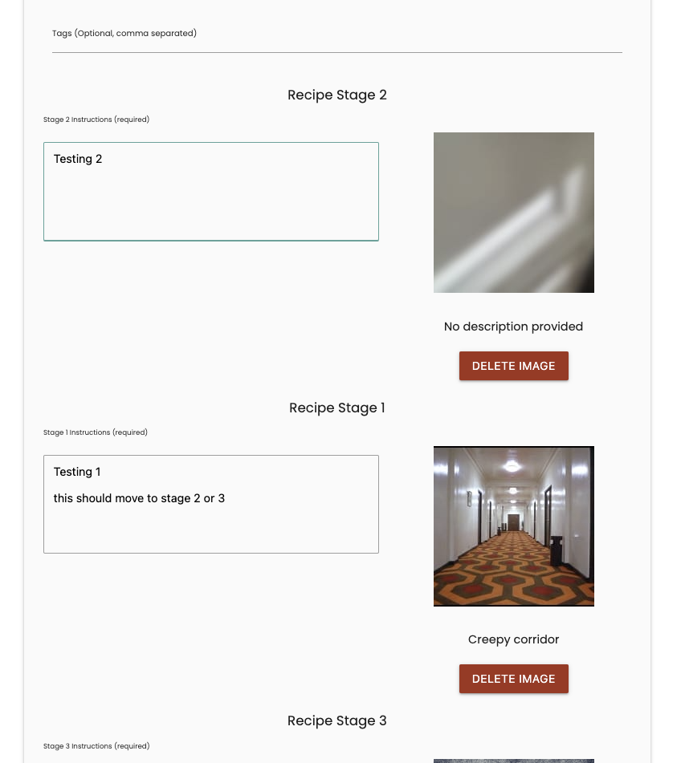

# **Colour Forge**
 
[Testing and Validation](#testing-and-validation)
 
 - [Usage Based Functionality Testing](#use-based-functionality-testing)
 - [Bugs, Issues and challenges](#Bugs-issues-and-challenges) 
 - [Unresolved Bugs](#unresolved-bugs)
 - [HTML Validation](#html-validation)
 - [CSS Validation](#css-validation)
 - [Accessibility](#accessibility)
 - [Performance](#lighthouse-performance-testing)
 - [User Testing](#user-testing)
 - [User Story Testing](#user-story-testing)
 - [JavaScript Testing](#javascript-testing)
 - [Python Testing](#python-testing)
 - [Device and Browser Testing](#device-and-browser-testing)
 - [Responsiveness](#responsiveness)
 - [Automated testing](#automated-testing)
 
# Testing and Validation
 
## Use based functionality testing
While building the basic functionality, I realised the best approach would be to test each specific feature as it was developed. Since I had created the modals file in its entirety before starting development of functions, I commented out the majority of the models.py file, initially retaining only the recipes table without any relationships. I then spent a lot of time checking the database directly via the CLI to see what data was being written. Additionally, I created a reset_db.py script designed to tear down and rebuild the database automatically. This approach saved me from manually resetting the database each time I needed to test a new feature, ensuring that my data remained clean and fresh.
 
To aid in testing I added limited print statements to the code so that I could see what data was being captured by the various forms before submission to the DB to ensure parity of data between the two. 
 
As I became more comfortable with writing and querying data on the DB, I moved away from this more manual approach, where I was checking print statements and monitoring the database directly and instead relied more on checking updates to the website directly, falling back to checking the DB where I needed to confirm non visible data, such as if Booleans were set to true or false. Unfortunately, during this phase, I neglected to record detailed test data, as my primary focus shifted to ensuring functionality was online and responding to necessary tweaks and changes.
 
The results of my initial testing can be found below. 
 
### add recipe
<details>
<summary>Output of writing to the recipes table</summary>

 
```
Recipe Name: This is a test of the add recipe function
Recipe Description: Testing the ability to add recipes. Nothing to see here. Once this works I will start to build the recipes page to show the stored data.
 
127.0.0.1 - - [29/Sep/2024 16:46:15] "POST /add_recipe HTTP/1.1" 302 -
127.0.0.1 - - [29/Sep/2024 16:46:15] "GET /recipes HTTP/1.1" 200 -
127.0.0.1 - - [29/Sep/2024 16:46:15] "GET /static/css/style.css HTTP/1.1" 304 -
127.0.0.1 - - [29/Sep/2024 16:46:15] "GET /static/images/logo.png HTTP/1.1" 304 -
127.0.0.1 - - [29/Sep/2024 16:46:15] "GET /static/js/script.js HTTP/1.1" 304 -
```
 
List of relations<br>
| Schema |  Name   | Type  |    Owner    |
|------- | ------- | ----- | ------------|
| public | recipes | table | urbqgoc5q8y |
 
| recipe_id |                recipe_name                 |                                                                recipe_desc                                                               |
| --------- | ------------------------------------------ | ---------------------------------------------------------------------------------------------------------------------------------------- |
|    1      | This is a test of the add recipe function  | Testing the ability to add recipes. Nothing to see here. Once this works I will start to build the recipes page to show the stored data. |
</details>
 
<details>
<summary>Output of writing to the recipe and recipe_stages tables</summary>

 
```
Recipe Name: This is a test of the recipe stages
Recipe Description: Testing to see if a single stage can be added OK
2
Instructions List: ['Just a single stage test. ']
Is Final Stage?: None
127.0.0.1 - - [29/Sep/2024 21:22:27] "POST /add_recipe HTTP/1.1" 302 -
127.0.0.1 - - [29/Sep/2024 21:22:27] "GET /recipes HTTP/1.1" 200 -
127.0.0.1 - - [29/Sep/2024 21:22:28] "GET /static/css/style.css HTTP/1.1" 304 -
127.0.0.1 - - [29/Sep/2024 21:22:28] "GET /static/images/logo.png HTTP/1.1" 304 -
127.0.0.1 - - [29/Sep/2024 21:22:28] "GET /static/js/script.js HTTP/1.1" 304 -
```
 
List of relations<br>
| Schema |     Name      | Type  |    Owner     |
| ------ | ------------- | ----- | ------------ |
| public | recipe_stages | table | urbqgoc5q8y  |
| public | recipes       | table | urbqgoc5q8y  |
 
| recipe_id |             recipe_name             |                   recipe_desc                     |
| --------  |------------------------------------ | ------------------------------------------------- |
|     1     | This is a test of the recipe stages | Testing to see if a single stage can be added OK  |
 
| stage_id | recipe_id | stage_num |        instructions        | is_final_stage   |
| -------- | --------- | --------- | -------------------------- | ---------------- |
|    1     |         1 |         1 | Just a single stage test.  | f                | 
</details>
 
<details>
<summary>Output of writing to the to the recipes table and adding multiple stages to the recipes_stages table</summary>

 
```
Recipe Name: Testing adding 2 stages
Recipe Description: This is a test of 2 stages
3
Instructions List: ['This is the first stage.', 'This is the second stage. ']
Is Final Stage?: None
127.0.0.1 - - [29/Sep/2024 21:25:01] "POST /add_recipe HTTP/1.1" 302 -
127.0.0.1 - - [29/Sep/2024 21:25:01] "GET /recipes HTTP/1.1" 200 -
127.0.0.1 - - [29/Sep/2024 21:25:02] "GET /static/images/logo.png HTTP/1.1" 304 -
127.0.0.1 - - [29/Sep/2024 21:25:02] "GET /static/js/script.js HTTP/1.1" 304 -
127.0.0.1 - - [29/Sep/2024 21:25:02] "GET /static/css/style.css HTTP/1.1" 304 -
```
 
| recipe_id |       recipe_name       |        recipe_desc         |
| --------- | ----------------------- | -------------------------- |
|      1    | Testing adding 2 stages | This is a test of 2 stages |
 
| stage_id | recipe_id | stage_num |        instructions        | is_final_stage  |
| -------- | --------- | --------- | -------------------------- | --------------- |
|     1    |      1    |      1    | This is the first stage.   | f               |
|     2    |      1    |      2    | This is the second stage.  | f               |
 
</details>
 
<details>
<summary>Output of writing to the recipe and recipe_stages tables and testing the Boolean</summary>

 
```
Recipe Name: Testing three stages with a final stage
Recipe Description: This is a test of all functions added so far, recipe name, recipe description, multiple recipe stages and finally if the final stage bool is honoured. 
4
Instructions List: ['This is stage 1 of the third test', 'This is stage 2 of the third test', 'This is stage 3 of the third test']
Is Final Stage?: on
127.0.0.1 - - [29/Sep/2024 21:28:22] "POST /add_recipe HTTP/1.1" 302 -
127.0.0.1 - - [29/Sep/2024 21:28:22] "GET /recipes HTTP/1.1" 200 -
127.0.0.1 - - [29/Sep/2024 21:28:22] "GET /static/css/style.css HTTP/1.1" 304 -
127.0.0.1 - - [29/Sep/2024 21:28:22] "GET /static/images/logo.png HTTP/1.1" 304 -
127.0.0.1 - - [29/Sep/2024 21:28:22] "GET /static/js/script.js HTTP/1.1" 304 -
```
 
| recipe_id |               recipe_name               |                                                                       recipe_desc                                                                      |
| --------- | --------------------------------------- | ------------------------------------------------------------------------------------------------------------------------------------------------------ |
|     1     | Testing three stages with a final stage | This is a test of all functions added so far, recipe name, recipe description, multiple recipe stages and finally if the final stage bool is honoured. |
 
| stage_id | recipe_id | stage_num |           instructions            | is_final_stage |
| -------- | --------- | --------- | --------------------------------- | -------------- |
|     1    |      1    |      1    | This is stage 1 of the third test | t              |
|     2    |      1    |      2    | This is stage 2 of the third test | t              | 
|     3    |      1    |      3    | This is stage 3 of the third test | t              | 
</details>
 
<br>
It seemed this was assigning true to all stages, rather than just the last. This caused me to rethink how this should be handled, either giving the user an option per stage, which seems like too clunky a solution. Or to automatically assume the last stage added is the last stage of the instructions, which would make more sense since this is where we would normally expect the image used in the card for the recipe to be selected from. 
<br>
<br>
 
<details>
<summary>Output of writing to the recipe and recipe_stages tables and testing the new Boolean logic</summary>

 
```
Recipe Name: Retest of multiple stages, with the new logic for the final stage added
Recipe Description: This is hopefully a final test of the add recipe function, featuring the ability to add multiple stages and for the last stage to automatically have its bool set as 'true' to denote it as the last stage, meaning its attached image will be used for the recipes image
5
Instructions List: ['This stage 1 of the test of the adjusted Boolean handling', 'This stage 2 of the test of the adjusted Boolean handling', 'This stage 3 of the test of the adjusted Boolean handling', 'This stage 4 of the test of the adjusted Boolean handling']
Is Final Stage?: None
127.0.0.1 - - [29/Sep/2024 21:43:16] "POST /add_recipe HTTP/1.1" 302 -
127.0.0.1 - - [29/Sep/2024 21:43:16] "GET /recipes HTTP/1.1" 200 -
127.0.0.1 - - [29/Sep/2024 21:43:17] "GET /static/js/script.js HTTP/1.1" 304 -
127.0.0.1 - - [29/Sep/2024 21:43:17] "GET /static/css/style.css HTTP/1.1" 304 -
127.0.0.1 - - [29/Sep/2024 21:43:17] "GET /static/images/logo.png HTTP/1.1" 304 -
```
 
| recipe_id |                               recipe_name                               |                                                                                                                                recipe_desc                                                                                                                                |
| --------- | ----------------------------------------------------------------------- | ------------------------------------------------------------------------------------------------------------------------------------------------------------------------------------------------------------------------------------------------------------------------- | 
|     1     | Testing three stages with a final stage                                 | This is a test of all functions added so far, recipe name, recipe description, multiple recipe stages and finally if the final stage bool is honoured.                                                                                                                    |
|     2     | Retest of multiple stages, with the new logic for the final stage added | This is hopefully a final test of the add recipe function, featuring the ability to add multiple stages and for the last stage to automatically have its bool set as 'true' to denote it as the last stage, meaning its attached image will be used for the recipes image |
(2 rows)
 
| stage_id | recipe_id | stage_num | instructions                                     | is_final_stage |
|----------|-----------|-----------|--------------------------------------------------|----------------|
| 1        | 1         | 1         | This is stage 1 of the third test                | t              |
| 2        | 1         | 3         | This is stage 2 of the third test                | t              |
| 3        | 1         | 3         | This is stage 3 of the third test                | t              |
| 4        | 2         | 1         | This is stage 1 of the adjusted Boolean handling | f              |
| 5        | 2         | 2         | This is stage 2 of the adjusted Boolean handling | f              |
| 6        | 2         | 3         | This is stage 3 of the adjusted Boolean handling | f              |
| 7        | 2         | 4         | This is stage 4 of the adjusted Boolean handling | f              |
 
</details>
 
<details>
<summary>Output of writing to the recipe and recipe_stages tables and testing the fixed Boolean logic</summary>

 
```
Recipe Name: Test of adjusted logic for Bool handling
Recipe Description: This is hopefully a final test for the adjusted Boolean logic
3
Instructions List: ['Stage 1 of the adjusted logic test', 'Stage 2 of the adjusted logic test']
Is Final Stage?: None
127.0.0.1 - - [29/Sep/2024 21:55:34] "POST /add_recipe HTTP/1.1" 302 -
127.0.0.1 - - [29/Sep/2024 21:55:34] "GET /recipes HTTP/1.1" 200 -
127.0.0.1 - - [29/Sep/2024 21:55:34] "GET /static/css/style.css HTTP/1.1" 304 -
127.0.0.1 - - [29/Sep/2024 21:55:34] "GET /static/images/logo.png HTTP/1.1" 304 -
127.0.0.1 - - [29/Sep/2024 21:55:34] "GET /static/js/script.js HTTP/1.1" 304 -
127.0.0.1 - - [29/Sep/2024 21:55:39] "GET /static/css/style.css HTTP/1.1" 304 -
```
 
| recipe_id |                               recipe_name                               |                                                                                                                                recipe_desc                                                                                                                                 |
| --------  | ----------------------------------------------------------------------- | -------------------------------------------------------------------------------------------------------------------------------------------------------------------------------------------------------------------------------------------------------------------------- |
|     1     | Testing three stages with a final stage                                 | This is a test of all functions added so far, recipe name, recipe description, multiple recipe stages and finally if the final stage bool is honoured.                                                                                                                     |
|     2     | Retest of multiple stages, with the new logic for the final stage added | This is hopefully a final test of the add recipe function, featuring the ability to add multiple stages and for the last stage to automatically have its bool set as 'true' to denote it as the last stage, meaning its attached image will be used for the recipes image  |
|     3     | Testing adjusted logic for last stage check                             | Adjusted logic check for final stage logic                                                                                                                                                                                                                                 |
|     4     | Test of adjusted logic for Bool handling                                | This is hopefully a final test for the adjusted Boolean logic                                                                                                                                                                                                              |
 
| stage_id | recipe_id | stage_num |                       instructions                        | is_final_stage |
| -------- | --------- | --------- | --------------------------------------------------------- | -------------- |
|    1     |    1      |    1      | This is stage 1 of the third test                         | t              |
|    2     |    1      |    2      | This is stage 2 of the third test                         | t              |
|    3     |    1      |    3      | This is stage 3 of the third test                         | t              |
|    4     |    2      |    1      | This stage 1 of the test of the adjusted Boolean handling | f              |
|    5     |    2      |    2      | This stage 2 of the test of the adjusted Boolean handling | f              |
|    6     |    2      |    3      | This stage 3 of the test of the adjusted Boolean handling | f              |
|    7     |    2      |    4      | This stage 4 of the test of the adjusted Boolean handling | f              |
|    8     |    4      |    1      | Stage 1 of the adjusted logic test                        | f              |
|    9     |    4      |    2      | Stage 2 of the adjusted logic test                        | t              |
 
</details>
 
<details>
<summary>Output of writing to the recipe, recipe_stages tables, uploading to Cloudinary and finally writing the results of the upload to the recipe_images table</summary>

 
```
Recipe Name: This is a test of adding the images to Cloudinary and the DB
Recipe Description: Testing of image upload for a single stage
1
Instructions List: ['This is the first and only stage. The Bool should be true. There should be an image URL and Thumbnail URL. ']
Is Final Stage?: None
Image names: [<FileStorage: 'hero-image.png' ('image/png')>]
127.0.0.1 - - [30/Sep/2024 18:04:08] "POST /add_recipe HTTP/1.1" 302 -
127.0.0.1 - - [30/Sep/2024 18:04:08] "GET /recipes HTTP/1.1" 200 -
127.0.0.1 - - [30/Sep/2024 18:04:08] "GET /static/css/style.css HTTP/1.1" 304 -
127.0.0.1 - - [30/Sep/2024 18:04:08] "GET /static/images/logo.png HTTP/1.1" 304 -
127.0.0.1 - - [30/Sep/2024 18:04:08] "GET /static/js/script.js HTTP/1.1" 304 -
```
 
| recipe_id |                         recipe_name                          |                recipe_desc                 |
| --------- | ------------------------------------------------------------ | ------------------------------------------ |
|     1     | This is a test of adding the images to Cloudinary and the DB | Testing of image upload for a single stage |
 
| stage_id | recipe_id | stage_num |                                                instructions                                                 | is_final_stage |
| -------- | --------- | --------- | ----------------------------------------------------------------------------------------------------------- | -------------- |
|     1    |     1     |     1     | This is the first and only stage. The Bool should be true. There should be an image URL and Thumbnail URL.  | t              |
 
| image_id | stage_id |                                       image_url                                        |                                        thumbnail_url                                         |                                 alt_text                                |
| -------- | -------- | -------------------------------------------------------------------------------------- | -------------------------------------------------------------------------------------------- | ----------------------------------------------------------------------- |
|     1    |     1    | https://res.cloudinary.com/dlmbpbtfx/image/upload/v1727715847/eupydc07vwmej3en6xbs.png | http://res.cloudinary.com/dlmbpbtfx/image/upload/c_fill,h_100,w_100/eupydc07vwmej3en6xbs.jpg | This is a hero image for the Pokebattler website for my second project. |
 
</details>
 
<details>
<summary>Output of writing to the recipe, recipe_stages tables, uploading multiple images to Cloudinary and finally writing the results of the upload to the recipe_images table</summary>

 
```
Recipe Name: This is a test of adding multiple images
Recipe Description: Will try for three images this time over 4 stages
1
Instructions List: ['This is the first stages image', 'This is the second stages image', 'The third stage will have no alt_text added', 'This will have no image attached ']
Is Final Stage?: None
Image names: [<FileStorage: '404-page-desktop.png' ('image/png')>]
127.0.0.1 - - [30/Sep/2024 18:12:03] "POST /add_recipe HTTP/1.1" 302 -
127.0.0.1 - - [30/Sep/2024 18:12:03] "GET /recipes HTTP/1.1" 200 -
127.0.0.1 - - [30/Sep/2024 18:12:03] "GET /static/css/style.css HTTP/1.1" 304 -
127.0.0.1 - - [30/Sep/2024 18:12:03] "GET /static/images/logo.png HTTP/1.1" 304 -
127.0.0.1 - - [30/Sep/2024 18:12:03] "GET /static/js/script.js HTTP/1.1" 304 -
127.0.0.1 - - [30/Sep/2024 18:04:08] "GET /static/js/script.js HTTP/1.1" 304 -
```
 
| recipe_id |                         recipe_name                          |                    recipe_desc                    |
| --------- | ------------------------------------------------------------ | ------------------------------------------------- |
|      1    | This is a test of adding the images to Cloudinary and the DB | Testing of image upload for a single stage        |
|      2    | This is a test of adding multiple images                     | Will try for three images this time over 4 stages |
 
| stage_id | recipe_id | stage_num |                                                instructions                                                 | is_final_stage  |
| -------- | --------- | --------- | ----------------------------------------------------------------------------------------------------------- | --------------- |
|    1     |     1     |     1     | This is the first and only stage. The Bool should be true. There should be an image URL and Thumbnail URL.  | t               |
|    2     |     2     |     1     | This is the first stages image                                                                              | f               |
 
| image_id | stage_id |                                       image_url                                        |                                        thumbnail_url                                         |                                 alt_text                                 | 
| -------- | -------- | -------------------------------------------------------------------------------------- | -------------------------------------------------------------------------------------------- | ------------------------------------------------------------------------ | 
|     1    |     1    | https://res.cloudinary.com/dlmbpbtfx/image/upload/v1727715847/eupydc07vwmej3en6xbs.png | http://res.cloudinary.com/dlmbpbtfx/image/upload/c_fill,h_100,w_100/eupydc07vwmej3en6xbs.jpg | This is a hero image for the Pokebattler website for my second project.  | 
|     2    |     2    | https://res.cloudinary.com/dlmbpbtfx/image/upload/v1727716322/tnp1ssx1ac3gjs8blb0g.png | http://res.cloudinary.com/dlmbpbtfx/image/upload/c_fill,h_100,w_100/tnp1ssx1ac3gjs8blb0g.jpg | Sad Pikachu!                                                             | 
</details>
<br>
The above only seemed to add a single image of the several that were input. On inspection, I'd missed creating the images and alt text entries as arrays. 
<br>
<br>
 
<details>
<summary>Output of writing to the recipe, recipe_stages tables, uploading multiple images to Cloudinary and finally writing the results of the upload to the recipe_images table - retest</summary>

 
```
Recipe Name: Testing multiple image uploads
Recipe Description: This is a test
3
Instructions List: ['Stage 1', 'Stage 2', 'Stage 3']
Is Final Stage?: None
Image names: ['404-page-desktop.png', 'hero-image.png', 'Screenshot 2024-06-16 123914.png']
alt text: ['Sad pika', 'Hero Image', 'Local Map']
127.0.0.1 - - [30/Sep/2024 22:17:19] "POST /add_recipe HTTP/1.1" 302 -
127.0.0.1 - - [30/Sep/2024 22:17:19] "GET /recipes HTTP/1.1" 200 -
127.0.0.1 - - [30/Sep/2024 22:17:19] "GET /static/css/style.css HTTP/1.1" 304 -
127.0.0.1 - - [30/Sep/2024 22:17:19] "GET /static/images/logo.png HTTP/1.1" 304 -
127.0.0.1 - - [30/Sep/2024 22:17:19] "GET /static/js/script.js HTTP/1.1" 304 -
```
 
| recipe_id |          recipe_name           |  recipe_desc   | 
| --------- | ------------------------------ | -------------- |
|     1     | Testing multiple image uploads | This is a test |
 
| stage_id | recipe_id | stage_num | instructions | is_final_stage |
| -------- | --------- | --------- | ------------ | -------------- |
|     1    |     1     |     1     | Stage 1      | f              |
|     2    |     1     |     2     | Stage 2      | f              |
|     3    |     1     |     3     | Stage 3      | t              |
 
| image_id | stage_id |                                       image_url                                        |                                        thumbnail_url                                         |  alt_text   |
| -------- | -------- | -------------------------------------------------------------------------------------- | -------------------------------------------------------------------------------------------- | ----------- |
|    1     |     1    | https://res.cloudinary.com/dlmbpbtfx/image/upload/v1727731037/zcs4iirp7kqhspzje4lv.png | http://res.cloudinary.com/dlmbpbtfx/image/upload/c_fill,h_100,w_100/zcs4iirp7kqhspzje4lv.jpg | Sad pika    |
|    2     |     2    | https://res.cloudinary.com/dlmbpbtfx/image/upload/v1727731037/ixa63ye6aszg97ls8vvu.png | http://res.cloudinary.com/dlmbpbtfx/image/upload/c_fill,h_100,w_100/ixa63ye6aszg97ls8vvu.jpg | Hero Image  | 
|    3     |     3    | https://res.cloudinary.com/dlmbpbtfx/image/upload/v1727731038/ocke1j24jnwolatvzmb3.png | http://res.cloudinary.com/dlmbpbtfx/image/upload/c_fill,h_100,w_100/ocke1j24jnwolatvzmb3.jpg | Local Map   |
</details>
 
<details>
<summary>Output of testing unexpected behaviours, such as not filling in all fields, forgetting to add alt-text (image description), forgetting to add an image, etc.</summary>


 
```
Recipe Name: Test of not adding data to all fields for multiple stages
Recipe Description: Some stages will have all fields filled. Some will not.
5
Instructions List: ['Stage 1 - this is the control and will have data in all fields ', 'Stage 2 - this will only have the instructions ', 'Stage 3 - This will just be an image', "Stage 4 - this is a possible, but unlikely scenario where an image description is added for an image alt. Once I've wired up the default placeholder image this should be overwritten so I may need logic for this. ", 'Stage 5 - this needed to be filled in to submit, as expected']
Is Final Stage?: None
Image names: ['Screenshot 2024-06-08 021116.png', '', 'Screenshot 2024-09-12 223744.png', '', 'Screenshot 2024-07-25 202904.png']
alt text: ['The Thing', '', '', 'I forgot to add an image', "Phone Mock-up - In this instance I'm testing adding images and no Instructions"]
127.0.0.1 - - [30/Sep/2024 22:28:38] "POST /add_recipe HTTP/1.1" 302 -
127.0.0.1 - - [30/Sep/2024 22:28:38] "GET /recipes HTTP/1.1" 200 -
127.0.0.1 - - [30/Sep/2024 22:28:39] "GET /static/css/style.css HTTP/1.1" 304 -
127.0.0.1 - - [30/Sep/2024 22:28:39] "GET /static/images/logo.png HTTP/1.1" 304 -
127.0.0.1 - - [30/Sep/2024 22:28:39] "GET /static/js/script.js HTTP/1.1" 304 -
```
 
| recipe_id |                        recipe_name                        |                       recipe_desc                        | 
| --------- | --------------------------------------------------------- | -------------------------------------------------------- |
|      1    | Testing multiple image uploads                            | This is a test                                           |
|      2    | Test of not adding data to all fields for multiple stages | Some stages will have all fields filled. Some will not.  |
 
| stage_id | recipe_id | stage_num |                                                                                                     instructions                                                                                                     | is_final_stage | 
| -------- | --------- | ----------| -------------------------------------------------------------------------------------------------------------------------------------------------------------------------------------------------------------------  | -------------- |
|     1    |     1     |     1     | Stage 1                                                                                                                                                                                                              | f              |
|     2    |     1     |     2     | Stage 2                                                                                                                                                                                                              | f              |
|     3    |     1     |     3     | Stage 3                                                                                                                                                                                                              | t              |
|     4    |     2     |     1     | Stage 1 - this is the control and will have data in all fields                                                                                                                                                       | f              |
|     5    |     2     |     2     | Stage 2 - this will only have the instructions                                                                                                                                                                       | f              |
|     6    |     2     |     3     | Stage 3 - This will just be an image                                                                                                                                                                                 | f              |
|     7    |     2     |     4     | Stage 4 - this is a possible, but unlikely scenario where an image description is added for an image alt. Once I've wired up the default placeholder image this should be overwritten so I may need logic for this.  | f              |
|     8    |     2     |     5     | Stage 5 - this needed to be filled in to submit, as expected                                                                                                                                                         | t              |
 
| image_id | stage_id |                                       image_url                                        |                                        thumbnail_url                                         |                                   alt_text                                    |
| -------- | -------- | -------------------------------------------------------------------------------------- | -------------------------------------------------------------------------------------------- | ----------------------------------------------------------------------------- |
|    1     |     1    | https://res.cloudinary.com/dlmbpbtfx/image/upload/v1727731037/zcs4iirp7kqhspzje4lv.png | http://res.cloudinary.com/dlmbpbtfx/image/upload/c_fill,h_100,w_100/zcs4iirp7kqhspzje4lv.jpg | Sad pika                                                                      |
|    2     |     2    | https://res.cloudinary.com/dlmbpbtfx/image/upload/v1727731037/ixa63ye6aszg97ls8vvu.png | http://res.cloudinary.com/dlmbpbtfx/image/upload/c_fill,h_100,w_100/ixa63ye6aszg97ls8vvu.jpg | Hero Image                                                                    |
|    3     |     3    | https://res.cloudinary.com/dlmbpbtfx/image/upload/v1727731038/ocke1j24jnwolatvzmb3.png | http://res.cloudinary.com/dlmbpbtfx/image/upload/c_fill,h_100,w_100/ocke1j24jnwolatvzmb3.jpg | Local Map                                                                     |
|    4     |     4    | https://res.cloudinary.com/dlmbpbtfx/image/upload/v1727731716/jwrsx0hlqixuxl2k1fdc.png | http://res.cloudinary.com/dlmbpbtfx/image/upload/c_fill,h_100,w_100/jwrsx0hlqixuxl2k1fdc.jpg | The Thing                                                                     |
|    5     |     6    | https://res.cloudinary.com/dlmbpbtfx/image/upload/v1727731717/ytwtbmoc6wmrxenzk5fj.png | http://res.cloudinary.com/dlmbpbtfx/image/upload/c_fill,h_100,w_100/ytwtbmoc6wmrxenzk5fj.jpg |                                                                               |
|    6     |     8    | https://res.cloudinary.com/dlmbpbtfx/image/upload/v1727731718/xeynhlcgz4jbzuysjg34.png | http://res.cloudinary.com/dlmbpbtfx/image/upload/c_fill,h_100,w_100/xeynhlcgz4jbzuysjg34.jpg | Phone Mock-up - In this instance I'm testing adding images and no Instructions |
</details>
<br>
The above test, while initially using 6 stages for testing, also let me test what would happen if I removed a stage using the remove button before submitting, since the 5th and 6th stages were both initially intended to have the instructions empty, with the sixth stage having just the images alt-text added. Since both stages were unable to be submitted as empty as per design this meant that stage 6 was no longer needed, allowing me to prove the removal of a stage stops it being submitted. 
<br>
<br>
<details>
<summary>Testing writing to all tables needed for adding a recipe, recipes, recipe_stages, recipe_images, recipe_tags and entity_tags</summary>

 
```
Recipe Name: Dark Angels Desaturated Power Armour
Recipe Description: This is a simple 3-4 paint recipe for very dark, very desaturated Dark Angels power armour
1
Instructions List: ['Undercoat the model with a flat black paint. ', "Using Caliban Green as a base coat, heavily drybrush the model - while we want to cover as much as we can, it's not a huge deal if the recesses are missed since the black will provide natural shadows where it is left. ", "using Loren Forest we now need to give the mini a much lighter drybrush, this can happily go over flat panels on the armour too, sinInstructions List: ['Undercoat the model with a flat black paint. ', "Using Caliban Green as a base coat, heavily drybrush the model - while we want to cover as much as we can, it's not a huge deal if the recesses are missed since the black will provide natural shadows where it is left. ", "using Loren Forest we now need to give the mini a much lighter drybrush, this can happily go over flat panels on the armour too, since we'll be cleaning this up in the next stage a little and it will help provide a more organic-looking highlight to the miniature. ", 'Next up, we cover the model in Coelia Greenshade once it's dried this should start to filter the lighter Loren forest coat and pull it down to be a little closer to the Dark Angels Green base coat. ']
Is Final Stage?: None
Image names: ['404-page-desktop.png', 'game-wave.png', 'hero-image.png', 'jest.png']
alt text: ['Undercoated Dark Angel', 'Base coat', 'First Highlight', 'Wash']
Full form content ImmutableMultiDict([('recipe_name', 'Dark Angels Desaturated Power Armour'), ('recipe_desc', 'This is a simple 3-4 paint recipe for very dark, very desaturated Dark Angels power armour'), ('tags', 'Dark Angels,Warhammer,Space Marines,Power Armour,Desaturated'), ('instructions[]', 'Undercoat the model with a flat black paint. '), ('instructions[]', "Using Caliban Green as a base coat, heavily drybrush the model - while we want to cover as much as we can, it's not a huge deal if the recesses are missed since the black will provide natural shadows where it is left. "), ('instructions[]', "using Loren Forest we now need to give the mini a much lighter drybrush, this can happily go over flat panels on the armour too, since we'll be cleaning this up in the next stage a little and it will help provide a more organic-looking highlight to the miniature. "), ('instructions[]', 'Next up, we cover the model in Coelia Greenshade once its dried this should start to filter the lighter Loren forest coat and pull it down to be a little closer to the Dark Angels Green base coat. '), ('image_desc[]', 'Undercoated Dark Angel'), ('image_desc[]', 'Base coat'), ('image_desc[]', 'First Highlight'), ('image_desc[]', 'Wash')])
```
List of relations
 
| Schema |     Name      | Type  |    Owner    | 
| ------ |-------------  | ----- | ----------- |
| public | entity_tags   | table | urbqgoc5q8y |
| public | recipe_images | table | urbqgoc5q8y |
| public | recipe_stages | table | urbqgoc5q8y | 
| public | recipe_tags   | table | urbqgoc5q8y |
| public | recipes       | table | urbqgoc5q8y |
 
| recipe_id |             recipe_name              |                                        recipe_desc                                         |
| --------- | ------------------------------------ | ------------------------------------------------------------------------------------------ |
|      1    | Dark Angels Desaturated Power Armour | This is a simple 3-4 paint recipe for very dark, very desaturated Dark Angels power armour | 
 
| stage_id | recipe_id | stage_num |                                                                                                                               instructions                                                                                                                               | is_final_stage  |
| -------- | --------- | --------- | ------------------------------------------------------------------------------------------------------------------------------------------------------------------------------------------------------------------------------------------------------------------------ | --------------- |
|     1    |     1     |     1     | Undercoat the model with a flat black paint.                                                                                                                                                                                                                             | f               |
|     2    |     1     |     2     | Using Caliban Green as a base coat, heavily drybrush the model - while we want to cover as much as we can, it's not a huge deal if the recesses are missed since the black will provide natural shadows where it is left.                                                | f               |
|     3    |     1     |     3     | Using Loren Forest we now need to give the mini a much lighter drybrush, this can happily go over flat panels on the armour too, since we'll be cleaning this up in the next stage a little and it will help provide a more organic-looking highlight to the miniature.  | f               |
|     4    |     1     |     4     | Next up, we cover the model in Coelia Greenshade once it's dried this should start to filter the lighter Loren forest coat and pull it down to be a little closer to the Dark Angels Green base coat.                                                                     | t               |
 
| image_id | stage_id |                                       image_url                                        |                                        thumbnail_url                                         |        alt_text         |       
| -------- | -------- | -------------------------------------------------------------------------------------- | -------------------------------------------------------------------------------------------- | ----------------------- | 
|    1     |    1     | https://res.cloudinary.com/dlmbpbtfx/image/upload/v1727987873/q5i2ftplla6udtqxdlob.png | http://res.cloudinary.com/dlmbpbtfx/image/upload/c_fill,h_100,w_100/q5i2ftplla6udtqxdlob.jpg | Undercoated Dark Angel  | 
|    2     |    2     | https://res.cloudinary.com/dlmbpbtfx/image/upload/v1727987876/afcihcowy0sjo7jvtzx1.png | http://res.cloudinary.com/dlmbpbtfx/image/upload/c_fill,h_100,w_100/afcihcowy0sjo7jvtzx1.jpg | Base coat               | 
|    3     |    3     | https://res.cloudinary.com/dlmbpbtfx/image/upload/v1727987877/bc4onemhmikj4otzngk2.png | http://res.cloudinary.com/dlmbpbtfx/image/upload/c_fill,h_100,w_100/bc4onemhmikj4otzngk2.jpg | First Highlight         | 
|    4     |    4     | https://res.cloudinary.com/dlmbpbtfx/image/upload/v1727987878/g5ccnr4thoblvveatmpq.png | http://res.cloudinary.com/dlmbpbtfx/image/upload/c_fill,h_100,w_100/g5ccnr4thoblvveatmpq.jpg | Wash                    | 
 
| tag_id |   tag_name    |
| ------ | ------------- |
|    1   | Dark Angels   |
|    2   | Warhammer     |
|    3   | Space Marines |
|    4   | Power Armour  |
|    5   | Desaturated   |
 
| recipe_id | tag_id | entity_type  |
| --------- | ------ | ------------ |
|     1     |      1 | recipe       |
|     1     |      2 | recipe       |
|     1     |      3 | recipe       |
|     1     |      4 | recipe       |
|     1     |      5 | recipe       |
</details>
 
# Bugs, Issues and challenges 
 
### Tags
Implementing the Tags feature presented several challenges, primarily due to the need for a many-to-many relationship and the ability for users to reuse existing tags. Initially, I explored using [Materialize Tags Input](https://henrychavez.github.io/materialize-tags/) and other tagging tools I found online. However, these approaches did not function as intended, particularly with the Materialize Chips, which hindered both the addition and deletion of tags during editing.
 
As a result, I shifted my approach to treat tag entry and editing more like a text field. After further research, I discovered Awesomeplete, which provides the necessary autocomplete functionality, allowing users to draw from and add to the existing tag library. I successfully integrated Awesomeplete by modifying some JavaScript based on the guidance from [this source.](https://elixirforum.com/t/how-to-use-a-js-library-like-awesomplete-within-a-liveview/32251/9) Consequently, the section of the JS file utilising Awesomeplete should not be graded, as it heavily relies on external code from the referenced source.
 
### Refactoring and DRY 
While developing the app routes for recipe functionality, I realised the need to refactor these routes into smaller helper functions. At one point, the edit route alone spanned over 120 lines of code, making it challenging to debug and understand interactions between different code sections. Refactoring not only simplified these routes but also encouraged a DRY (Don't Repeat Yourself) approach, allowing for code reuse and easier maintenance.
 
The initial focus of this refactoring was on the main routes file, as it contained the bulk of the logic. While additional auth and admin files were added later, their smaller routes have not yet been prioritised for refactoring.
 
I’ve identified a few instances where code duplication remains, such as performing image uploads directly within certain functions instead of using a designated image upload helper. As time allows, these redundancies will be addressed to further streamline the codebase.
 
### Cloudinary Deletion
While developing the edit function, I realised that I was leaving images on Cloudinary that were no longer needed, since I hadn't built any logic to remove these. As such where stage deletion or image changes were handled, I added in functions to also delete the image from Cloudinary using the images public ID. 
 
### Accidental Image Deletion
I had an issue that was detected late on that allowed the default images used in the demo recipe to be deleted by any user when they delete the Demo Recipe, which is understandably not desirable, since this will impact all users who may join. As such, I added an additional check when deleting images to ensure that the public ID does not start with the word 'Placeholder'. Since I can manually set the PublicID and image names on images hosted on Cloudinary I was able to use this as a way of preventing this from being an issue. 
 
### Button Debounce
During development, I published the app to Heroku to allow for user testing, which quickly revealed a significant issue where users could accidentally submit the same recipe multiple times by pressing a button multiple times. To address this, I implemented a JavaScript function to disable the submit button upon click, preventing multiple submissions. Initially applied only to the add_recipe page, this functionality was gradually extended to all form submission pages.
 
While most of the site’s submit buttons are now disabled on click, I encountered an issue with Google ReCaptcha on the email form. ReCaptcha appears to take control of the button on click, which prevents my JavaScript disable function from executing. Further investigation is needed to find a workaround, but since ReCaptcha was very much a stretch goal, I’m comfortable postponing this fix. The main issue it causes is that users may unintentionally send duplicate emails, which has no direct impact on site functionality.
 
### Jinja Issues caused by not storing data in the DB
While building the edit recipe page, I encountered an issue where recipes with placeholder images (i.e., no image entry in the database) generated a Werkzeug error:
```
jinja2.exceptions.UndefinedError: sqlalchemy.orm.collections.InstrumentedList object has no element 0
```
This error occurred because Jinja couldn’t locate non-existent database entries when loading the edit page for recipes without images.
 
To resolve this, I modified the image handling logic in routes.py to insert a URL string into the images table whenever a user does not submit an image. This ensures that a placeholder image URL is always present, allowing Jinja to render it without errors. I’ve also kept the HTML fall backs in place as a safety net, though these should rarely be needed and will only be required issues where a bug or other issue causes a recipe to not correctly save to the DB. 
 
### Card Reflow issues.
During development, I encountered a persistent issue where cards in the same row would sometimes grow larger than others, causing the row below to reflow. To address this, I implemented CSS media queries to ensure that cards render in a reasonably consistent manner across various screen sizes and resolutions.
 
While this solution works, it’s a temporary fix. Ideally, a more comprehensive approach would involve adjusting font sizes, card dimensions, and text reflow to achieve a fully responsive layout. However, implementing these changes will require additional time.
 
<br> 
<details>
<summary>Reflow Bug</summary>

</details>
<br>

### Text Box issues. 
Another persistent issue I encountered was with the Materialize text box. For some reason this would not readily adjust when changing screen resolution during testing, consistently causing issues with page overflow which resulted in the page shrinking within the window at varying screen resolutions, compressing the site into itself. 
I noticed that I'd omitted to include the JavaScript provided by Materialize to help with text box resizing, however even with this added I was finding the behaviour was still present. 
 
To resolve this, I implemented a custom text box with accompanying JavaScript for resizing. This custom approach not only fixed the resizing issue but also improved the UI by making the text box visually distinct from single-line text fields. Unlike the default Materialize setup, which presents both inputs as blank lines, my custom text box is styled as a distinct box, signalling to users that it can accommodate larger amounts of text.
 
<br> 
<details>
<summary>Reflow Bug</summary>


</details>
<br> 

### Stage Ordering Issues. 
Late in development, I discovered an issue where updating a single stage within a multi-stage recipe would sometimes cause the stages to reorder unexpectedly. This behaviour is inconsistent, as it does not always occur during recipe editing, making it difficult to predict or replicate reliably.
 
<br> 
<details>
<summary>Sorting Bug</summary>


</details>
<br>
<details>
<summary>Resolved Sorting Bug</summary>


</details>
<br>

This was the recipe before editing. 
| stage_id | recipe_id | stage_num | instructions | is_final_stage 
| -------- | --------- | --------- | ------------ | --------------- |
|      135 |        53 |         1 | Testing 1    | f               |
|      136 |        53 |         2 | Testing 2    | f               |
|      137 |        53 |         3 | Testing 3    | t               |
 
This was the recipe after editing. 
open_punch_bath_8981=> select * from recipe_stages where recipe_id = 53;
| stage_id | recipe_id | stage_num |           instructions                          | is_final_stage |
| -------- | --------- | --------- | ----------------------------------------------- |--------------- |
|      136 |        53 |         2 | Testing 2                                       | f              |
|      135 |        53 |         1 | Testing 1\r \r this should move to stage 2 or 3 | f              |
|      137 |        53 |         3 | Testing 3                                       | t              |
 
To address the stage reordering issue, I implemented a forced sort within the for loop on any pages rendering recipe stages. This ensures that stages display in the correct order, regardless of the sequence in the database. While this doesn’t address the underlying cause, it provides a short-term, user-facing solution, allowing time to investigate the root issue.
 
This sorting can remain as a reliable fallback even after resolving the underlying issue. It acts as an extra safeguard against any unexpected reordering that may arise as the site evolves or undergoes further development and refactoring.
 
Jinja for loop before the fix:
```

```
Jinja for loop after the fix:
```

```
​​
### Large Image Handling.
Something I neglected to realise early on is that the free version of Cloudinary has a [max file size](https://support.cloudinary.com/hc/en-us/articles/202520592-Do-you-have-a-file-size-limit#:~:text=On%20our%20free%20plan%2C%20the,also%20limited%20to%2010%20MB.) for uploads, which is set at 10Mb.
Initially, I was considering letting this slide since I suspect images larger than 10 MB will be very rarely encountered. (In testing the only time I found images larger than this is when uploading uncropped photos from a DSLR, which for the sites use case should be rare enough to be almost 0 of the uploads) however, I wasn't happy just leaving it there so I decided to try to resolve this while I had some time. [This following Stack Overflow article](https://stackoverflow.com/questions/2104080/how-do-i-check-file-size-in-python), [this turing.com article](https://www.turing.com/kb/how-to-get-the-size-of-file-in-python#making-use-of-file-object) proved useful in outlining methods that I could use to approach the issue to create a file size check, which via some trial and error I managed to get working.

<br> 
<details>
<summary>Large Image Bug</summary>

</details>
<br> 

Even though the site would throw an error, the recipe was still able to be saved, just without the large images. However, this created a few issues. The first of which was that if the image was to be the final stage image this would render the recipe inaccessible since the image is used in the anchor tag to allow users to click through to the recipe page. Additionally, for some reason stages where large images were used and generating the Werkzeug error were not rendering on the recipe page at all.

<br>
<details>
<summary>Large Image Recipe Card</summary>

</details>
<br> 
<details>
<summary>Missing stage due to large image</summary>

</details>
<br>

After managing to get the check to work, I found it was still allowing the recipe to be saved, but with a missing image icon.

<br> 
<details>
<summary>Broken Image Recipe Card</summary>

</details>
<br> 
<details>
<summary>Broken Image stage</summary>

</details>
<br>

One possible solution to this was to reload the page as the return to the large image checker, which while valid would be less than ideal, since if the user had added a fairly long recipe having to re-enter it would create a negative user experience. I quickly realised that the best solution would be to simply pass the two constants that have been set for the placeholder image to cause the recipe to replace the large image with a placeholder image, meaning not only is the recipe able to be saved, but the site can gracefully handle larger images. I do have issues with how slow this process is for large image handling since it can take around 30 seconds to a minute to return anything. Still, I am not currently sure how to best improve performance here, since we're dealing with a few factors - uploading the image from the users’ device to the site, to check before passing to Cloudinary.
I am also not entirely happy with how the flashed alerts are handled here, since while we need to inform the user of the replacement of their image due to file size, we're also flashing that the recipe was added successfully. A future improvement will be to combine both of these messages or alert the user in another method such as an email or similar.

<br>
<details>
<summary>Broken Image stage</summary>

</details>
<br>

### Too long Tags causing errors
At the time the bug was discovered, tags were allowed to be 100 characters long, due to a misunderstanding of how the table would handle multiple tags when the Modals file was generated. This has since been dropped to 20 characters. 
 
Tag names that were longer than the maximum number of characters in the table would cause a crash and generate a Werkzueg error. To resolve this I adjusted the tag_handler function to check for the number of characters in a tag and skip adding it if it's too long. This also generates a message to the user to advise of the skipped tag. 
 
This issue combined with the Large Image Handling issue helped highlight that the fall back static HTML rendered image for recipe cards was not functioning as expected. 
 
Code before the fix
```
    if tag_names:
        for tag_name in tag_names:
            tag_name = tag_name.strip()
            if tag_name:
                tag = RecipeTag.query.filter_by(tag_name=tag_name).first()
 
                if not tag:
                    tag = RecipeTag(tag_name=tag_name)
                    db.session.add(tag)
                    # Do not commit here to batch transactions
```
Code after the fix
```
    MAX_TAG_LENGTH = 20
 
    if tag_names:
        for tag_name in tag_names:
            tag_name = tag_name.strip()
            if tag_name:
                if len(tag_name) > MAX_TAG_LENGTH:
                    flash(
                        f"""Tag {tag_name} is too long. Tags must be
                        {MAX_TAG_LENGTH} characters or less.""",
                        category='error'      
                    )
                    # Skip over this tag and continue iterating through the rest
                    continue
 
                # Check if tag exists
                tag = RecipeTag.query.filter_by(tag_name=tag_name).first()
 
                if not tag:
                    tag = RecipeTag(tag_name=tag_name)
                    db.session.add(tag)
```
 
### Fall back HTML Image not loading when needed
If, for some reason, a recipe does not have a final_stage image the site is designed to have fall backs to allow for the recipe card to still render correctly. Unfortunately this was not working as expected due to the Jinja based logic checks I had in place always returning a truthy value even when this wasn't specifically the case. 
 
Jinja Implementation before the fix
```



```
 
Jinja implementation after the fix
```


```
 
The above was implemented over multiple HTML pages where HTML fallback options exist. 
 
# Unresolved Issues
The site has a minor graphical issue that I have noticed but can't quite pin down.
 
 - The desktop search bar shows a strip of white beneath it when a user clicks into it to search, I cannot locate a cause for this. 

<br> 
<details>
<summary>Search Box Bug</summary>

</details>
<br>

There is evidence of an underlying issue in recipe handling logic, where if something fails in the recipe creation process the recipe will be created still but is missing any data that wasn't written to the DB prior to the point of failure. 
 
 - Failed Recipes
 This was highlighted as an issue when I identified the issue with images above 10mb and was confirmed when the issue with long tags was identified. 
 
 Essentially, what's happening is if there is an error state in any process of the recipe creation process, the recipe is still able to be created and seems to save everything prior to the point of the error occurring. This can result in recipes being saved that are missing parts of the data and are also not fixable via edits. 
 
 This issue seems to also cause problems with editing recipes past the point of the last data insertion. So if stages were not added, the recipe renders with no stage and stages can not be added when trying to edit the recipe, since the add stage feature assumes that stage 1 will always exist. 
 
 This issue only occurs when a major error happens in the recipe creation process so, with the various safeguards and fixes I've put in place, should happen rarely. But it does warrant further long term investigation and improvement around the recipe creation logic implementing which could, rather than just creating the recipe, warn the user and kick them back to the Add Recipe or Edit Recipe page with some flashed messaging to allow them to make the needed corrections. Longer term, I would want to refactor my code somewhat and include error logging to send issues to a platform such as Datadog, Sentry or another monitoring platform allowing alerts to be generated when issues do occur to help ensure awareness that an issue exists as well as logging where the issue may have occurred to help with debugging and troubleshooting. Finally, this could also allow me to use the flash feature to throw a friendly message at the user to let them know that an issue has occurred but that it is under investigation. 

<br>
<details>
<summary>Broken Recipes</summary>


</details>
<br>
 
Additionally, while I have already mentioned it in the resolved bugs section, I feel it's worth again calling out the issues with recipe ordering, since while I have a fix in place, it is, at best a band-aid solution to what I think maybe a much larger issue which warrants further investigation, particularly since the fix I have in place would cause problems with potential future functionality where reordering the recipe stages or adding in new between existing ones is concerned. 
 
I am not aware of other bugs or issues with the site currently. 
 
# HTML Validation
 
W3Schools HTML Validator was used to test all HTML. Since much of the site is locked behind a login requirement the testing tool cannot test directly from the website, so I have had to view source and paste for each page that needed to be tested. 
 
| Page                  | Result                                                          | 
| --------------------- | --------------------------------------------------------------- |
| Logged out home page  |                 |
| About Page            |                |
| Login Page            |                |
| Register Page         |             |
| Contact Page          |              |
| Logged in Home Page   |                  |
| My Recipes Page       |            |
| Recipe Page           |           |
| Add Recipe Page       |            |
| Edit Recipe Page      |           |
| Account Page          |               |
| Account Admin Page    |         |
| Account Admin Search  |  |
| Recipe Admin Page     |          |
| Recipe Admin Search   |   |
| Tag Search Page       |            |
| Error Pages           |                    |
 
# CSS Validation
 
CSS validation was conducted using the W3Schools validation service. This highlights an error with Materialize CSS. There are also a group of warnings in my own CSS that are highlighted, specifically around the use of vendor extensions and pseudo-elements, which were required to ensure maximal compatibility. 

<br>
<details>
<summary>Site CSS Warnings</summary>

</details>
<br>
<details>
<summary>Materialize CSS Issue</summary>

</details>
<br>

I had attempted to work around to mitigate the error by using the following addition to my own CSS. 
 
```
.table-of-contents a {
    letter-spacing: 0.4px !important;
}
```
However the issue was still being picked up by the Jigsaw test, so I removed this since it seemed to make no difference. As such there is, at the time of writing, a failure on the test results but this is caused by an externally sourced CSS file which I have no control over and seemingly cannot override. 
 
The results of the CSS validation be found here: [W3Schools Jigsaw test results](https://jigsaw.w3.org/css-validator/validator?uri=https%3A%2F%2Fcolourforge.co.uk&profile=css3svg&usermedium=all&warning=1&vextwarning=&lang=en)
 
# Accessibility
WAVE was used to check to ensure the site conforms to accessibility standards. 
 
A few issues were highlighted, specifically around duplication of the link to the Home Page, since this features in both the site name and the home button; some images having 'suspicious' Alt Text, which was caused by the 'Default Image' placeholder Alt Texts used for placeholder images. Some broken and missing link messages were occurring on every page, which were caused by the side nav menu and both the admin and search drop downs, which use fake links for them to work. Also some forms reported no labels. However, other than two forms on the contact page which I believe may be caused by ReCaptcha, I could not locate any forms that were missing labels on the site. There were a few minor call outs to headings also, which considering the site can't really conform to standardised layouts I think is reasonably acceptable, since there's no sections etc to have H2, H3 and so on and these were used where it was appropriate to do so. 
 
## Logged Out Pages
<details>
<summary>Homepage</summary>

</details>
<br>
 
<details>
<summary>About Page</summary>

</details>
<br>
 
<details>
<summary>Login Page</summary>

</details>
<br>
 
<details>
<summary>Register Page</summary>

</details>
<br>
 
<details>
<summary>Contact Page</summary>

</details>
<br>
 
## Logged In Pages
<details>
<summary>Homepage</summary>

</details>
<br>
 
<details>
<summary>My Recipes Page</summary>

</details>
<br>
 
<details>
<summary>Account Page</summary>

</details>
<br>
 
<details>
<summary>Tag Search Results</summary>

</details>
<br>
 
<details>
<summary>Add Recipe Page Results</summary>


</details>
<br>
 
<details>
<summary>Recipe Page Results</summary>

</details>
<br>
 
<details>
<summary>Edit Recipe Results</summary>

</details>
<br>
 
<details>
<summary>Error Page Results</summary>

</details>
<br>
 
## Admin Pages
<details>
<summary>User Admin Results</summary>

</details>
<br>
 
<details>
<summary>User Admin Search Results</summary>

</details>
<br>
 
<details>
<summary>Recipe Admin Search Results</summary>

</details>
<br>
 
<details>
<summary>Recipe Admin Search Results</summary>

</details>
<br>
 
# Lighthouse Performance Testing
Performance testing was conducted with Google's Lighthouse, which is part of its DevTools package in Chrome. 
 
Due to the site's reliance on several external resources, which in some cases are on free tiers, which can impact performance, I fully expected performance tests to not be great for this app, since external services can be a factor when it comes to load times that are beyond the control of the site owner. Similarly the nature of the site being image and DB query heavy will be contributing factors since the images can, often intentionally so, be large. Similarly there can be multiple calls made to the DB per page where multistage recipes are concerned. This is part of the reason I opted to use Cloudflare for caching content when the site has been browsed, since this can help to mitigate load times where possible. 
 
I also suspect that using a cheaper Dyno from Heroku may not be helping in terms of general load times and responsiveness, combined with what I suspect may be some inefficient coding on my part will also be contributing. 
 
I suspect I may be able to implement things like pre-caching of CSS, JavaScript and common images to help. Similarly I have generated a minified CSS file which the site uses and may, in future, shift to minimised JavaScript and HTML files to see if these help with load times. 
 
## Logged Out
<details>
<summary>Home Page Results</summary>

</details>
<br>
 
<details>
<summary>About Page Results</summary>

</details>
<br>
 
<details>
<summary>Login Page Results</summary>

</details>
<br>
 
<details>
<summary>Registration Page Results</summary>

</details>
<br>
 
<details>
<summary>Contact Page Results</summary>

</details>
<br>
 
## Logged In
<details>
<summary>Logged in Home Page Results</summary>

</details>
<br>
 
<details>
<summary>My Recipes Results</summary>

</details>
<br>
 
<details>
<summary>Account Results</summary>

</details>
<br>
 
<details>
<summary>Recipe Page Results</summary>

</details>
<br>
 
<details>
<summary>Add Recipe Results</summary>

</details>
<br>
 
<details>
<summary>Edit Recipe Results</summary>

</details>
<br>
 
<details>
<summary>Tag Search Results</summary>

</details>
<br>
 
## Admin Pages
<details>
<summary>User Admin Results</summary>

</details>
<br>
 
<details>
<summary>User Admin Search Results</summary>

</details>
<br>
 
<details>
<summary>Recipe Admin Results</summary>

</details>
<br>
 
<details>
<summary>Recipe Admin Search Results</summary>

</details>
<br>
 
# User Testing
User level testing was conducted throughout development by contacting a small group of fellow hobbyists who I know are often keen to share information on how they approach painting, which lead to a few issues being discovered, which have been highlighted elsewhere. Some of the discovered issues include the ability to add multiple duplicate entries, issues with shared images being deleted by a single user deleting a recipe and issues with tag length. User testing has proven to be invaluable in hunting for bugs and testing scenarios outside of those that I might envisage on my own.
 
# User Story Testing
 
## Successes 
 
The below user stories were all met based on requirements. In some cases there were minor caveats, such as admins being able to modify user recipes, though I believe that there is an expectation that moderation of user content can occur when using a service where the content is user generated. In other cases some of the requirements were exceeded, such as a limited number of user recipes being visible on the homepage when logged out, or all recipes being visible to all users when logged in. 
 
| User Story                                                                                                  | Status              | Notes |
| ----------------------------------------------------------------------------------------------------------- | ------------------- | ------|
| As a user, I want to log in securely to access my data.                                                     | Working As Expected | During registration the user's password is securely hashed using SHA-512, allowing for secure storage of passwords in order to protect the user's account and data. |
| As a user, I want to be able to change my account details                                                   | Works as expected   | The website has an account page which allows the user to modify their email address, password and delete their account. | 
| As a user, I want to add detailed step by step instructions to my recipes.                                  | Works as expected   | Users can create paint recipes, which allow for multiple stages to be added or removed as needed, allowing for some fairly in depth approaches to miniature painting to be documented. |
| As a user, I would like to upload images to help see how each stage of the recipe looks.                    | Works as expected   | Users are able to upload images to each stage of their recipes thanks to Cloudinary integration. This also auto generates thumbnails which are able to be used to display smaller versions of the uploaded images where appropriate. |
| As a user, I want to be able to add tags or other identifiers to recipes to help me organise them.          | Works as expected   | Recipes are able to have tags added to them, allowing for users to search for recipes with tags assigned. |
| As a user, I would like to be able to edit my recipes as I improve them or need to change paints used.      | Works as expected   | Recipes can be edited by users, with additional stages added, content of existing stages changed, stages removed and different images added to those that are already present. |
| As a user, I would like to be able to delete recipes that are no longer of use to me.                       | Works as expected   | Users can delete any recipe they create. Deletion creates a modal pop up which alerts the user to the deletion, allowing for some defence from deleting the wrong thing, or accidental deletions |
| As a user, I want to be able to search my library and recipes using tags                                    | Works as expected   | Users can use the tags they add to recipes to search for and find all recipes with the associated tags. 
| As a user, I want the application to be clean and easy to navigate.                                         | Works as expected   | The website features a nav bar across the top or a pull out nav bar, accessible via the hamburger menu which provides simple navigation around the website. |
| As a user, I would like the application to be fully responsive so that it can be easily used regardless of the device I access it from. | Works as expected | The website has been designed with mobile-first, responsive design in mind. Meaning it will adjust depending on the device in use and provide a user interface that's adapted to either touch or mouse-based entry. |
| As a user, I want my password to be stored securely to protect my account.                                  | Works as expected   | User passwords are hashed using SHA 512
| As a user, I would like that only I can modify or edit my library or recipes.                        | Works as expected   | The only people who can modify a user's recipes or other data are the users who contributed that data to site admins. Site admins only have the facility to this to protect the site from malicious use, which I feel is an expectation when it comes to using a platform online |
| As a user, I want to receive visual feedback or confirmation when I edit or delete a paint or recipe.       | Works as expected   | Feedback is provided to users via the form of flashed messages which auto hide after 3 seconds or can be dismissed before the 3 seconds are up if the user chooses to do so |
| As a user, I would like to be alerted when I try to submit an incomplete form, with an indication of what data may be missing. | Works as expected | The site uses a mix of flashed alerts and form level tooltips which should highlight why a form may fail to submit |
| As an admin, I want to be able to manage user accounts, including editing and deletion.                     | Works as expected | The website features an admin panel to allow site admins to manage both user accounts and user-submitted recipes, this grants them the ability to modify and delete both accounts and recipes to help users or protect the site from abuse and misuse. |
| As a user I would like to be able to have a link for my recipes so that I can share them with other users.  | Works as expected | All recipes are available to share with both other members of the site (And indeed they're displayed to all users on the home page) as well as the wider internet by sharing the URL |
 
## Partial Successes 
These were all partially implemented where easier-to-implement solutions have been used or some story-based functionality may be missing due to needing to scale back the scope for an MVP. Implementation would be given a priority focus for the next release
 
| User Story                                                                                                  | Status              | Notes |
| ----------------------------------------------------------------------------------------------------------- | ------------------- | ------|
| As a user, I want to be able to reset my password if I forget it                                            | Partial             | While self-serve password reset functionality is not currently implemented, the user can request an admin to change their password for them, allowing them to be able to login and change their password to something more suitable. |
| As a user, I want to be able to register for an account so that I may save my paint collection and recipes. | Partial             | The website has a registration page which allows users to register an account to use the site. This auto logs in the user and generates a demonstration recipe which provides some basic usage instructions. Once logged in the user can create, edit and save paint recipes. However, due to having to scale back, adding paint and having a library of paints is not yet implemented. | 
| As a user, I would like to be able to create new recipes using paints from my Library.                      | Partial             | Users can create paint recipes, however, because the paint library was deemed to be beyond the scope of the MVP the ability to add specific paints to a recipe or create a recipe from paints is currently not present. This will be added in a future iteration. |
 
## Failed to meet. 
These were user stories which were unable to be implemented due to scaling back the project for an MVP candidate. However, this functionality would be treated as being a priority for the next release candidate update. The below user stories mostly focused on the ability to add paint to a paint library or use this data in recipes or in other forms, which was a feature that was chosen to be de-prioritised to meet an MVP release for the due date. 
 
| User Story                                                                                                                        | Status              | Notes                                                             |
| --------------------------------------------------------------------------------------------------------------------------------- | ------------------- | ----------------------------------------------------------------- |
| As a user, I would like to be able to add new paints to my collection by entering details of the paint.                           | Failed to meet      | The paint library function has been deferred to a future release. |
| As a user, I want to be able to edit details of any paints in my collection, such as quantity, if I need to replace it and so on. | Failed to meet      | The paint library function has been deferred to a future release. |
| As a user, I would like to be able to delete paints that I no longer have or use.                                                 | Failed to meet      | The paint library function has been deferred to a future release. |
| As a user, I want to be able to search and filter my paint collection.                                                            | Failed to meet      | The paint library function has been deferred to a future release. |
| As a user, I would like to be able to add paints to my library from an existing list.                                             | Failed to meet      | The paint library function has been deferred to a future release. |
| As a user, I want to be able to see all recipes that may use a particular paint from my library.                                  | Failed to meet      | The paint library function has been deferred to a future release. |
| As a user, I would like to be able to import my paint collection for faster entry.                                                | Failed to meet      | The paint library function has been deferred to a future release. |
| As a user, I would like to be able to export my collection and recipes so that I know I have a backup.                            | Failed to meet      | While useful and potentially simple to implement this function was not added in time to meet the deadline |
 
# JavaScript Testing
JavaScript validation was performed using [JSHint](https://jshint.com/) which highlighted a few unused variables, some undeclared variables and a lot of informational warnings about some features only being available in ES6. 
 
I need to refactor the JS file and break things up into functions to make it more readable however from some initial attempts at refactoring and cleaning up the unused variables this causes functionality to break in terms of adding and removing stages as well as some other features. So for now I will leave this mostly untouched so I can go back and refactor at a later date. 
 
# Python Testing
PEP8 Compliance testing was conducted with the Code Institute provided [Python Linter ](https://pep8ci.herokuapp.com/) the results of which can be seen below. 
 
| File Name   | Result                               |
| ----------- | ------------------------------------ |
| __init__.py | Pass                                 |
| admin.py    | Pass                                 |
| auth.py     | Pass                                 |
| helpers.py  | Pass                                 |
| mail.py     | Pass                                 |
| models.py   | Pass                                 |
| routes.py   | Pass                                 |
| seed.py     | Pass                                 |
 
Several lines in the __init__.py, helpers.py and seed.py file all use noqa to help with validation of the files for PEP8 Compliance. 
These are used under advice from my mentor, or from notes from parts of the course, where I have had to implement things in ways that would otherwise cause issues for PEP8. 
 
# Device and Browser Testing
 
| Operating System | Browser | Notes                                                                                                                                          | Result       |
| ---------------- | ------- | ---------------------------------------------------------------------------------------------------------------------------------------------- | ------------ |
| Mac OS           | Safari  | Admin Dropdown renders correctly vs when using Chrome. Minor rendering issues with the search box that I've documented elsewhere               | Functions OK |
| Mac OS           | Chrome  | Minor issues that have been raised elsewhere about the admin drop down and search box                                                          | Functions OK |
| Mac OS           | Firefox | Minor issues with the search box, also found a new problem with the tags selector where this is too narrow for the content which was corrected. | Functions OK |
| Windows          | Chrome  | Minor issues that have been raised elsewhere about the admin drop-down and search box                                                          | Functions OK |
| Windows          | Firefox | Minor issues with the search box, also found a new problem with the tags selector where this is too narrow for the content which was corrected. | Functions OK |
| Windows          | Edge    | Minor issues that have been raised elsewhere about the admin drop-down and search box                                                          | Functions OK |                
 
<br> 
<details>
<summary>Example of the Firefox issue before its resolution.</summary>

</details>
<br> 

# Responsiveness
 
I tested my project both when deployed locally and on the Heroku server using Google Chrome's dev tools, trying various simulated phones as well as just shifting the responsive dimensions screen around to view how varying resolutions impacted the site's rendering. 
 
| Device            | Resolution  | Test Results | Supporting Evidence                                                                    |
| ----------------- | ----------- | ------------ | -------------------------------------------------------------------------------------- |
| iPhone SE         | 375 x 667   | Pass         | [Recording of iPhone SE resolution browser](docs/videos/iphone-se.mp4)                 |
| iPhone 14 Pro Max | 430 x 932   | Pass         | [Recording of iPhone 14 Pro Max resolution browser](docs/videos/iphone-14-pro-max.mp4) |
| Pixel 7           | 412 x 915   | Pass         | [Recording of Pixel 7 resolution browser](docs/videos/iphone-se.mp4)                   |
| Galaxy Z Fold 5   | 344 x 882   | Pass         | [Recording of Galaxy Z Fold 5 resolution browser](docs/videos/galaxy-z-fold-5.mp4)     |
| Laptop            | 1920 x 1080 | Pass         | [Recording of a typical Laptop resolution browser](docs/videos/laptop.mp4)             |
 
# Automated testing
Automated testing was something I had attempted to consider, but ended up being skipped in favour of live use testing, where since the site was published on Heroku I could invite a limited selection of users to test the site and put it through its paces. This helped highlight a few issues as testing occurred, such as being able to submit duplicate DB entries by repeatedly clicking the button, adding multiple images to a stage via button spam, finding that there were issues with ordering when saving a single stage of a recipe and so on. User testing occurred from the moment I had basic functionality in place right through to two weeks before the due date for the project, giving me around 3-4 weeks of fairly constant user testing to work with. The main reason for choosing to fall back on live user testing was a mix of time constraints around needing to understand how to conduct testing with Python as well as feeling I was mostly going to end up falling back on scripts and documentation from various [sources](https://testdriven.io/blog/flask-pytest/) online rather than writing my own to help limit how much time I had to dedicate to it, which since this would preclude it from being considered in the marking process made me feel it wasn't worth investing the time in implementing. 
 
An example of some of the code I would have been using is: 
 
```
def test_user_create():
    """
    GIVEN a User model
    When a new User is created
    THEN check the username, email, password and is_admin fields are defined correctly
    """
    user = User('test_user', 'email@domain.com', 'hashed password', False)
    assert user.username == 'test_user'
    assert user.email == 'email@domain.com'
    assert user.password == 'hashedpassword'
    assert user.is_admin is False
```